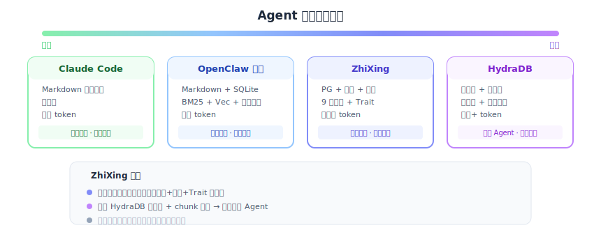

# AI Agent 记忆系统研究报告

> 研究时间：2026-03-16
> 目的：分析主流 Agent 记忆系统的架构、优劣和适用场景，为 ZhiXing 的产品定位和技术演进提供决策依据。

## 文档索引

| 文档 | 内容 |
|------|------|
| [01-agent-data-panorama.md](./01-agent-data-panorama.md) | Agent 数据全景：七层数据模型、记忆系统分层模型 |
| [02-knowledge-agentic-search.md](./02-knowledge-agentic-search.md) | Agentic Search vs 传统 RAG 趋势分析、对 ZhiXing 知识+记忆定位的战略影响 |
| [03-memory-native-systems.md](./03-memory-native-systems.md) | Claude Code 和 OpenClaw 原生记忆系统深度分析 + 发展趋势 |
| [04-memory-third-party-systems.md](./04-memory-third-party-systems.md) | MemOS、OpenViking、HydraDB、Google Always-On Memory 等第三方系统分析 |
| [05-retrieval-memrl-qvalue.md](./05-retrieval-memrl-qvalue.md) | 检索优化：Q-value 效用评分、MemRL 记忆 RL 增强 |
| [06-flywheel-model-training.md](./06-flywheel-model-training.md) | 提取优化：数据飞轮架构、三层飞轮、平台模型训练 |
| [07-environment-neon.md](./07-environment-neon.md) | Neon 分析、Agent Environment vs Knowledge/Memory、dbay.cloud 启示 |
| [08-jeff-dean-supermemory.md](./08-jeff-dean-supermemory.md) | Jeff Dean 前瞻观点 + Supermemory 竞品深度分析 |
| [09-vertical-integration.md](./09-vertical-integration.md) | 垂直整合分析：向上做 Agent（OpenClaw/OpenJiuWen）还是向下做存储（dbay.cloud） |
| [10-discussion-storage-vs-memory.md](./10-discussion-storage-vs-memory.md) | 内部讨论：存储形式创新 vs 记忆创新（回应"文本记忆就够了"的质疑） |
| [11-zhixing-strategy.md](./11-zhixing-strategy.md) | ZhiXing 综合定位与策略建议：愿景、现状、策略与路线图 |
| [11a-competitive-analysis.md](./11a-competitive-analysis.md) | 竞品分析与能力差距：能力盘点、替换/叠加定位、HydraDB/MemOS/OpenViking 深度对比 |
| [12-counterarguments.md](./12-counterarguments.md) | 红蓝军辩论：九场深度对抗（团队讨论用） |
| [13-claude-code-developer-memory.md](./13-claude-code-developer-memory.md) | Claude Code 开发者记忆：主战场分析与策略 |
| [14-developer-memory-test-tracker.md](./14-developer-memory-test-tracker.md) | 开发者记忆测试追踪 |
| [15-post-compact-hook.md](./15-post-compact-hook.md) | Post-compact hook 技术方案 |
| [16-dbay-knowledge-offering.md](./16-dbay-knowledge-offering.md) | DBay 知识库 Offering：知识管线下沉到 dbay.cloud 的产品策略分析 |
| [17-knowledge-base-research.md](./17-knowledge-base-research.md) | 知识库/RAG 技术全景研究：文档解析、分块策略、GraphRAG、高级检索、多模态、评估基准、生产系统实践、DBay 实施建议 |
| [18-jeff-dean-probabilistic-agent-infra.md](./18-jeff-dean-probabilistic-agent-infra.md) | Jeff Dean 概率性 Agent 基础设施观点 |
| [19-clowder-ai-data-layer-analysis.md](./19-clowder-ai-data-layer-analysis.md) | **Clowder AI（猫猫咖啡馆）数据层全景分析**：用七层模型审视猫猫的数据能力现状、gap 识别、DBay 集成增强方案 |

## 核心结论速览

### 1. 不同 Agent 需要根本不同的记忆策略

- **编码助手**（Claude Code）：记忆量小，全量 Markdown 加载，不需要检索
- **个人助理**（OpenClaw）：记忆量大且持续增长，需要语义检索 + 时间衰减
- **业务 Agent**（客服/销售）：需要精确时序推理 + 决策链追踪 + 多用户隔离

**Agent 记忆需求光谱：**



### 2. 记忆系统应分三层

```
记忆策略层（何时记、记什么、何时忘）   ← 必须分场景，不可能通用
记忆组织层（类型、元数据、关联）       ← 部分通用
底层存储层（向量、图、全文检索）       ← 完全可以通用
```

### 3. 省 token 的关键不在底层存储，在上层策略

MemOS 省 72% token、OpenViking 省 83% token——核心机制是：
- 精准记忆召回替代 MEMORY.md 全量注入（MemOS、memory 插件可做）
- L0/L1/L2 分层加载（OpenViking、memory 插件可做）
- 对话历史压缩额外贡献 ~8%（OpenClaw 原生 memory-core，ContextEngine 管理对话历史压缩，第三方 memory 插件无法做到）

### 4. 两个产品各自的战略定位

**dbay.cloud**——Serverless Agent 数据平台。不只是数据库：存储（Serverless PG + OBS 文档/知识存储）+ 数据工程（PG → Lance）+ 计算（Ray 训练）+ 模型产出。Serverless 化、弹性伸缩、存算分离、多版本多分支。独立服务任何记忆系统（OpenViking、MemOS、ZhiXing），与开源生态合力。

**ZhiXing**——AI Agent 的记忆智能引擎。差异化在智能层（Trait 反思 + Q-value 飞轮 + 可视化管理），不在存储层。跑在任意 PG 上。不做 Agent 框架（LangChain/LlamaIndex 已占位），做 Agent 能调用的最好的记忆工具。

### 5. 双产品定位：两个独立产品，各有各的用户

**dbay.cloud** — Serverless Agent 数据平台。面向"需要 AI 数据基础设施的人"。从原始数据存储到模型训练的完整闭环（PG + OBS + Lance + Ray）。Serverless、弹性、存算分离、多版本分支。可以支撑**任何**记忆系统（ZhiXing、OpenViking、MemOS），与开源生态合力。

**ZhiXing**（SDK + Cloud）— AI Agent 的记忆智能引擎。面向"需要记忆的人"。差异化在智能层：9 步 Trait 反思、Q-value 飞轮、记忆可视化管理、跨 Agent 画像——这些是 OpenViking/MemOS/Mem0 都没有的。可以跑在 dbay.cloud 上也可以跑在任意 PG 上。

两个产品独立获客、独立发展、各自直接产生价值。dbay.cloud 的路线图由 Serverless PG 市场驱动，ZhiXing 的路线图由 Agent 记忆市场驱动。

### 6. 发展趋势

三大确定性趋势：
- **记忆系统从"核心内置"走向"可插拔生态"**：Claude Code 开放 MCP，OpenClaw 推出 `kind: "memory"` 插件接口——第三方记忆系统的入场券已备好
- **记忆膨胀和 Token 浪费是已验证痛点**：OpenClaw 用户报告每天浪费 12 万 token，QMD 冷启动 15 秒——对话压缩和分层加载是最快可感知的价值
- **结构化记忆是社区强需求，但平台方不做**：OpenClaw 两次关闭结构化记忆提案，留给生态——ZhiXing 的类型系统和反思引擎正好填补空白

### 7. Agentic Search 不替代 RAG，替代的是"只有 RAG"

传统 RAG 和 Agentic Search 将收敛为路由模式：简单查询走 RAG（快、便宜），复杂查询走 Agentic（准、灵活）。对 ZhiXing 的影响：
- 每次 Agentic 工具调用的底层仍是检索 → 更好的 RAG 是基础
- API 需要返回丰富元数据（置信度、时间、来源）→ 让 Agent 能自评估检索质量
- 支持 MCP 协议 → Agent 能直接调用 ZhiXing 作为工具
- L0/L1/L2 天然适配 Agentic → Agent 先要 L0 快速扫描，按需展开 L1/L2

### 8. 数据飞轮：MemRL + DBay.cloud 构建最强壁垒

MemRL（记忆 RL 增强）给每条记忆加 Q-value 效用分数，通过任务反馈持续优化检索质量——不需要重训模型，只更新一个浮点数。三层飞轮：
- **第一层（运行时）**：Q-value 更新，每用户检索个性化闭环，零成本（Jeff Dean: 检索即个性化）
- **第二层（平台模型）**：聚合全平台匿名数据 → 在 dbay.cloud Ray 集群上训练 ZhiXing 专精小模型（记忆提取/管理/排序）→ 所有用户受益
- **第三层（企业增值）**：per-tenant LoRA 微调（企业在平台模型上定制自己的记忆策略）+ export() 导出训练数据
- **壁垒**：积累的 Q-value + 平台模型 + 训练数据资产在其他平台不存在，迁移 = 从零学习

### 9. Neon 的启示：Agent Environment ≠ Knowledge/Memory

Neon 的"数据库为 Agent"核心场景是 Agent Environment（AI 编码 Agent 为应用创建后端数据库），不是知识/记忆。DBay.cloud 应聚焦知识+记忆层，借鉴 Neon 的 Agent 友好特性（匿名创建、分支、MCP Server）。

Jeff Dean 的关键信号：
- 个人投资 Supermemory（AI 记忆层创业公司）—— 赛道获顶级认可
- "万亿 token 幻觉"架构（分级漏斗检索）—— 验证 L0/L1/L2 分层加载方向
- 个性化通过检索而非微调 —— 验证 ZhiXing recall() API 范式

### 10. 知识管线下沉到 dbay.cloud

知识管线与记忆策略不同——**完全可以通用化**。文档解析、智能分块、chunk 增强、图谱提取、三路 embedding、L0/L1/L2 摘要生成，每个环节都是标准化的、与 Agent 类型无关的。用户自建管线极其复杂（解析器选型、分块策略、embedding 部署……），这正是平台化的机会。

**DBay 知识库 = 托管知识管线 + Serverless PG 存储 + MCP 检索工具。** 用户上传文档（含视频、图片等多模态内容），后台 Ray 自动处理，拿到 MCP endpoint 配到 Agent 里即可。管线支持插件式扩展，用户可按需接入不同的文档处理器（PDF、视频转录、图片 OCR 等）。

与 ZhiXing 边界清晰：知识（管线+存储+检索）归 dbay.cloud，记忆（智能+反思+飞轮）归 ZhiXing。两者对 Agent 是两个独立工具（Supermemory 已验证的模式）。详见 [16-dbay-knowledge-offering.md](./16-dbay-knowledge-offering.md)。

### 11. 知识库/RAG 技术全景

基于对文档解析、分块策略、GraphRAG、高级检索、多模态 RAG、评估基准、生产系统（Cursor/Perplexity/Notion AI/v0）的系统研究，DBay 知识管线的推荐技术栈：

- **解析**：Marker（MVP）→ Docling（阶段二），本地运行、开源、准确率顶尖
- **分块**：结构感知分块 + RAPTOR 树（天然对齐 L0/L1/L2）
- **Embedding**：Qwen3-Embedding-8B（MTEB 多语言榜首 70.58，中英双语最强）
- **检索**：pgvector + pg_search (ParadeDB BM25) + RRF 融合 + ColBERT reranking——一个 PG 解决三路检索
- **图谱**：LightRAG（阶段二，成本仅 GraphRAG 的 10%）
- **多模态**：ColQwen2-VL + Whisper large-v3-turbo（阶段三）
- **批量处理**：Ray Data（Notion 已从 Spark 迁移到 Ray，验证方向正确）

详见 [17-knowledge-base-research.md](./17-knowledge-base-research.md)。

### 12. Clowder AI（猫猫咖啡馆）数据层分析

用七层模型审视猫猫咖啡馆（多 Agent 协作平台，9 只猫组队工作）的数据能力：

- **核心优势**：③对话历史（████）和 ④上下文组装（████）——完善的消息持久化、session chain、摘要压缩、token budget 管理
- **最大 gap**：②记忆（▓▓）——当前是"项目文档索引"而非"Agent 记忆"，缺少 trait 反思、Q-value、自动提取、时间衰减
- **存储瓶颈**：SQLite + sqlite-vec（768 维）已成为多猫协作的瓶颈（无并发、无共享）
- **DBay 集成价值**：P0 是记忆层（Memory Base 补齐记忆智能）+ 知识层（Knowledge Base 补齐 RAG pipeline），P1 是轨迹层（Q-value 飞轮基础数据）

猫猫作为多 Agent 协作平台，是 DBay 记忆库的理想客户——多猫共享知识、跨 session 记忆持久化、团队级 trait 发现，这些需求在多 Agent 协作中极为关键。

详见 [19-clowder-ai-data-layer-analysis.md](./19-clowder-ai-data-layer-analysis.md)。
