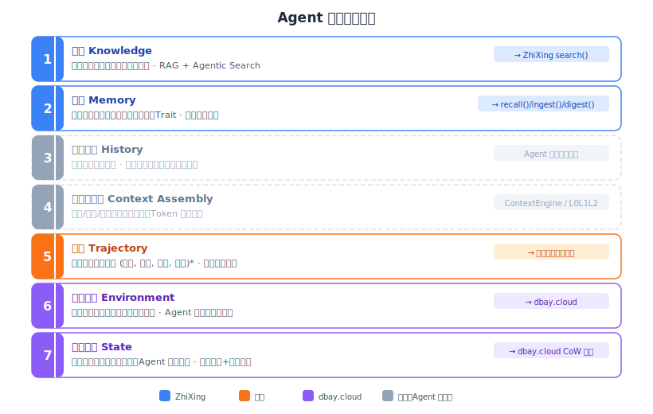
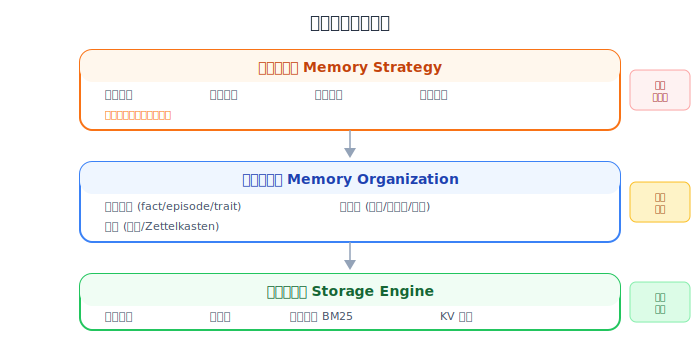
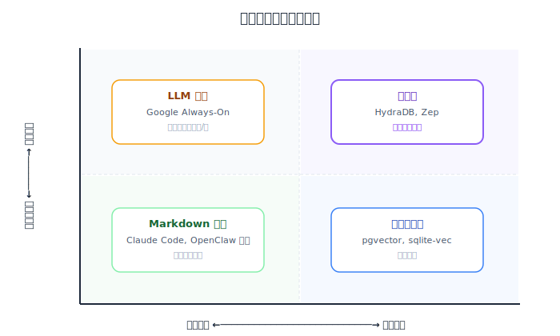

# Agent 数据全景图

> 本文建立 Agent 数据需求的完整框架：七个数据层次、不同 Agent 类型的差异化需求、产品功能覆盖图。后续文档（02-09）按数据层次展开深度分析。

---

## 1. Agent 分类

| Agent 类型 | 代表产品 | 核心特征 |
|-----------|---------|---------|
| **编码助手** | Claude Code, Cursor, Copilot | 记忆量小但极高频读取；需要精确匹配而非模糊召回 |
| **个人助理/聊天** | OpenClaw, ChatGPT, 豆包 | 记忆量大且持续增长；需要语义检索；跨会话连续性是核心价值 |
| **垂直业务 Agent** | 客服 Bot、销售 Agent | 结构化程度高；需要精确检索 + 权限隔离 |
| **多 Agent 协作** | CrewAI, AutoGen | 短生命周期；需要 Agent 间共享；读写并发高 |
| **长期陪伴** | Character.AI, 情感 AI | 时间跨度极长；需要遗忘曲线、情感标注、人格稳定性 |

---

## 2. Agent 数据全景：七个层次

Agent 在运行中需要和产生七种类型的数据。它们之间存在明确的精炼链条：



---

## 3. 七个数据层详解

### 3.1 知识 (Knowledge)

| 维度 | 说明 |
|------|------|
| **是什么** | 外部文档、领域知识、API 文档、参考资料 |
| **数据来源** | 人工导入文档、连接器（Google Drive、Notion、GitHub）、实时网络搜索 |
| **生命周期** | 相对静态，人工管理和更新 |
| **与用户的关系** | 用户无关（通用知识），所有用户可以共享同一知识库 |
| **检索方式** | 向量语义搜索 + BM25 关键词 + 图谱增强 + Agentic Search（多步推理检索） |
| **典型操作** | 导入 → 分块 → 向量化 → 检索 → L0/L1/L2 分层返回 |
| **行业趋势** | 传统 RAG 和 Agentic Search 收敛为路由模式：简单查询走 RAG，复杂查询走 Agentic |

**深度分析** → [02-knowledge-agentic-search.md](./02-knowledge-agentic-search.md)

### 3.2 记忆 (Memory)

| 维度 | 说明 |
|------|------|
| **是什么** | 从对话中提取的用户相关持久化信息：事实、偏好、画像、情景记忆、行为特征 |
| **数据来源** | 自动从对话中提取（ingest），或用户/AI 主动写入 |
| **生命周期** | 持续演化，跨会话保留，需要遗忘和衰减机制 |
| **与用户的关系** | **用户相关**（个性化），每个用户有独立的记忆空间 |
| **检索方式** | 语义向量 + BM25 + 图谱 boost + 时间衰减 + **Q-value 效用加权** |
| **典型操作** | 提取 → 存储 → 反思（归纳 Trait）→ 召回 → 遗忘 |

**Q-value（效用分数）** 是记忆检索的核心创新——详见下方 [3.2.1 节](#321-q-value效用分数记忆检索的-pagerank)。

**记忆类型体系：**

| 类型 | 说明 | 示例 |
|------|------|------|
| **Fact** | 持久事实 | "用户是 Python 开发者" |
| **Episode** | 时间事件 | "3月12日用户调试了一个内存泄漏" |
| **Trait** | 用户特征（反思引擎归纳） | "用户偏好简洁风格，讨厌冗长解释" |
| **Procedural** | 过程性记忆 | "部署流程：先跑测试，再 push，最后 SSH 重启" |

**深度分析** → [03-memory-native-systems.md](./03-memory-native-systems.md)、[04-memory-third-party-systems.md](./04-memory-third-party-systems.md)

#### 3.2.1 Q-value（效用分数）：记忆检索的 PageRank

**问题：语义相似 ≠ 实际有用。**

传统记忆检索靠余弦相似度排序。但一条关于"Python 调试"的记忆和当前 Python 问题语义相似度很高，却可能编码了一个在特定场景下会失败的策略。Agent 检索到它并执行，任务失败。下次遇到类似问题，还是会检索到这条"高相似度"的坏记忆。

**Q-value 的解法：给每条记忆一个效用分数，通过任务结果反馈来更新。**

```
每条记忆 = (内容, 向量, Q-value)

Q-value ∈ [0, 1]，初始值 0.5
  → 任务成功且用到了这条记忆 → Q 上升
  → 任务失败且用到了这条记忆 → Q 下降

更新公式（指数移动平均）：
  Q_new = Q_old + α × (reward - Q_old)
  reward ∈ [-1, 1]（任务成功/失败信号）
  α = 学习率（如 0.1）
```

**两阶段检索：**

```
Phase 1 — 相似度召回（缩小候选集）：
  query → 余弦相似度 > 阈值 → 候选池（top-k1）

Phase 2 — 效用加权选择（精选最终结果）：
  候选池 → 按 (1-λ)×similarity + λ×Q_value 重排序 → top-k2
  λ 控制"相似度 vs 历史效用"的权重
  初期 λ=0（纯相似度），随 Q-value 积累信号逐渐增大
```

**类比：Q-value 之于记忆，正如 PageRank 之于网页。**

- Google 不只按"关键词匹配"排序网页（相似度），还按"链接权威度"排序（PageRank）
- ZhiXing 不只按"语义相似度"排序记忆，还按"历史任务效用"排序（Q-value）
- PageRank 不需要重新训练搜索引擎模型——Q-value 也不需要，只更新一个浮点数

**Q-value 是"检索即个性化"的核心机制**——每个用户的 Q-value 分布不同，同样的查询在不同用户的记忆库中会检索到不同结果。不需要训练模型，不需要 GPU，只需要一个浮点数的指数移动平均。

来源：MemRL 论文（[arxiv:2601.03192](https://arxiv.org/abs/2601.03192)），在 ALFWorld 任务上实现 +56% 提升。

**深度分析** → [05-retrieval-memrl-qvalue.md](./05-retrieval-memrl-qvalue.md) / [06-flywheel-model-training.md](./06-flywheel-model-training.md)

### 3.3 对话历史 (History)

| 维度 | 说明 |
|------|------|
| **是什么** | 当前会话的原始消息序列——用户和助手的交替对话 |
| **数据来源** | 会话内实时累积，每条消息原样追加 |
| **生命周期** | 会话内线性增长，会话结束即消亡（部分可压缩为记忆） |
| **与用户的关系** | 当前用户的当前对话，无跨会话持久化 |
| **典型操作** | 追加 → 累积 → 压缩（compaction）→ 截断 |
| **核心问题** | Token 无限增长——长对话导致上下文窗口耗尽 |

**与记忆和轨迹的区别：**

| | 对话历史 | 记忆 | 轨迹 |
|---|---------|------|------|
| **生命周期** | 会话内 | 跨会话 | 跨会话（用于训练） |
| **内容** | 原始消息 | 提取后的事实/偏好/trait | 完整执行记录（含工具调用、推理、奖励） |
| **管理者** | Agent 平台 | 记忆系统（ZhiXing） | 可观测性/训练管线 |

**ZhiXing 不做对话历史管理。** 原因：

1. **避免与 Agent 平台的上下文管理冲突。** 对话历史是 Agent 平台的核心领地——OpenClaw 有 compaction 机制，Claude Code 有自动压缩，每个平台的实现方式不同。如果 ZhiXing 试图管理对话历史，就必须替换 Agent 的 ContextEngine（`kind: "context-engine"`），这意味着用户失去 Agent 平台原生的全部上下文管理功能。
2. **`kind: "memory"` 插件无权限。** 作为记忆插件，ZhiXing 只能在记忆召回环节注入信息，无法控制对话历史的保留/压缩/丢弃。这是平台架构决定的权限边界。
3. **记忆侧优化已经足够。** MemOS 的 72% token 节省来自精准记忆召回（替代 MEMORY.md 全量注入），不是来自对话历史压缩。ZhiXing 通过 L0/L1/L2 分层加载优化记忆侧 token 消耗，对话历史侧交给 Agent 平台原生能力——两者叠加可达 ~90% token 节省。

**深度分析** → 对话历史管理机制见 [03-memory-native-systems.md](./03-memory-native-systems.md)（OpenClaw compaction 机制）。

### 3.4 上下文组装 (Context Assembly)

| 维度 | 说明 |
|------|------|
| **是什么** | 管理什么信息进入上下文窗口的编排过程 |
| **不是什么** | 不是一种数据类型，而是一个更高层的"导演"角色 |
| **职责** | 知识检索决策 + 记忆召回决策 + 对话历史管理 + Token 预算分配 + 最终 prompt 组装 |
| **谁做** | Agent 平台原生能力（OpenClaw ContextEngine）或第三方插件（OpenViking L0/L1/L2） |
| **核心冲突** | 全量加载（不漏）vs 精准检索（省 token）——编码助手和个人助理的策略完全相反 |

```
上下文组装的完整职责（Agent 平台负责）：
├── 知识检索（从知识库中选什么文档进来）
├── 记忆召回（从记忆库中选什么记忆进来）
├── 历史管理（保留/压缩/丢弃哪些对话历史）
├── Token 预算分配（知识/记忆/历史各占多少）
└── 最终组装（按什么顺序拼成 prompt）

ZhiXing 做"记忆侧组装"（recall 内部）：
├── 返回什么记忆（Q-value + 相关度排序）
├── 返回多少条（top-k 控制）
├── 返回什么粒度（L0 摘要 / L1 概要 / L2 全文）
└── 返回 token_cost + confidence 元数据
    → 让 Agent 根据自己的 token 预算决定取舍
```

**ZhiXing 的边界：** 作为 `kind: "memory"` 插件，ZhiXing 不控制全局上下文组装，只控制**记忆如何被格式化和返回**。recall() 返回带元数据的分层结果，Agent 平台决定最终塞什么进上下文。这样 ZhiXing 不需要知道 Agent 的上下文窗口大小或其他信息源，也不会与 Agent 平台的 ContextEngine 冲突。

**深度分析** → 分布在 [03-memory-native-systems.md](./03-memory-native-systems.md)（OpenClaw 原生上下文管理）和 [04-memory-third-party-systems.md](./04-memory-third-party-systems.md)（OpenViking L0/L1/L2）中。暂无独立分析文档。

### 3.5 轨迹 (Trajectory)

| 维度 | 说明 |
|------|------|
| **是什么** | 一次完整的任务执行记录：`τ = (s₀, a₀, o₀, s₁, a₁, o₁, ..., sₙ, aₙ, oₙ, reward)` |
| **包含** | 用户输入、Agent 动作（工具调用、代码执行、文本生成）、观察结果、最终奖励信号 |
| **与记忆的关系** | 记忆**来自**轨迹——episodic memory 是压缩后的轨迹，semantic memory 是多条轨迹的归纳 |
| **与 Trace 的关系** | Trace（可观测性日志）是轨迹的工程表示，侧重调试/监控而非学习 |

**ZhiXing 与轨迹的关系：分两层理解。**

**第一层：训练 ZhiXing 自身的提取/管理模型——不需要外部完整轨迹。** ZhiXing 自己就能产生所需的训练数据：

```
ZhiXing 自身记录的数据（无需外部轨迹）：
├── 输入：收到的对话文本（ingest 时传入）
├── 输出：提取了什么记忆（ZhiXing 自己的提取结果）
├── 反馈：这些记忆后来被检索时是否有用（Q-value 变化）
└── 这三项构成了训练提取模型的完整监督信号：
    (对话, 提取结果, 后来是否有用)
```

**Q-value 如何更新？隐式反馈，不依赖外部接口。** ZhiXing 作为 `kind: "memory"` 插件已有 recall() 和 ingest() 两个 MCP 调用，Q-value 更新在这两个现有调用的闭环内完成：

```
轮次 N:
  recall(query) → 返回记忆 A, B, C
  ZhiXing 内部记录：本次为 query X 返回了 [A, B, C]

轮次 N+1:
  ingest(conversation) → 收到新的对话内容
  ZhiXing 从对话中推断上轮记忆的效用：
  ├── 用户满意/话题顺利推进 → reward > 0 → A, B, C 的 Q 值上升
  ├── 用户纠正/重新提问 → reward < 0 → 相关记忆 Q 值下降
  └── 统计信号：反复被检索且不被纠正的记忆 → Q 值缓慢上升
```

**不需要 Agent 框架提供新接口，不需要客户端显式调用 feedback()。** feedback() 作为 MCP 工具仍然暴露，供高级用户/企业显式调用作为补充信号，但 Q-value 的主要更新来源是 recall→ingest 隐式闭环。

**第二层：企业用户训练自己的 Agent 模型——需要完整轨迹，通过 `ingest_trajectory()` 主动上报。** 这是增值数据服务，不是 ZhiXing 核心功能的前置依赖。

| 目标 | 需要什么数据 | 谁提供 |
|------|------------|--------|
| 训练 ZhiXing 提取模型 | 对话 + 提取结果 + Q-value 反馈 | ZhiXing 自身记录 |
| 训练 ZhiXing 管理模型 | 管理决策序列 + 任务结果 | ZhiXing 自身记录 |
| 训练 ZhiXing 检索模型 | query + 候选记忆 + Q-value | ZhiXing 自身记录 |
| 企业训练自己的 Agent 模型 | 完整轨迹（含工具调用、推理过程） | 企业通过 `ingest_trajectory()` 上报 |

**深度分析** → [05-retrieval-memrl-qvalue.md](./05-retrieval-memrl-qvalue.md) / [06-flywheel-model-training.md](./06-flywheel-model-training.md)

### 3.6 运行环境 (Environment)

| 维度 | 说明 |
|------|------|
| **是什么** | Agent 为应用创建的后端数据库、代码沙箱、业务数据 |
| **典型场景** | AI 编码 Agent（Replit、Databutton）为每个应用创建独立的 Postgres 实例 |
| **关键数据** | Neon 上 80%+ 的数据库是由 AI Agent 创建的，不是人类 |
| **与我们的关系** | dbay.cloud 覆盖此层（Serverless Agent 数据平台），ZhiXing 不涉及 |

**深度分析** → [07-environment-neon.md](./07-environment-neon.md)

### 3.7 工作状态 (State)

| 维度 | 说明 |
|------|------|
| **是什么** | 工作流检查点、中间结果、Agent 协作状态 |
| **核心能力** | 分支试错（Agent 在危险操作前快照，失败则回滚）、多 Agent 状态同步 |
| **谁做** | dbay.cloud（copy-on-write 分支，Neon 同类能力）|
| **分析状态** | 暂无独立深度分析文档 |

---

## 4. 不同 Agent 的数据需求矩阵

### 4.1 需求强度矩阵

| Agent 类型 | 知识 | 记忆 | 对话历史 | 上下文组装 | 轨迹 | 运行环境 | 工作状态 |
|-----------|------|------|---------|----------|------|---------|---------|
| **编码助手** (Claude Code) | ★★★ 项目文档、API 参考 | ★☆☆ 项目规范 | ★★★ 完整保留 | ★☆☆ 全量加载即可 | ★★☆ debug 回放 | ★★★★★ 代码沙箱 | ★★★ 分支试错 |
| **个人助理** (OpenClaw) | ★★★ 常识 FAQ | ★★★★★ 用户画像、事实/trait | ★★★★★ 需压缩省 token | ★★★★★ 精准检索省 token | ★★★ 反思原料 | ★☆☆ | ★☆☆ |
| **业务 Agent** (客服/销售) | ★★★★★ 业务知识库 | ★★★★ 客户档案、流程记忆 | ★★★★ 需审计留痕 | ★★★ 权限隔离、审计日志 | ★★★★ 决策链追踪 | ★★★ 业务数据 | ★★★ 流程状态 |
| **多 Agent** (CrewAI) | ★★☆ 共享知识 | ★★☆ 共享记忆 | ★★☆ 各自管理 | ★★☆ 并发组装 | ★★★★★ 协作轨迹 | ★★★ 共享沙箱 | ★★★★★ 状态同步 |
| **长期陪伴** (Character.AI) | ★☆☆ 极少 | ★★★★★ 关系记忆、情感状态 | ★★★★★ 极长对话需压缩 | ★★★★ 情感加权、人格一致 | ★★★ 情感回放 | ☆☆☆ | ☆☆☆ |

### 4.2 关键冲突

不同 Agent 对同一数据层的策略可能完全相反：

```
编码助手 vs 个人助理的记忆策略冲突：

编码助手需要:                    个人助理需要:
├── 全量加载（不能漏）           ├── 精准检索（不能塞太多）
├── 用户可直接编辑记忆           ├── 自动提取（用户无感知）
├── 记忆不应衰减                 ├── 记忆要遗忘/衰减
├── 项目级隔离                   ├── 跨场景统一画像
└── 零延迟（本地文件）           └── 可接受 100ms+ 延迟
```

**核心结论：一套记忆策略不可能同时满足所有 Agent 类型。** 这就是为什么记忆系统需要分层（策略层必须分场景），以及为什么 per-tenant LoRA 有价值（不同场景需要不同的记忆管理策略）。

---

## 5. 产品功能覆盖图

行业混乱的根源是每个产品都横跨了多个功能域，但覆盖范围不同：

| 产品 | ①知识 | ②记忆 | ③对话历史 | ④上下文组装 | ⑤轨迹/飞轮 | ⑥运行环境 | ⑦工作状态 |
|------|-------|-------|----------|-----------|-----------|----------|----------|
| **RAG 框架** (LangChain等) | **████** 纯知识检索 | ░░░░ | ░░░░ | ░░░░ | ░░░░ | ░░░░ | ░░░░ |
| **Mem0** | ░░░░ | **████** 纯记忆存取 | ░░░░ | ▓▓ 注入记忆 | ░░░░ | ░░░░ | ░░░░ |
| **Supermemory** | ▓▓ 6个连接器/文档导入 | **████** 记忆提取 | ░░░░ | ▓▓ 注入记忆 | ░░░░ | ░░░░ | ░░░░ |
| **MemOS** | ░░░░ | **████** recall/save | ░░░░ | ▓▓ 替代全量注入 | ░░░░ | ░░░░ | ░░░░ |
| **OpenViking** | **████** 资源/技能文件系统 | **████** 记忆文件系统 | ░░░░ | **████** L0/L1/L2 全面组装 | ░░░░ | ░░░░ | ░░░░ |
| **HydraDB** | ░░░░ | **████** 用RAG技术做记忆 | ░░░░ | ░░░░ 纯API | ░░░░ | ░░░░ | ░░░░ |
| **Claude Code** | ░░░░ | ▓▓ MEMORY.md 全量加载 | **████** 自动压缩 | **████** 内置上下文管理 | ░░░░ | ░░░░ | ░░░░ |
| **OpenClaw 原生** | ░░░░ | ▓▓ Markdown+SQLite | **████** 原样累积+compaction | **████** ContextEngine | ░░░░ | ░░░░ | ░░░░ |
| **Neon** | ░░░░ | ░░░░ | ░░░░ | ░░░░ | ░░░░ | **████** 秒级建库/scale-to-zero | **████** copy-on-write 分支 |
| **Langfuse/Arize** | ░░░░ | ░░░░ | ░░░░ | ░░░░ | **████** Trace 捕获+可观测 | ░░░░ | ░░░░ |
| | | | | | | | |
| **ZhiXing** | **████** RAG+搜索 | **████** 提取/反思/Q-value | ░░░░ | ▓▓ 记忆侧分层加载 | **████** Q-value 飞轮+数据导出 | ░░░░ | ░░░░ |
| **dbay.cloud** | ░░░░ | ▓▓ pgvector 存储层 | ░░░░ | ░░░░ | ▓▓ PG→OBS→Lance 管线 | **████** Neon 替代/秒级建库 | **████** 分支/检查点/回滚 |
| **ZhiXing + dbay.cloud** | **████** | **████** | ░░░░ | ▓▓ | **████** | **████** | **████** |

`████` = 核心能力　　`▓▓` = 部分覆盖　　`░░░░` = 不涉及

**关键发现：**
- **没有任何单一产品覆盖全部七层**——行业天然分层
- **dbay.cloud 独立覆盖 ⑥运行环境 + ⑦工作状态**（+ ①②存储层 + 数据工程 + Ray 训练计算）。作为 Serverless Agent 数据平台，它可以支撑任何记忆系统（OpenViking、MemOS、ZhiXing）
- **ZhiXing 独立覆盖 ①知识 + ②记忆智能 + ⑤轨迹/飞轮**，跑在任意 PG 上，不依赖 dbay.cloud
- **可观测性平台（Langfuse/Arize）做的是 Trace 而非 Trajectory**——侧重调试/监控，不做学习优化；ZhiXing 的 Q-value 飞轮是轨迹数据的学习态利用
- **名称与实际功能域不对应**——OpenViking 叫"Context Database"但主要做记忆+知识+组装，MemOS 叫"Memory Operating System"但只做记忆存取+注入，HydraDB 叫"Context Infrastructure"但只做记忆存储

---

## 6. 记忆系统分层模型

记忆系统应分为三层（不是两层）：



文件系统（Markdown）横跨组织层和存储层：
- 作为**组织层**：标题、frontmatter、目录结构本身是一种结构化组织
- 作为**存储层**：文件系统是最简单的存储引擎，但机器检索能力几乎为零

---

## 7. 底层存储技术对比

| 技术 | 核心数据结构 | 检索方式 | 时序能力 | 关系能力 | 适用 Agent |
|------|------------|---------|---------|---------|-----------|
| **Markdown 文件** | 纯文本 | 全量加载/文件名 | 无 | 无 | 编码助手 |
| **SQLite + FTS5 + sqlite-vec** | 向量+倒排索引 | BM25+向量混合 | 时间衰减 | 无 | OpenClaw 原生 |
| **pgvector + pg_search** | 向量+倒排索引+图 | BM25+向量+图 boost | 双时间线 | 简单图谱 | ZhiXing |
| **HydraDB** | 时序状态多重图 | 加权融合(语义+图+时序) | Git式版本链 | 类型化图 | 业务 Agent |
| **纯 LLM 驱动** (Google) | SQLite+LLM 读写 | LLM 自己决定 | LLM 判断 | LLM 判断 | 轻量原型 |



---

## 8. 关键洞察

1. **没有一个产品完整覆盖所有七个数据层。** 每个产品都在特定层上有优势，但在其他层上缺失。ZhiXing 聚焦 Knowledge + Memory + Trajectory 三层，对话历史交给 Agent 平台原生管理——这是有意的边界选择，不是能力缺失。

2. **一套记忆策略不可能同时满足所有 Agent 类型。** 编码助手需要全量加载+不衰减，个人助理需要精准检索+遗忘。这就是为什么需要 per-tenant LoRA。

3. **Q-value 是记忆检索的 PageRank。** 语义相似度不等于任务效用。Q-value 通过任务反馈持续优化检索排序，不需要训练模型，只更新一个浮点数。

4. **轨迹是 Agent 所有学习的原材料，记忆是轨迹的精炼形态。** 完整链条：轨迹 → episodic memory → semantic memory/trait → knowledge。当前行业在"trace 捕获"和"agent 改进"之间缺乏标准化桥梁。

5. **上下文管理是手段，记忆智能是目的。** 用户不关心"上下文管理"——用户关心"AI 记得我"和"省钱"。

6. **ZhiXing 定位为"Agent 调用的最好的数据类工具"**，提供知识+记忆双能力。Memory 和 Knowledge 作为两个独立工具暴露给 Agent。对话历史管理依赖 Agent 平台原生能力。

---

## 9. 深度分析文档索引

按数据全景图顺序排列：

| 数据层 | 文档 | 内容 |
|--------|------|------|
| **知识** | [02-knowledge-agentic-search.md](./02-knowledge-agentic-search.md) | Agentic Search vs 传统 RAG，知识检索趋势 |
| **记忆** | [03-memory-native-systems.md](./03-memory-native-systems.md) | Claude Code 和 OpenClaw 原生记忆系统 |
| **记忆** | [04-memory-third-party-systems.md](./04-memory-third-party-systems.md) | MemOS、OpenViking、HydraDB 等第三方系统 |
| **对话历史** | ZhiXing 不做此层 | Agent 平台原生管理，机制见 03 号文档 |
| **上下文组装** | 分布在 03、04 号文档中 | *暂无独立分析文档* |
| **轨迹（检索优化）** | [05-retrieval-memrl-qvalue.md](./05-retrieval-memrl-qvalue.md) | Q-value 效用评分、MemRL 记忆 RL 增强 |
| **轨迹（提取优化）** | [06-flywheel-model-training.md](./06-flywheel-model-training.md) | 数据飞轮架构、三层飞轮、平台模型训练 |
| **运行环境** | [07-environment-neon.md](./07-environment-neon.md) | Neon 分析、Agent Environment vs Knowledge/Memory |
| **工作状态** | 07 号文档简要涉及 | *暂无独立分析文档* |
| — | [08-jeff-dean-supermemory.md](./08-jeff-dean-supermemory.md) | Jeff Dean 前瞻观点 + Supermemory 竞品分析 |
| — | [09-vertical-integration.md](./09-vertical-integration.md) | 垂直整合分析：向上做 Agent 还是向下做存储 |
| — | [10-discussion-storage-vs-memory.md](./10-discussion-storage-vs-memory.md) | 内部讨论：存储创新 vs 记忆创新 |
| — | [11-zhixing-strategy.md](./11-zhixing-strategy.md) | **ZhiXing 综合策略（整合所有发现）** |
| — | [12-counterarguments.md](./12-counterarguments.md) | 策略反驳与质疑（团队讨论用） |

### HydraDB 定位辨析

HydraDB 的滑动窗口处理的是**对话片段**（dialogue segments），不是文档 chunk。论文中 `S = {s1, s2, ..., sn}` 是把对话切分成语义段落，用双向上下文窗口增强每个段落。**它是把 RAG 的技术（分块+增强+向量化）用在了对话数据上**——不是 RAG 知识库，而是用 RAG 技术做的记忆系统。
