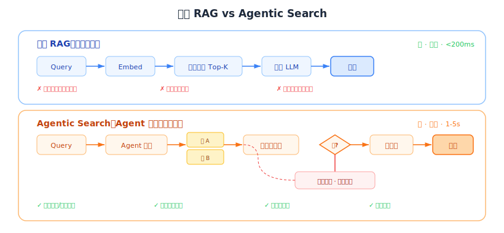

# Agentic Search vs 传统 RAG：趋势分析与战略影响

## 1. 核心概念：Agentic Search 是什么

### 1.1 从线性管线到智能循环

**传统 RAG** 是固定的线性管线：query → embed → 向量搜索 Top-K → 喂给 LLM → 回答。无状态、单步、不能判断检索结果是否够用。

**Agentic Search**（也叫 Agentic RAG、Agentic Retrieval）把自主 AI Agent 包裹在检索管线外面，Agent 可以：
- **规划**：把复杂查询分解为子查询
- **路由**：动态决定使用哪个数据源（向量库、网络搜索、SQL、API、文件系统）
- **评估**：检查检索结果是否充分
- **重试**：改写查询、换数据源、迭代深入
- **校验**：自检生成结果是否有幻觉

### 1.2 架构对比



| 维度 | 传统 RAG | Agentic Search |
|------|---------|---------------|
| **流程** | 线性：检索 → 生成 | 迭代循环，有决策点 |
| **路由** | 无或静态规则 | Agent 动态决定 |
| **多数据源** | 通常单个索引 | 多索引、网络、API、数据库 |
| **自纠错** | 无 | 查询改写、换源重试 |
| **工具使用** | 无 | 计算器、API、代码执行 |
| **质量关卡** | 无 | 相关性评分、幻觉检查 |
| **延迟** | 低（单次检索） | 高（多次 LLM 调用） |

### 1.3 LlamaIndex 的四级演进模型

LlamaIndex（2025.5）提出 RAG 到 Agentic Retrieval 的四级演进：

1. **基础块检索**：vanilla RAG（embed → top-k → 生成）
2. **模式智能**：同一数据支持多种检索模式（chunk 检索、元数据过滤、内容级检索）
3. **自动路由**：Agent 根据 query 自动选择检索模式
4. **多索引系统**：Agent 在异构知识库间自动分类和路由

### 1.4 LangChain 的两个关键模式

**CRAG（Corrective RAG）**：检索后评估文档质量，给出置信度分数，不确定时回退到网络搜索。

**Self-RAG（反思式 RAG）**：用"反思 token"控制 是否检索/检索结果是否相关/生成结果是否有用 的决策。

两者都通过 LangGraph 状态机实现，有决策点、循环和条件分支。

---

## 2. 主要玩家和产品

### 2.1 搜索即服务（Agent 的搜索工具）

| 产品 | 定位 | 关键特点 |
|------|------|---------|
| **Tavily** | Agent 搜索基础设施 | Hybrid RAG（向量库+实时网络搜索），93.3% SimpleQA 准确率，66% token 减少。2026.2 被 Nebius 收购 |
| **Exa** | 为 AI 构建的搜索引擎 | 结构化返回优化机器消费，<180ms，专用索引（代码/金融/新闻/70M+企业/1B+人物），SOC 2。FRAMES 基准 54.4% 领先 |
| **Perplexity** | 消费级 Agentic Search | Deep Research 多步探索，模型无关（GPT-4/Claude/DeepSeek/Grok），正在扩展到"agentic commerce" |
| **秘塔搜索** | 中国市场 Agentic Search | 2025.11 发布自主规划+多步执行功能 |

### 2.2 框架层

| 框架 | 贡献 |
|------|------|
| **LlamaIndex** | 提出"Agentic Retrieval"概念（2025.5），研究 Agent 工具 vs 向量搜索的性能对比 |
| **LangChain / LangGraph** | CRAG 和 Self-RAG 状态机模式，流程工程（决策点+循环+条件路由） |
| **CrewAI** | 多 Agent 协作框架，支持 Agentic RAG 协调 |
| **Letta** | 多 Agent 框架，支持长期记忆 + Agentic 检索 |

### 2.3 向量数据库公司的响应

**Weaviate** 已有完整的 Agentic RAG 文档（单 Agent 路由器、多 Agent RAG 模式），说明向量数据库厂商已经意识到纯向量搜索不够，需要被 Agent 包裹。

---

## 3. 谁会胜出：收敛，不是替代

### 3.1 LlamaIndex 的实测数据

| 场景 | Agent（文件系统工具） | 传统 RAG | 胜者 |
|------|---------------------|---------|------|
| 小数据集质量 | 8.4/10 | 6.4/10 | **Agent** |
| 大数据集（100K+ docs）速度 | 慢/不实际 | 快 | **RAG** |
| 简单事实查找 | 过度设计 | 够用 | **RAG** |
| 多源复杂推理 | 自然适配 | 做不到 | **Agent** |
| 延迟 | ~11s | ~7s | **RAG** |

### 3.2 各自的领地

**Agentic Search 胜出的场景**：
- 需要跨多个数据源推理的复杂问题
- 模糊查询（系统需要先判断需要什么信息）
- 高准确性要求（自纠错和校验比延迟更重要）
- Deep Research 任务（迭代探索）

**传统 RAG 胜出的场景**：
- 单一知识库的简单事实查找（低延迟、低成本）
- 高并发生产系统（RAG 更快更便宜）
- 大规模文档集合（100K+ docs，Agent 探索不实际）
- 成本敏感应用（每个查询多次 LLM 调用太贵）
- 需要确定性的管线（可预测性比灵活性更重要）

### 3.3 趋势判断：走向路由模式

```
未来的主流架构（已经在形成）：

用户查询
    ↓
路由 Agent（轻量级 LLM 判断）
    ├── 简单查询 → 传统 RAG（快、便宜、确定性）
    └── 复杂查询 → Agentic Search（准、灵活、贵）
```

此外，**上下文窗口扩大**（2026 年已达 1-2M tokens）正在改变格局：
- 能放进上下文的数据集 → 直接长上下文处理，两者都不需要
- 超出上下文的数据 → Agentic Search 仍有优势
- 需要实时信息 → Agentic Search 必须

**结论：Agentic Search 不替代 RAG，它替代的是"只有 RAG"。** 两者收敛为一个路由系统的两个分支。

---

## 4. Supermemory 和 HydraDB 的做法

### 4.1 Supermemory：Memory 和 Knowledge 分离为两个 Agent 工具

Supermemory 把 Memory 和 Knowledge 设计为两个独立 API：

| API | 功能 | Agent 何时调用 |
|-----|------|--------------|
| **Memory API** | 提取/追踪用户事实，处理矛盾和时间更新，自动遗忘 | 需要个性化时（"这个用户喜欢什么"） |
| **RAG API** | 语义搜索+元数据过滤的文档检索 | 需要查找事实时（"这个产品的退货政策"） |
| **User Profiles** | 静态长期事实 + 动态近期上下文，~50ms 返回 | 需要快速了解用户时 |

两者都暴露为 Agent 可调用的工具（MCP、LangChain、Vercel AI SDK、OpenAI Agents SDK、Mastra）。

**关键设计：Agent 自己决定何时用 memory、何时用 knowledge。** Supermemory 不做 Agent 框架，它做的是 Agent 能调用的最好的数据工具。这天然兼容 Agentic Search 模式——Agent 在多步推理中按需调用 memory/knowledge。

### 4.2 HydraDB：在检索管线内部做 Agentic

HydraDB 的做法不同——它不暴露为 Agent 工具，而是在检索管线内部实现了 Agentic 能力：
- **查询扩展**：LLM 改写 N 个子查询并行执行
- **三层重排序融合**：向量流 + 图实体流 + chunk 扩展流
- **滑动窗口推理**：LLM 增强每个 chunk 的语义

这些本质上是把"Agentic"能力内化到数据库内部，对外仍是标准的 query → results API。好处是对调用方透明，坏处是灵活性低——Agent 不能自己决定检索策略。

### 4.3 两种路线对比

```
Supermemory 路线（推荐）：
  Agent ←→ 工具 A: Memory recall
        ←→ 工具 B: Knowledge search
        ←→ 工具 C: Web search
  → Agent 控制检索策略，数据层做好每个工具

HydraDB 路线：
  Agent ←→ HydraDB（内部自动做查询扩展、重排序、图遍历）
  → 数据库控制检索策略，Agent 只管调一次
```

趋势上看，**Supermemory 路线更符合 Agentic 时代**：Agent 越来越智能，应该让 Agent 控制策略，数据层专注做好每次工具调用的质量和速度。

---

## 5. 战略分析：ZhiXing 应该支持什么

### 5.1 核心定位：做 Agent 调用的最好的数据类工具

```
传统世界：                    Agentic 世界：
┌──────────┐                ┌──────────────────────┐
│ App/Agent │                │ Agent (规划+路由+评估) │
└─────┬────┘                └──────────┬───────────┘
      │ 单次查询                       │ 多次工具调用
┌─────▼────┐                ┌──────────▼───────────┐
│ RAG 管线  │                │  工具 A: 记忆 recall   │
│ (向量搜索) │                │  工具 B: 知识 search   │
└──────────┘                │  工具 C: 网络搜索      │
                            │  工具 D: SQL 查询      │
                            └──────────────────────┘
                                 ↑
                            ZhiXing 应该在这里：
                            做 Agent 能调用的最好的数据类工具
```

**不做 Agent 框架**（LangChain/LlamaIndex/CrewAI 已占位，这层在快速商品化），**做 Agent 调用的最好的数据类工具**。

### 5.2 投入方向

| 方向 | 投入 | 理由 |
|------|------|------|
| 更好的 RAG | ✅ 必须做 | Agentic 的每次工具调用底层仍是检索，检索质量决定最终效果 |
| Agentic Search 友好 | ✅ 必须做 | 不是做 Agent，是让 API 对 Agent 友好（MCP、结构化返回、元数据） |
| 做 Agent 框架 | ❌ 不做 | 已有 LangChain/LlamaIndex/CrewAI，商品化竞争 |

### 5.3 ZhiXing 暴露给 Agent 的工具集设计

```
工具 1: zhixing.recall(query, user_id)
  → 返回与该用户相关的记忆（facts/traits/episodes）
  → 带置信度分数、时间标签、来源归因
  → Agent 用来个性化回答

工具 2: zhixing.search(query, collection_id)
  → 知识库语义搜索（向量+BM25+图增强）
  → 支持元数据过滤、L0/L1/L2 分层返回
  → Agent 用来查找事实

工具 3: zhixing.profile(user_id)
  → ~50ms 返回用户画像摘要（借鉴 Supermemory）
  → Agent 用来快速了解用户偏好

每个工具返回结构化元数据（支持 Agent 自评估）：
{
  "results": [...],
  "confidence": 0.87,        ← Agent 用来判断是否需要再查
  "freshness": "2026-03-16", ← Agent 用来判断是否过时
  "token_cost": 340           ← Agent 用来管理 token 预算
}
```

### 5.4 Agent 友好的关键设计原则

1. **Memory 和 Knowledge 是两个独立工具**（Supermemory 验证了这个模式）—— Agent 推理时能明确选择"查记忆"还是"查知识"
2. **返回丰富元数据**（置信度、时间、来源）—— 让 Agent 能评估检索质量，决定是否重新检索
3. **支持 MCP 协议** —— OpenClaw、Claude Code、Cursor 都在推 MCP 作为工具接口标准
4. **每次调用要快**（<200ms）—— Agentic 模式下一个用户问题可能触发 3-10 次检索调用
5. **L0/L1/L2 天然适配 Agentic** —— Agent 可以先要 L0 摘要快速扫描，再按需请求 L1/L2

---

## 6. 对 ZhiXing 产品覆盖图的影响

之前 ZhiXing 定位为"不做知识（RAG）"。加入知识能力后，覆盖图更新：

```
                    知识        记忆        对话历史      上下文组装
                  Knowledge    Memory      History     Assembly
                 ─────────  ─────────  ─────────  ─────────
 ZhiXing         ████████   ████████   ░░░░░░░░   ░░▓▓░░░░
 (新定位)          知识检索     记忆智能    待定        注入记忆
                  RAG+搜索    提取/反思              分层加载
                              /召回/遗忘

 vs Supermemory   ▓▓▓▓▓▓▓▓   ████████   ░░░░░░░░   ░░▓▓░░░░
                  6个连接器     记忆提取               注入记忆
                  文档导入

 vs OpenViking    ████████   ████████   ░░░░░░░░   ████████
                  资源/技能     记忆       不管历史    L0/L1/L2
                  文件系统     文件系统                全面组装
```

**ZhiXing vs Supermemory 的差异化**：
- Trait 反思引擎（Supermemory 没有）
- 中国市场合规（数据在中国）
- dbay.cloud 成本优势（Serverless PG）
- L0/L1/L2 分层加载（Supermemory 没有）

---

## 参考链接

### Agentic Search 概念
- [LlamaIndex: RAG is Dead, Long Live Agentic Retrieval](https://www.llamaindex.ai/blog/agentic-retrieval)
- [LangChain: Self-Reflective RAG with LangGraph](https://blog.langchain.dev/agentic-rag-with-langgraph/)
- [Weaviate: Agentic RAG Patterns](https://weaviate.io/blog/agentic-rag)

### 搜索即服务
- [Tavily: Search API for AI Agents](https://tavily.com/)
- [Exa: Search Engine Built for AI](https://exa.ai/)
- [Perplexity Deep Research](https://www.perplexity.ai/)
- [秘塔搜索 Agentic Search](https://metaso.cn/)

### 行业分析
- [LlamaIndex: Filesystem Tools vs Vector Search for Agents](https://www.llamaindex.ai/blog/agent-tools-vs-rag)
- [Tavily Hybrid RAG: Context Engineering for Agents](https://tavily.com/blog/hybrid-rag)
