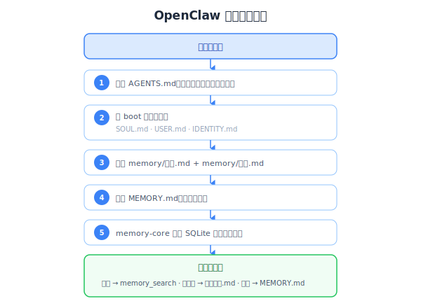

# Claude Code 和 OpenClaw 原生记忆系统分析

## 1. Claude Code 记忆系统

### 1.1 文件组成

```
~/.claude/
├── projects/
│   └── -Users-jacky-code-hilobster/
│       ├── memory/                    ← 持久记忆（跨会话）
│       │   ├── MEMORY.md             ← 索引文件（指针+描述）
│       │   ├── cci_deployment.md      ← 具体记忆文件
│       │   └── dbay_cloud.md          ← 具体记忆文件
│       ├── *.jsonl                     ← 会话历史（每会话一个）
│       └── */subagents/               ← 子 agent 元数据
├── settings.json                       ← 全局配置
└── history.jsonl                       ← 全局会话索引

项目根目录:
└── CLAUDE.md                          ← 项目指令（git 跟踪）
```

### 1.2 记忆类型

Claude Code 定义了四种记忆类型，通过 YAML frontmatter 标注：

| 类型 | 用途 | 示例 |
|------|------|------|
| `user` | 用户角色、偏好、知识水平 | "用户是数据科学家，关注日志系统" |
| `feedback` | 用户对 Claude 行为的纠正 | "不要在测试中 mock 数据库" |
| `project` | 项目动态、目标、时间线 | "3月5日后冻结非关键合并" |
| `reference` | 外部资源位置指针 | "pipeline bug 在 Linear INGEST 项目中追踪" |

记忆文件格式：
```markdown
---
name: dbay.cloud 数据库连接
description: asyncpg 需 sslnegotiation=direct
type: reference
---
具体内容...
```

### 1.3 写入机制

| 文件 | 写入方式 | 触发条件 |
|------|---------|---------|
| `CLAUDE.md` | 用户手动 or Claude 辅助编辑 | 用户主动维护项目规范 |
| `memory/*.md` | Claude 用 Write 工具写入 | 用户说"记住这个"，或 Claude 判断值得记忆 |
| `MEMORY.md` | Claude 用 Edit 工具更新索引 | 每次新增/修改记忆文件时同步更新 |
| `*.jsonl` | 系统自动追加 | 每条消息交互自动写入 |

### 1.4 读取机制

- **CLAUDE.md** + **memory/*.md**：每次新对话开始时**全量注入**到 system prompt
- `MEMORY.md` 限制 200 行，超出截断
- **无检索**：不做任何语义匹配，全部塞进上下文窗口
- 会话历史（JSONL）：仅在恢复会话时加载

### 1.5 优缺点

**优点：**
1. **极简可靠**：纯文件，无外部依赖，不会挂
2. **人可读可编辑**：用户可以直接改 Markdown
3. **可版本控制**：CLAUDE.md 随代码 git 跟踪
4. **透明**：用户能看到所有记忆内容
5. **精确**：全量加载不会遗漏，不存在检索召回率问题
6. **延迟低**：读文件比 API 调用快几个数量级

**不足：**
1. **不可扩展**：记忆量受上下文窗口限制
2. **无语义检索**：记忆多了以后无法按相关性筛选
3. **无自动遗忘**：过时记忆需要手动清理
4. **无跨项目共享**：每个项目的记忆完全隔离
5. **无记忆关联**：扁平文件结构，无法表达记忆间的关系
6. **类型系统简陋**：只有四类，靠 LLM 自律执行

**关键洞察**：Claude Code 的记忆系统之所以"够用"，是因为编码助手的记忆量天然很小——一个项目的规范、用户偏好、关键决策，加起来也就几千 token。它不需要检索，全量加载就够了。

### 1.6 发展趋势

#### 近期更新时间线

| 版本 | 日期 | 记忆相关变更 |
|------|------|------------|
| 2.1.59 | 2026-02 | 自动记忆上线（默认开启） |
| 2.1.33 | 2026-02 | 子 Agent 独立记忆目录（`memory` frontmatter） |
| 2.1.74 | 2026-03 | `autoMemoryDirectory` 自定义路径；修复流式 API 内存泄漏 |
| 2.1.75 | 2026-03 | 记忆文件 last-modified 时间戳（新旧推理） |
| 2.1.76 | 2026-03 | `/context` 命令显示记忆膨胀警告和优化建议 |

#### 官方态度：明确拒绝复杂化

**关键信号**：GitHub Issue #87（42 票，请求高级记忆工具）被关闭为 **"not planned"**。Anthropic 选择了轻量 Markdown 方案，自动记忆（v2.1.59）是他们的最终答案。

设计原则：
- 记忆是**本地的**，不跨设备同步
- MEMORY.md 上限 **200 行**，溢出到主题文件
- 记忆以用户消息注入（非 system prompt），无严格执行保证
- 子 Agent 可维护独立记忆目录

#### 社区痛点

开发者社区最常提到的问题：

1. **会话失忆**：每次新对话只有 MEMORY.md，无法语义召回过去对话
2. **压缩有损**：auto-compact 丢弃早期上下文，不可恢复（Issue #3841）
3. **无跨设备同步**：记忆文件纯本地
4. **无结构化搜索**：记忆检索是线性文件读取
5. **200 行上限**：大项目快速超出
6. **进程内存泄漏**：长会话消耗 15-129GB RAM（Issues #11315, #22042）

#### 第三方 MCP 记忆生态

社区已涌现大量填补空白的 MCP 记忆服务：

| 项目 | 机制 | 特点 |
|------|------|------|
| **Anthropic Knowledge Graph Memory** | 官方 MCP server | 实体-关系存储，Claude Desktop/Code 共享 |
| **Mem0** | 向量+KV+可选图 | 混合存储 |
| **MemCP** | SQLite | 受 MIT CSAIL 递归记忆研究启发 |
| **claude-code-vector-memory** | 向量搜索 | 会话摘要语义检索 |
| **memory-graph** | Neo4j | 图数据库关系记忆+时间标记 |

#### 趋势判断

**Claude Code 的策略是：核心保持简单（Markdown），通过 MCP 协议开放扩展。**

- ❌ 不会内置向量/语义搜索
- ❌ 不会内置知识图谱
- ✅ 会持续完善 Markdown 记忆（时间戳、子 Agent 记忆、膨胀警告）
- ✅ MCP 是指定的扩展点

**对 ZhiXing 的启示**：Claude Code 的记忆市场不大（编码场景不需要复杂记忆），但 MCP 生态的活跃说明**开发者确实需要更好的记忆**——只是在别的场景（个人助理、企业 Agent）。ZhiXing 的 MCP server 已有 13 个工具，定位正确。

---

## 2. OpenClaw 原生记忆系统

### 2.1 Workspace 文件体系

OpenClaw 使用一套完整的 Markdown workspace 文件：

```
agent-workspace/
├── AGENTS.md          ← 操作指令（优先级、边界、工作流）— 最高优先级
├── SOUL.md            ← 人格、语气、行为边界
├── USER.md            ← 用户信息（名字、时区、偏好）
├── IDENTITY.md        ← 结构化身份（名字、角色、目标、语音风格）
├── TOOLS.md           ← 本地工具使用说明
├── HEARTBEAT.md       ← 定时任务/心跳配置
├── BOOT.md            ← 启动序列指令
├── MEMORY.md          ← 长期记忆（策划过的知识）
└── memory/
    ├── 2026-03-16.md  ← 今天的日记
    ├── 2026-03-15.md  ← 昨天的日记
    └── ...            ← 历史日记
```

### 2.2 两层记忆架构

**第一层：日记文件（Daily Notes）— 短期记忆**
- 路径：`memory/YYYY-MM-DD.md`
- 写入：AI 在会话中自动追加写入当天文件
- 读取：每次会话启动时只读**今天 + 昨天**两个文件
- 类似人类的"工作记忆"，只保留最近的上下文

**第二层：MEMORY.md — 长期记忆**
- 写入：AI 或用户定期从日记中提炼重要信息，手动迁移到 MEMORY.md
- 读取：每次会话启动时全量加载
- 类似人类的"长期记忆"，经过筛选和整理

### 2.3 检索机制（memory-core 插件）

OpenClaw 不是简单的全量加载，它有一套本地 RAG 检索系统：

```
Markdown 文件
    ↓ 分块 + 向量化
SQLite 索引 (~/.openclaw/memory/<agentId>.sqlite)
    ↓
混合检索：
├── 向量搜索（sqlite-vec, 余弦相似度）权重 0.7
├── BM25 全文搜索（SQLite FTS5）权重 0.3
└── RRF 融合排序
    ↓
MMR 重排（Maximal Marginal Relevance, 平衡相关性和多样性）
    ↓
时间衰减（指数衰减，近期记忆权重更高）
```

关键特点：
- **Markdown 是 source of truth**：SQLite 索引只是加速查找，原始数据始终是人可读的 Markdown
- **存储引擎**：SQLite（轻量，本地优先）
- **嵌入方式**：支持本地模型或远程 API
- **可选后端**：`memory.backend = "qmd"` 可切换为 QMD sidecar

### 2.4 会话加载流程



### 2.5 OpenClaw 原生的 Token 消耗问题

OpenClaw 原生存在结构性的 token 浪费：

```
原生 OpenClaw 的上下文构成（一个典型会话）：
┌──────────────────────────────────────────┐
│ System Prompt                            │ ~2k tokens
│ AGENTS.md + SOUL.md + USER.md            │ ~3-5k tokens
│ MEMORY.md（全量加载）                     │ ~1-10k tokens
│ 今天+昨天的日记（全量加载）               │ ~2-20k tokens
│ memory_search 召回结果                    │ ~1-5k tokens
│ 对话历史（持续增长，不可控）              │ ~10k-200k+ tokens
└──────────────────────────────────────────┘
```

痛点：
1. 对话历史无限增长：每条消息、每个工具结果都累积，15-20 分钟就能到几万 token
2. 日记文件越来越大：一天内多次会话，daily note 不断追加
3. MEMORY.md 全量加载：不管相关不相关，全塞进去
4. context compaction 会丢信息：OpenClaw 的上下文压缩机制会静默丢弃重要信息

### 2.6 优缺点

**优点：**
1. **Markdown 即 source of truth**：人可读、可编辑、可 git 跟踪，同时有检索能力
2. **两层架构设计合理**：日记 → 长期记忆的提炼过程模拟人类记忆巩固
3. **本地优先**：SQLite 索引完全本地，无需外部服务，离线可用
4. **身份系统完整**：SOUL/IDENTITY/USER 分离，角色定义清晰
5. **检索 + 全量加载混合**：核心文件全量加载，历史记忆按需检索
6. **轻量级**：SQLite 比 PostgreSQL/Qdrant 轻得多

**不足：**
1. **记忆提炼靠人/AI 自律**：日记 → MEMORY.md 的迁移不是自动的，容易堆积
2. **无图谱关联**：记忆之间无结构化关系，不能做关联推理
3. **无情感/重要性标注**：所有记忆平等，无法按重要性筛选
4. **单用户设计**：每个 agent workspace 独立，不支持多用户隔离
5. **嵌入质量受限**：本地小模型的嵌入质量不如云端大模型
6. **日记只读两天**：第三天前的日记只能靠 memory_search 找到

### 2.7 发展趋势

#### 近期重要更新

**v2026.3.11（2026-03-12）—— 多模态记忆**
- 图片和音频索引（opt-in），支持 JPG/PNG/WEBP/GIF/HEIC + MP3/WAV/OGG 等
- 使用 `gemini-embedding-2-preview` 嵌入

**v2026.3.7（2026-03-08）—— ContextEngine 插件接口（里程碑）**
- 完整生命周期钩子：`bootstrap` → `ingest` → `assemble` → `compact` → `afterTurn` → `prepareSubagentSpawn` → `onSubagentEnded`
- **上下文管理完全可插拔**——记忆的摄入、组装、压缩、检索都可以被插件替换
- 这是 OpenClaw 记忆架构最大的一次变化

**v2026.2.x（2026-02）**
- 记忆架构大改，提升检索速度（v2026.2.2）
- 召回的记忆标记为"不可信上下文"防止 prompt injection（v2026.2.14）

**实验性功能（已上线但 opt-in）**
- **Session Memory Search**：索引对话记录，跨会话可搜索
- **QMD 后端**：本地搜索 sidecar（BM25+向量+重排序）
- **压缩前记忆刷写**：压缩前静默提醒 AI 持久化重要记忆
- **批量索引**：OpenAI/Gemini/Voyage 异步批处理

#### 社区正在讨论什么——按主题分类

**记忆类型结构化（最热门）**

| Issue/Discussion | 提案 | 状态 |
|-----------------|------|------|
| **#13991** 关联层次记忆 | 层次粒度+关联图+Zettelkasten 结构 | ❌ 关闭（NOT_PLANNED） |
| **#22077** 三层记忆架构 | 情景层(30-60天)→语义层(事实/偏好)→过程层(技能/模式) | ⚠️ 开放但标记 stale |
| **#2910** 知识图谱记忆 | OpenMemory/Cognee/ZEP 集成 | ✅ 通过社区插件关闭 |
| **Discussion #17692** | 五层系统：T0 基础→T1 工作→T2 日常→T3 短期→T4 长期 | 讨论中 |
| **研究文档** Retain/Recall/Reflect | 类型化事实 W/B/O/S + 实体页面 + 置信度演化 | 探索阶段，无时间表 |

**关键洞察**："三层记忆架构"提出者指出：**"难的不是检索，而是决定什么从 Layer 1 晋级到 Layer 2"**——这正是 ZhiXing 反思引擎在做的事。

**记忆压缩/膨胀（第二热门）**

| Issue | 问题 | 状态 |
|-------|------|------|
| **#24624** MEMORY.md 注入模式 | 6,500+ token 每次注入，有用户报告每天浪费 12 万 token | 开放 |
| **#42877** 记忆大小限制 | MEMORY.md 无限增长（3,800 字节+），AI 只追加不整理 | 开放 |
| **#3772** 压缩时保留近期上下文 | 压缩丢失近期对话纹理 | 开放 |
| **#7926/#17461** 压缩模型可配置 | 压缩用主模型（如 Opus）太浪费 | 开放 |

**关键洞察**：OpenClaw 的记忆膨胀问题是**真实且普遍的**。社区已经在手动维护 `MEMORY-ARCHIVE.md`。这正是 ZhiXing 对话压缩功能的目标市场。

**存储后端替代（第三热门）**

| Issue | 提案 | 状态 |
|-------|------|------|
| **#15093** PostgreSQL+pgvector 后端 | 替代 QMD，PoC 实现 200ms vs QMD 15-16 秒冷启 | 开放 |
| **#11308** QMD 系统性问题 | 14+ 子问题，进程模型冷加载 2.1GB GGUF 模型 | 已关闭（大部分修复） |
| **#9581** QMD 改为 MCP server 模式 | 每次查询新进程→应改为常驻服务 | 关闭（not planned） |

**关键洞察**：QMD 的性能问题（15-16 秒冷启动）让用户苦不堪言，PostgreSQL+pgvector 是呼声最高的替代方案——**这恰好是 ZhiXing 的底层存储**。

**第三方记忆插件生态（已经起步）**

| 插件 | 后端 | 特点 |
|------|------|------|
| **openclaw-memory-mem0** | Mem0（自托管） | LLM 事实提取+去重 |
| **openclaw-supermemory** | Supermemory 云 | 持久用户画像+自动召回 |
| **memory-lancedb-pro** | LanceDB | 混合检索+cross-encoder+多范围隔离 |
| **openclaw-graphiti-memory** | Graphiti+Neo4j | 时序知识图谱 |
| **MemOS Cloud Plugin** | MemOS Cloud | 执行前记忆预召回 |
| **openclaw-engram** | QMD+本地 | LLM 提取+Markdown 存储 |
| **PowerMem** (Issue #7021) | 密集+全文+图检索 | 80-90% token 压缩 |

#### 维护者态度信号

**接受的方向：**
- ContextEngine 插件接口（已发布）—— 偏好可插拔架构而非单体核心
- 多模态记忆（已发布）—— 主动扩展记忆模态
- 社区插件作为替代后端的答案（Issue #2910 通过插件关闭）

**明确拒绝的：**
- 关联层次记忆（Issue #13991 —— NOT_PLANNED）
- QMD MCP server 模式（Issue #9581 —— not planned）

**无回应（开放）：**
- 三层记忆架构（#22077）
- MEMORY.md 注入模式（#24624）
- 记忆大小限制（#42877）
- PowerMem 集成（#7021）
- PostgreSQL+pgvector 后端（#15093）

#### 趋势判断

**OpenClaw 的策略是：核心保持 Markdown+SQLite，通过 ContextEngine 插件开放记忆系统的完全替换。**

这对 ZhiXing 意味着：

1. **机会窗口已打开**：ContextEngine 插件接口让第三方记忆系统可以完全接管 OpenClaw 的记忆生命周期
2. **竞争已经开始**：Mem0、MemOS、Supermemory、LanceDB 等已有 OpenClaw 插件
3. **痛点已验证**：记忆膨胀（12 万 token/天）、QMD 性能差（15 秒冷启）、缺乏结构化记忆——社区在喊"记忆坏了"
4. **核心团队不会自己做**：结构化记忆提案被关闭，说明 OpenClaw 团队把这个留给了生态
5. **PostgreSQL+pgvector 是用户想要的**：Issue #15093 正是 ZhiXing 的天然优势

---

## 3. Claude Code vs OpenClaw 对比

| 维度 | Claude Code | OpenClaw |
|------|------------|---------|
| **文件类型** | CLAUDE.md + memory/*.md | AGENTS/SOUL/USER/IDENTITY/MEMORY.md + daily notes |
| **身份系统** | 无（靠 CLAUDE.md 中的指令） | 完整（SOUL.md 人格 + IDENTITY.md 身份） |
| **短期记忆** | 会话 JSONL（系统管理） | daily notes（AI 主动写入 Markdown） |
| **长期记忆** | memory/*.md（分类存储） | MEMORY.md（集中存储） |
| **检索能力** | **无**（全量加载） | **有**（SQLite 向量 + BM25 混合检索） |
| **加载策略** | 全量注入 system prompt | boot 序列 + 按需 memory_search |
| **人可编辑** | 是 | 是 |
| **Source of truth** | Markdown 文件 | Markdown 文件 |
| **索引** | 无 | SQLite（sqlite-vec + FTS5） |
| **记忆衰减** | 无 | 有（时间衰减） |
| **跨项目** | 不支持 | 不支持（每个 workspace 独立） |

### 共同的设计哲学

两者都选择了 **Markdown 文件作为 source of truth**，这不是巧合：
- 开发者/用户对"AI 记住了什么"有强烈的透明度需求
- Markdown 是人机共读的最佳格式
- 文件系统提供了天然的版本控制（git）和编辑能力
- 简单意味着可靠——不依赖外部服务

### 共同的不足

- 记忆量增长后都会面临 token 压力
- 都缺乏跨 workspace/项目 的记忆共享
- 都缺乏自动记忆整理（从短期 → 长期的迁移靠自律）

---

## 4. 综合趋势判断

### 4.1 三大确定性趋势

**趋势 1：记忆系统正在从"核心内置"走向"可插拔生态"**

- Claude Code：MCP 协议扩展
- OpenClaw：ContextEngine 插件接口
- OpenJiuWen：目前无接口，但这正是机会

**含义**：ZhiXing 不需要等平台原生支持，插件/MCP 就是入场券。但竞争者（Mem0、MemOS、Supermemory）已经在同一赛道。

**趋势 2：记忆膨胀和 Token 浪费是已验证的痛点**

- OpenClaw 用户报告每天浪费 12 万 token 在 MEMORY.md 注入上
- Claude Code 用户受 200 行上限困扰
- QMD 15 秒冷启动让记忆搜索形同虚设

**含义**：对话压缩（省 token 70%+）和分层加载（省 token 83%+）是**最快可感知的价值**，应作为 P0 优先级。

**趋势 3：结构化记忆是社区强需求，但平台方不做**

- OpenClaw 两次关闭结构化记忆提案（NOT_PLANNED）
- 社区持续提出三层/五层/图谱记忆方案
- 平台方选择留给生态

**含义**：ZhiXing 的 fact/episode/trait/procedural 类型系统和 9 步反思引擎正好填补这个空白。这不是功能过剩——是市场需要。

### 4.2 两个需要关注的风险

**风险 1：Supermemory 的竞争**

Jeff Dean 投资 + 已有 OpenClaw 插件 + 跨平台定位。Supermemory 是 ZhiXing 最直接的竞争对手。详细分析见 [08-jeff-dean-supermemory.md](./08-jeff-dean-supermemory.md)。

**风险 2：平台方随时可能改变策略**

OpenClaw 的 Retain/Recall/Reflect 研究文档说明他们**在思考**结构化记忆。如果核心团队决定自己做，第三方的空间会被压缩。

对策：尽快建立用户基础和数据壁垒，让"迁移成本"成为护城河。

---

## 参考链接

### Claude Code
- [How Claude remembers your project - Official Docs](https://code.claude.com/docs/en/memory)
- [Feature Request: Advanced Memory Tool - GitHub Issue #87](https://github.com/anthropics/claude-code/issues/87)
- [Context Memory Loss After Compact - GitHub Issue #3841](https://github.com/anthropics/claude-code/issues/3841)
- [Claude Code Release Notes](https://releasebot.io/updates/anthropic/claude-code)
- [Create custom subagents - Claude Code Docs](https://code.claude.com/docs/en/sub-agents)

### OpenClaw
- [OpenClaw Memory 官方文档](https://docs.openclaw.ai/concepts/memory)
- [OpenClaw Memory Architecture - Daily Notes and Long-Term Memory](https://zenvanriel.com/ai-engineer-blog/openclaw-memory-architecture-guide/)
- [OpenClaw Local Memory System: Storing AI Memories in Markdown](https://eastondev.com/blog/en/posts/ai/20260205-openclaw-memory-system/)
- [We Extracted OpenClaw's Memory System (memsearch)](https://milvus.io/blog/we-extracted-openclaws-memory-system-and-opensourced-it-memsearch.md)
- [Local-First RAG: Using SQLite for AI Agent Memory with OpenClaw](https://www.pingcap.com/blog/local-first-rag-using-sqlite-ai-agent-memory-openclaw/)
- [OpenClaw memory files explained](https://openclaw-setup.me/blog/openclaw-memory-files/)
- [Memory & Search - DeepWiki](https://deepwiki.com/openclaw/openclaw/3.4.3-memory-and-search)
