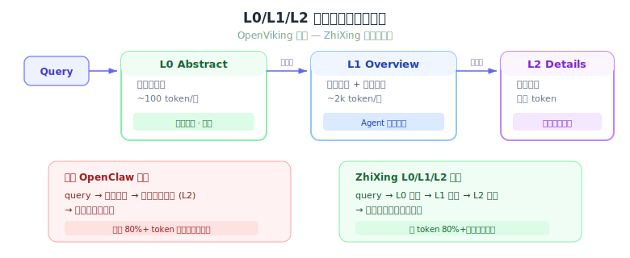
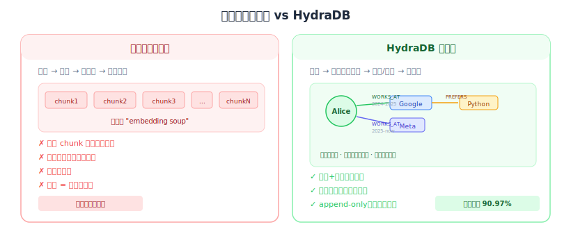

# 第三方记忆系统分析：MemOS、OpenViking、HydraDB

## 1. MemOS（MemTensor）

### 1.1 概述

MemOS 是 MemTensor 开发的 AI 记忆操作系统，已推出 OpenClaw 插件（Cloud + Local 两个版本）。核心卖点是降低 OpenClaw 的 token 消耗。

- 官方宣称：token 消耗降低 **72%**，记忆精度从 23.73% 提升到 31.68%
- 基准测试：LOCOMO 长对话基准（15.6M tokens → 4.4M tokens）
- GitHub: [MemTensor/MemOS](https://github.com/MemTensor/MemOS)
- 插件发布时间：2026 年 3 月 8 日

### 1.2 核心机制：精准召回替代全量注入

```
原生 OpenClaw:
  每轮对话 = system prompt + 全部历史 + 全部 MEMORY.md 文件
  记忆部分 token ∝ MEMORY.md 总大小（随对话增长，不可控）

MemOS:
  每轮对话 = system prompt + 全部历史 + MemOS 召回的相关记忆（固定预算）
  记忆部分 token ∝ 召回预算（可配置，固定上限）

注意：MemOS 作为 kind: "memory" 插件，不能压缩对话历史——
对话历史仍由 OpenClaw 原生 ContextEngine 管理。
72% 的省 token 主要来自记忆注入侧（精准召回 vs MEMORY.md 全量注入）。
```

### 1.3 两阶段生命周期

**Recall 阶段（每轮对话前）：**
- 用当前 query 对 MemOS 做语义搜索
- 只返回最相关的记忆（可配置条目数）
- 注入上下文替代 MEMORY.md 全量注入

**Save 阶段（每轮对话后）：**
- 从新对话中提取事实/偏好/关系存入记忆库
- 对记忆条目做去重和合并（记忆库内部优化，非对话历史压缩）
- 记忆质量随时间提升而非降低

### 1.4 额外特性

- **Skill Memory**：跨任务的过程性记忆复用和演化
- **Multi-Agent Sharing**：通过统一 user_id 实现多 agent 共享记忆
- **Local Plugin**：SQLite + FTS5 + 向量的本地版本，含 Memory Viewer Dashboard

### 1.5 基准测试数据

| 指标 | 原生 OpenClaw | MemOS |
|------|-------------|-------|
| Token 消耗 | 15.6M | 4.4M (**-72%**) |
| 记忆精度 | 23.73% | 31.68% (**+33%**) |
| 模型调用频率 | 基准 | 降低 59.5% |

基准：LOCOMO 长对话基准（1540 个测试用例）

---

## 2. OpenViking（字节跳动/火山引擎）

### 2.1 概述

OpenViking 是字节跳动 Volcano Engine Viking 团队开源的上下文数据库，专为 AI Agent 设计。核心创新是用文件系统范式统一管理 Agent 的上下文。

- GitHub: [volcengine/OpenViking](https://github.com/volcengine/OpenViking)
- 15,000+ GitHub Stars（截至 2026-03-28，较初始调研时 1,610 增长 ~10x）
- 发布时间：2026 年初，当前版本 v0.2.13
- 官网：[openviking.ai](https://www.openviking.ai/)

### 2.2 核心创新：L0/L1/L2 三层上下文按需加载



| 层级 | 内容 | Token 量 | 用途 |
|------|------|---------|------|
| **L0 Abstract** | 一句话摘要 | ~100 tokens | 快速过滤和识别 |
| **L1 Overview** | 核心信息+使用场景 | ~2k tokens | Agent 规划决策 |
| **L2 Details** | 完整原文 | 不限 | 深度阅读时按需加载 |

写入时自动生成 L0/L1 摘要（TreeBuilder 异步处理），大多数场景只需 L0/L1，省 token 的效果极其显著。

### 2.3 文件系统范式

所有上下文映射到 `viking://` 协议的虚拟目录：

```
viking://
├── memory/           ← 记忆
│   ├── facts/
│   └── episodes/
├── resources/        ← 外部资源
└── skills/           ← 能力/工具
```

Agent 可以像开发者操作文件一样操作上下文（ls, find, read），提供确定性的上下文操作能力。

### 2.4 目录递归检索策略

1. **意图分析**：生成多个检索条件
2. **初始定位**：向量检索快速定位高分目录
3. **精细探索**：在目录内二次检索
4. **递归下钻**：如有子目录则递归重复
5. **结果聚合**：获取最相关的上下文

### 2.5 OpenClaw 集成实现：L0/L1/L2 不是 Agent API，是检索管线内部优化

深入调研 OpenViking 的 OpenClaw 插件源码（`volcengine/OpenViking/examples/openclaw-memory-plugin/`）后，发现一个关键认知纠偏：

**L0/L1/L2 主要不是 Agent 面对的多步交互 API，而是检索管线的内部优化。** 有两种工作模式：

#### 模式 A：自动模式（autoRecall）—— 83% 省 token 的主要来源

```
用户发送消息
    ↓ before_agent_start 钩子自动触发
插件内部：
    1. 用用户消息做向量搜索 → 匹配 L0 摘要定位相关目录
    2. 在目录内二次检索 → 用 L1 概要做重排序和格式化
    3. 只在必要时加载 L2 完整内容
    ↓
将预过滤的记忆注入 <relevant-memories> 上下文
    ↓
Agent 开始响应（完全不感知 L0/L1/L2 的存在）
```

Agent 看到的只是注入到 prompt 中的预过滤记忆——它不需要主动请求 L0 列表再逐个展开。**这就是为什么不改 OpenClaw 也能实现分层加载。**

#### 模式 B：Agentic 模式（CLI via bash）—— 可选的高级用法

Agent 通过注入 system prompt 的 CLI 指令显式导航 OpenViking 文件系统：

```bash
ov ls viking://          # 列目录（显示 L0 摘要）
ov abstract viking://... # 获取 L0 一句话摘要
ov overview viking://... # 获取 L1 概要（~2k tokens）
ov read viking://...     # 获取 L2 完整内容
ov find "query"          # 语义搜索（可配置返回层级）
```

这种模式**需要多次工具调用**（Agent 浏览 L0 → 决定展开 L1 → 按需加载 L2），但只在复杂检索场景使用。

#### 关键技术细节

- **L0/L1 在 ingest 时预计算**：`SemanticProcessor` 使用 VLM 异步生成，存储为物理文件（`.abstract.md` / `.overview.md`），不是检索时动态生成
- **层级递归构建**：子目录的 L0 摘要自底向上聚合为父目录的 L1 概要，形成可导航的层级结构
- **检索管线（HierarchicalRetriever）三阶段**：
  1. Global Positioning：向量搜索 L0 摘要定位高分目录
  2. Recursive Exploration：多级目录遍历，得分传播（`Final = 0.5 × Parent + 0.5 × Vector Similarity`）
  3. Refinement：L1 重排序，仅对最终结果加载 L2
- **不需要专用工具定义**：OpenViking RFC 推荐通过 bash 工具注入 CLI 指令，而非注册独立的 function-calling schema

#### 对 ZhiXing 的关键启示

**ZhiXing 实现分层加载不需要修改 OpenClaw，只需在 ContextEngine 插件内部优化检索管线：**

1. `ingest()` 时为每条记忆预生成 L0（一句话）和 L1（核心信息）摘要
2. `recall()` 内部先搜 L0 定位 → L1 精筛 → 按需返回 L2
3. 通过 ContextEngine 的 `assemble` 钩子将预过滤结果注入上下文
4. Agent 无感知，用户只看到 token 下降

这比之前设想的"Agent 多次调用 recall(detail_level=L0/L1/L2)"更简单、更实用。

### 2.6 部署方式与向量存储

OpenViking 不绑定任何特定向量数据库，而是通过 `VikingDBManager` 抽象层支持四种后端：

| 后端 | 实现 | 适用场景 |
|------|------|---------|
| **Local** | 内嵌 C++ 向量库（LocalCollection） | 本地开发，零依赖 |
| **HTTP** | 连接远程 OpenViking Server | 团队协作，多客户端共享 |
| **Volcengine** | 火山引擎 VikingDB 云服务 | 生产环境，弹性扩缩 |
| **VikingDB** | 私有化部署的 VikingDB | 企业内网，数据不出域 |

**关键架构组件：**
- **AGFS（Agent Global File System）**：Go 实现的文件服务，管理 L0/L1/L2 物理文件（`.abstract.md` / `.overview.md`），可本地运行或远程部署
- **向量检索**：通过 VikingDBManager 委托给上述四种后端之一，不内嵌 pgvector 或 LanceDB
- **Embedding**：支持火山引擎豆包模型（推荐，低成本）、OpenAI、Jina、MiniMax、Azure OpenAI、Gemini、Ollama、Voyage、LiteLLM（v0.2.8+ 大幅扩展），通过 `~/.openviking/ov.conf` 配置
- **Rerank**：v0.2.8+ 在 HierarchicalRetriever 中集成 rerank 服务，增强分层检索质量

**四种部署模式：**

| 模式 | AGFS | 向量库 | 适用 |
|------|------|--------|------|
| Embedded | 子进程 | Local C++ | 单机开发 |
| HTTP Server | 独立服务 | Local/Cloud | 团队共享 |
| HTTP Client | 连接远端 | 远端 | 多客户端 |
| Hybrid | 远程 AGFS | 远程向量库 | 分布式生产 |

**关键差异 vs ZhiXing：**
- OpenViking 的向量存储是**独立组件**（VikingDB 或 C++ 嵌入库），ZhiXing 用 **pgvector 统一在 PostgreSQL 内**
- OpenViking 的 L0/L1 是**物理文件**（存在 AGFS 文件系统中），ZhiXing 计划存为**PG 表字段**
- OpenViking 需要 Go 运行时（AGFS），ZhiXing 只需要 Python + PG
- **没有托管版 SaaS**——OpenViking 是纯开源，需自行部署（或用火山引擎云服务做后端）

### 2.7 基准测试数据

| 配置 | 任务完成率 | 输入 Token |
|------|----------|-----------|
| 原生 OpenClaw | 35.65% | 24,611,530 |
| OpenClaw + OpenViking (-memory-core) | 52.08% (**+46%**) | 4,264,396 (**-83%**) |
| OpenClaw + OpenViking (+memory-core) | 51.23% (**+44%**) | 2,099,622 (**-91%**) |

基准：LoCoMo10 数据集，1540 个测试用例，使用 seed-2.0-code 模型

**为什么开启 memory-core 反而更省 token（-83% → -91%）？**

这个数据反直觉——加了一个额外的记忆系统，token 反而更少了。原因是 **memory-core 不只是"多加一个记忆来源"，它还包含 OpenClaw 的上下文压缩（compaction）机制**：

```
关闭 memory-core 时（4.26M tokens）：
├── OpenViking 接管长期记忆检索（L0/L1/L2 高效）  ← 记忆 token 大幅减少
└── 对话历史原样累积（无 compaction）              ← 历史 token 持续增长
    4.26M 中大量是未压缩的对话历史

开启 memory-core 时（2.1M tokens）：
├── OpenViking 管长期记忆（L0/L1/L2）              ← 记忆 token 大幅减少
└── memory-core 的 compaction 压缩旧对话历史        ← 历史 token 也大幅减少
    两层压缩叠加 → 2.1M
```

额外的 8% 省 token（-83% → -91%）主要来自 **memory-core 的对话历史压缩**，不是来自记忆检索。任务完成率略降（52.08% → 51.23%）也印证了 compaction 有损——压缩对话历史时丢了一些有用信息。

**关键结论：分层加载（省记忆 token）和对话压缩（省历史 token）是两个独立的省 token 机制，可以叠加。** 在 OpenViking 的基准测试中，两者叠加从 -83% 提升到 -91%。

### 2.8 省 token 两个机制的分析与约束

上下文窗口中有两个可优化的部分：

```
上下文窗口的构成：
┌─────────────────────────────────────────────────┐
│ System Prompt + Workspace 文件                   │ ← 固定
├─────────────────────────────────────────────────┤
│ 记忆检索结果                                     │ ← L0/L1/L2 可优化（memory 插件可做）
├─────────────────────────────────────────────────┤
│ 对话历史                                        │ ← compaction 可优化（需 ContextEngine 权限）
├─────────────────────────────────────────────────┤
│ 当前用户消息                                     │ ← 固定
└─────────────────────────────────────────────────┘
```

| 机制 | 压缩什么 | 谁能做 | 插件类型要求 |
|------|---------|--------|------------|
| L0/L1/L2 分层加载 | 记忆检索结果 | OpenViking, ZhiXing | `kind: "memory"` 即可 |
| 对话历史压缩 (compaction) | 对话历史 | OpenClaw memory-core | `kind: "context-engine"`（替换整个上下文管理） |

#### 关键约束：对话压缩不在 memory 插件的权限范围内

OpenClaw 的插件体系中，`kind: "memory"` 插件只能在 recall/save 阶段操作记忆数据，**不能修改对话历史数组**。对话历史的压缩（compaction）是 ContextEngine 的职责。

这意味着：
- **MemOS 的 -72% 和 OpenViking 的 -83% 都只优化了记忆注入侧**，对话历史仍由 OpenClaw 原生管理
- **额外的 -83% → -91% 来自 OpenClaw 自带的 memory-core compaction**，不是第三方插件的功劳
- 要同时优化两侧，必须替换 ContextEngine——但这意味着接管 OpenClaw 全部上下文管理功能，代价很大

#### 对 ZhiXing 的影响

作为 `kind: "memory"` 插件，ZhiXing 能做的省 token 优化：
- ✅ L0/L1/L2 分层加载（记忆侧）
- ✅ 精准召回替代全量注入（记忆侧）
- ❌ 对话历史压缩（需要 ContextEngine 权限）

ZhiXing 可以与 OpenClaw 原生 memory-core compaction 共存——ZhiXing 管记忆，memory-core 管对话压缩，两者叠加效果理论上接近 -90%。不需要替换 ContextEngine 也能获得大部分收益。

### 2.9 最新进展追踪（截至 2026-03-28）

> 本节为后续更新追踪，记录初始调研后的重要变化。

**爆发式增长**：GitHub Stars 从初始调研时的 ~1,600 增长到 15,000+（~10x），Forks ~1,000。OpenViking 已成为 Agent 记忆/上下文领域 star 增长最快的开源项目。主要驱动力是与 OpenClaw 的原生兼容——腾讯、阿里、小米等大厂集成 OpenClaw 后，OpenViking 作为首选记忆插件跟随受益。

**版本迭代速度**：从 v0.2.1 到 v0.2.13（2026-03 一个月内发布 13 个版本），节奏极快。

#### 关键新增能力

**1. 记忆冷热分层（v0.2.8）**

新增 memory cold-storage archival with hotness scoring——记忆条目按访问频率标记热度，低热度记忆自动归档到冷存储。这是之前分析中没有的能力，说明 OpenViking 开始向"记忆管理智能"方向演进（之前只做组织和检索）。

**对 ZhiXing 的影响**：ZhiXing 的 Q-value 效用评分仍然更先进（基于任务成功/失败的强化学习信号 vs 简单的访问频率统计），但 OpenViking 开始在这个方向追赶。

**2. Embedding 生态大幅扩展（v0.2.8 ~ v0.2.11）**

| 版本 | 新增 Provider |
|------|-------------|
| v0.2.8 | Ollama、Voyage |
| v0.2.11 | MiniMax、Azure OpenAI、GeminiDenseEmbedder、LiteLLM |

从最初仅支持豆包/OpenAI/Jina 三家，扩展到几乎覆盖所有主流 Embedding 服务。LiteLLM 的接入意味着理论上支持 200+ 模型。

**注意**：v0.2.10 紧急安全发布——因上游 LiteLLM 供应链漏洞，临时禁用所有 LiteLLM 集成。说明快速扩展生态的代价是依赖链安全风险。

**3. Rerank 集成（v0.2.8）**

在 HierarchicalRetriever 的分层检索中集成 rerank 服务。之前分析的三阶段检索（Global Positioning → Recursive Exploration → Refinement）现在在 Refinement 阶段增加了模型 rerank，而非仅靠 L1 概要做规则重排序。

**4. 多格式文档解析扩展（v0.2.8 ~ v0.2.11）**

- v0.2.5：PDF bookmark 提取为层级标题、font-based heading 检测
- v0.2.8：支持 legacy 格式（.doc、.xls）
- v0.2.11：Whisper 音频解析、Lark（飞书）文档支持

OpenViking 正从"纯代码上下文"扩展到"多模态文档"，开始侵入传统 RAG/知识库的领地。

**5. OpenClaw Context Plugin v2.0（v0.2.8）**

OpenClaw 插件升级到 v2.0，作为 context engine 运行。这意味着 OpenViking 不再只是 `kind: "memory"` 插件，而是开始替换 ContextEngine——这正是我们在 2.8 节分析中提到的"代价很大"的路线。

**对 ZhiXing 的影响**：如果 OpenViking 作为 ContextEngine 运行，它将同时控制记忆检索和对话历史压缩，理论上可以独占两层 token 优化。这削弱了"ZhiXing 管记忆 + memory-core 管历史"的共存策略——用户可能直接选择 OpenViking 一站式方案。

**6. 可观测性与运维（v0.2.8 ~ v0.2.11）**

- v0.2.8：comprehensive trace metrics（全链路追踪）
- v0.2.11：Prometheus metrics + health statistics APIs
- v0.2.11：Helm Charts for Kubernetes 部署
- v0.2.11：多租户加密增强

从开发者工具走向生产级基础设施。Helm Charts + Prometheus 表明 OpenViking 在推动企业级部署。

**7. Web Console（v0.2.6）**

新增 OpenViking Console web 界面。之前只有 CLI，现在提供可视化管理。

**8. Per-Agent Memory Isolation（开发中）**

GitHub PR 显示正在开发 per-agent memory isolation——每个 agent 独立的记忆空间。这是多 Agent 协作场景的关键能力。

#### 更新后的竞争定位

| 维度 | OpenViking（更新后） | ZhiXing | DBay Memory |
|------|-------------------|---------|-------------|
| **Stars / 社区** | 15,000+（爆发增长） | 内部项目 | 内部项目 |
| **记忆智能** | 冷热分层（hotness scoring） | Q-value + 9 步 Trait 反思 | 6 类型 + Trait 5 级成熟度 |
| **检索增强** | L0/L1/L2 + rerank | RRF + 图谱 boost + 时间衰减 | pgvector + BM25 + RRF |
| **Embedding 生态** | 10+ provider（含 LiteLLM） | 按需配置 | BGE-M3（SiliconFlow） |
| **文档解析** | PDF/Doc/XLS/音频/飞书 | 无（依赖外部） | PDF/DOCX/MD（知识库管线） |
| **部署成熟度** | Helm + Prometheus + 多租户加密 | REST API + MCP | REST API + MCP + CLI |
| **OpenClaw 集成** | ContextEngine v2.0（全接管） | kind: "memory" 插件 | 独立服务 |
| **存储架构** | AGFS + VikingDB + C++ 向量库 | PostgreSQL only | Serverless PostgreSQL |
| **记忆遗忘** | hotness 冷存归档 | 无（计划中） | 无（计划中） |
| **图谱能力** | RelationService（graph context） | 图节点+边+Zettelkasten | graph_nodes + graph_edges |

#### 对 ZhiXing 策略的影响

1. **OpenViking 成为 ContextEngine 是重大变化**。之前的分析假设 OpenViking 只是 memory 插件，与 ZhiXing 是同一赛道的竞品。现在 OpenViking 升级为 ContextEngine，它的竞争对手变成了 OpenClaw 原生 ContextEngine，而非仅仅是记忆插件。ZhiXing 如果继续做 `kind: "memory"` 插件，可能面临"OpenViking ContextEngine 已经内置记忆管理"的挤压。

2. **记忆冷热分层是信号，但不是 Q-value**。hotness scoring 是简单的访问频率统计，ZhiXing 的 Q-value 是基于任务成功/失败的强化学习信号——维度完全不同。但 OpenViking 开始向这个方向走，说明行业认同"记忆需要智能管理"。

3. **文档解析扩展确认了知识管线需求**。OpenViking 加 PDF/Doc/音频解析，印证了 [16-dbay-knowledge-offering.md](./16-dbay-knowledge-offering.md) 的判断：知识管线是刚需。DBay Knowledge Base 在这个维度上更完整（托管管线 + Serverless 存储），OpenViking 的解析是嵌入式的（需要自行部署）。

4. **社区爆发增长 + 大厂集成是最大竞争壁垒**。技术可以追赶，但 15,000 stars + 腾讯/阿里/小米集成的生态优势很难复制。ZhiXing 的差异化必须在 OpenViking 不做的维度上建立：Q-value 飞轮、per-tenant LoRA、训练数据导出。

---

## 3. HydraDB

### 3.1 概述

HydraDB 是一个 Serverless 上下文基础设施（刚融 $6.5M A 轮），不是传统数据库，而是专为 AI Agent 设计的有状态记忆层。核心数据结构是**时序状态多重图（Temporal-State Multigraph）**。

- 官网: [hydradb.com](https://hydradb.com/)
- 技术论文: [Cortex Paper](https://research.hydradb.com/cortex.pdf)

### 3.2 为什么说"颠覆向量库"

HydraDB 指出向量数据库的三个结构性缺陷：

| 缺陷 | 具体表现 | HydraDB 的解法 |
|------|---------|---------------|
| **相似 ≠ 相关** | 余弦相似度高的 chunk 不一定是当前任务需要的 | 本体图（ontology graph）理解实体和关系 |
| **记忆碎片化** | 对话切片后丢失指代、因果、时间线 | 滑动窗口推理恢复完整上下文 |
| **时序盲** | embedding 不编码时间，旧事实和新事实分不清 | 时序图 + append-only 版本链 |

简单说：向量数据库把知识压成"高维点"，点和点之间没有关系、没有时间、没有因果。HydraDB 把知识组织成"有时间线的关系图"。

### 3.3 底层存储：数据库系统，非文件系统

HydraDB 是**闭源 SaaS**，底层实现不公开。根据论文和公开信息推断：

- **向量存储**：论文称 "Multi-Field Hybrid Schema within a **self-hosted vectorstore**"，强调 "in-memory" 和 "ultra low latency"，大概率是 Qdrant/Weaviate 这类独立向量引擎
- **图存储**：需要多跳遍历和 cross-encoder 重排序，可能是自建内存图结构或 Neo4j
- **BM25**：稀疏关键词索引
- **不是文件系统**：SDK 用 tenant/sub-tenant 模型，官网说 "in-memory data stores"

推测架构：
```
┌─────────────────────────────────────────┐
│  HydraDB SaaS API Layer                 │
└─────────────┬───────────────────────────┘
              │
┌─────────────▼───────────────────────────┐
│  Ingestion Pipeline                     │
│  ├── Sliding Window Inference (LLM)     │
│  ├── Entity/Relation Extraction (LLM)   │
│  └── Multi-field Embedding              │
└─────────────┬───────────────────────────┘
              │
    ┌─────────┼──────────┐
    ↓         ↓          ↓
┌────────┐ ┌────────┐ ┌────────┐
│ 向量库  │ │ 图存储  │ │ BM25   │
│(自托管) │ │(内存图) │ │(倒排)  │
│Qdrant? │ │自建?   │ │        │
│Weaviate?│ │Neo4j?  │ │        │
└────────┘ └────────┘ └────────┘
  三路向量    append-only  稀疏关键词
  v_content   时序边
  v_inferred
  v_sparse
```

### 3.4 核心架构：对话处理流程



### 3.5 五个核心创新（基于 Cortex 论文深度分析）

**创新 1：滑动窗口推理（Sliding Window Inference Pipeline）**

论文 Section 2.3 详细描述。解决 "Orphaned Pronoun Paradox"——标准 chunking 导致约 40% 的 chunk "语义不可见"。

技术细节（论文公式 3-5）：
```
S = {s1, s2, ..., sn}          ← 对话切分为 n 个 segment
Wi = [s_{i-h_prev}, ..., si, ..., s_{i+h_next}]  ← 双向上下文窗口
c'_i = f_θ(si | Wi) = {T_res, P_map, si}         ← LLM 增强函数

其中：
- T_res = Entity Resolution：将代词替换为明确实体
  例: "她讨厌那个框架" → "Alice 讨厌 React 框架"
- P_map = Preference Mapping：提取隐含的用户偏好
  例: 从多次拒绝中推断 "用户偏好开源工具"
```

关键：**增强后的 chunk c'_i 本身被存储和向量化**，而不仅仅是提取出的记忆条目。这意味着检索时可以直接命中消解后的实体。

```
si = "I moved to the office."
si-5 = "User: Marine Biologist"
    ↓ f_θ (sliding window enrichment)
c'_i = "The user (Marine Biologist) moved to the office."
    ↓ 三路向量化
v_content  = embed("I moved to the office.")         ← 原始文本
v_inferred = embed("The user (Marine Biologist)...")  ← 增强文本（关键！）
v_sparse   = BM25 关键词
```

**创新 2：Git 式版本化时序图（Append-Only Temporal Graph）**

论文 Section 2.2。**"Git 式"是比喻，不是真用 Git。** 比喻的是 append-only immutable log 这个数据建模模式。

| Git 的概念 | HydraDB 的对应 |
|-----------|---------------|
| commit | 一条新的图边 e_k |
| commit timestamp | t_commit（写入时间） |
| commit message | C_meta（决策理由、情感、情境因素） |
| 文件版本历史 | E(u,v) = 同一实体对间所有边的时间序列 |
| `git log` | ΔState(u,v) = SortByTime(E(u,v)) |
| HEAD | 最新的有效边 |

每条边的数据模型（论文公式 1）：
```
e_k = (r_k, t_commit, t_valid, C_meta)

r_k     = 语义关系（WORKS_AT, PREFERS, CAUSED_BY, BLOCKED_BY）
t_commit = 写入时间戳
t_valid  = 事实有效时间（"in 1999"）
C_meta   = 上下文元数据（变化原因、情感、决策因素）
```

不覆盖旧事实，追加新版本：
```
传统做法: UPDATE user SET city = 'London'  ← 旧数据丢了
HydraDB:  APPEND edge(Alice, LIVES_IN, NYC, 2022, context="work at startup XYZ")
          APPEND edge(Alice, LIVES_IN, London, 2024, context="now at Meta, closer to parents")
```

**这个模式本身不难实现——核心就是"只 INSERT 不 UPDATE"，任何数据库都能做。** HydraDB 的附加价值在于 C_meta 字段记录了**为什么变化**，不只是变了什么。

论文明确拒绝了 "Iterative Resolution Loop"（先搜索相似记忆再让 LLM 决定更新/删除）的做法，理由是：
- 语义相似不等于事实冗余（"I love Python" vs "I used to love Python"）
- O(N) 延迟陷阱（每条输入都要做一次检索+推理）

**创新 3：三路向量存储（Multi-Field Hybrid Schema）**

论文 Section 2.5。每个 memory block 存储三个向量表示：

| 字段 | 内容 | 用途 |
|------|------|------|
| v_content | 原始内容的密集向量 | 直接语义匹配 |
| v_inferred | **滑动窗口增强后内容的向量** | 捕获隐含意图（关键创新） |
| v_sparse | BM25 稀疏特征 | 确保罕见但关键的 token 不被忽略 |

v_inferred 解决了 "Vocabulary Mismatch Gap"：用户问 "Why is the app behaving strangely?"，相关记忆是 "Error 503: Service Unavailable"——这两者在 embedding 空间很远，但 v_inferred 包含了增强后的语义桥接。

**创新 4：自适应查询扩展（Adaptive Query Expansion）**

论文 Section 2.6.1。用 LLM 将用户查询扩展为 N 个语义多样的改写，并行执行：
```
"What did I do last week?" → 并行查询:
  - "Projects worked on in the last 7 days"
  - "Commits pushed during the previous week"
  - "Meetings or tasks completed last week"
```

**创新 5：三层重排序融合（Triple-Tier Reranking）**

论文 Section 2.6.2-2.6.5。最终上下文窗口由三个独立重排序的候选流融合：

```
检索公式（论文公式 7）：
S_retrieval(q,c) = x·sim(q, v_content) + y·sim(q, v_inferred) + α·BM25(q, v_sparse)

融合流程：
1. 向量流：hybrid vector search → cross-encoder 重排序
2. 图实体流：query 实体匹配 → 多跳遍历 → cross-encoder 重排序
3. Chunk 扩展流：每个向量 chunk 的预关联实体 → 邻域图遍历 → 重排序

最终上下文（论文公式 16）：
C_final = TopK1(C_vs ⊕ C_expansion, k1) ∪ TopK2(C_graph, k2)
```

注意：chunk-level graph expansion 发生在 **ingestion 阶段**（预关联），而非 query 阶段——避免了实时实体抽取的延迟。

### 3.6 基准测试与各创新的贡献归因

| 基准 | HydraDB | 说明 |
|------|---------|------|
| LongMemEval-s 综合 | **90.79%** | 500 个手工问题，~115k tokens/实例，比前 SOTA +5% |
| 单 session 用户信息提取 | **100%** | 归因：滑动窗口防止 chunk 碎片化 |
| 单 session 助手回忆 | **100%** | 归因：滑动窗口保持 session 内一致性 |
| 单 session 偏好提取 | **96.67%** | 归因：v_inferred 捕获隐含偏好 |
| 时序推理 | **90.97%** | 归因：**Git 式时序图**（论文明确指出） |
| 知识更新 | **97.4%** | 归因：append-only ledger 防止破坏性覆盖 |
| 多 session 推理 | 高（具体数据未分列） | 归因：图多跳遍历 + chunk 扩展 |

**重要：论文没有提供各创新的消融实验。** 90.79% 是整个系统的成绩，无法确定滑动窗口单独贡献了多少。但论文自己的归因说明：
- 时序推理的提升 "directly stems from the **Git-Style Versioned Graph**"（时序图贡献）
- 单 session 提取的完美成绩归因于 "overlapping contextual representations"（滑动窗口贡献）
- 偏好理解归因于 "**Latent Context Injection**"（v_inferred 向量贡献）

LongMemEval 测五个维度：信息提取、多 session 推理、**时序推理**、知识更新、**拒答能力**——恰好是向量数据库最弱的地方。

### 3.7 适用场景

| Agent 类型 | 适用度 | 原因 |
|-----------|-------|------|
| 编码助手 (Claude Code) | **不适用** | 记忆量太小，全量 Markdown 够用 |
| 个人聊天助理 (OpenClaw) | **高度适用**（有条件） | 需要对话量足够大、需要时序推理 |
| 垂直业务 Agent (客服/销售) | **最佳场景** | 因果+时序链条是刚需 |
| 长期陪伴 AI | **适用** | 偏好演化追踪 |

条件限制：
- 对话量要足够大（几百轮以上）才能体现优势
- 用户场景需要时序推理
- 需要付出延迟代价（图遍历 > 简单向量检索）
- 目前仅 SaaS，价格未公开

---

## 4. Google Always-On Memory Agent

### 4.1 概述

Google 高级 AI 产品经理 Shubham Saboo 在 Google Cloud Platform 官方 GitHub 上开源的参考实现。

- GitHub: [GoogleCloudPlatform/generative-ai/.../always-on-memory-agent](https://github.com/GoogleCloudPlatform/generative-ai/tree/main/gemini/agents/always-on-memory-agent)
- 许可：MIT（可商用）
- 设计哲学：**No vector database. No embeddings. Just an LLM that reads, thinks, and writes structured memory.**

### 4.2 工作方式

```
数据输入（文件/API/文本/图片/音频/PDF）
    ↓
LLM 读取 → 生成结构化记忆 → 写入 SQLite
    ↓ 每 30 分钟自动
记忆整合：LLM 重读存储的记忆 → 合并重复 → 丢弃噪声 → 保持整洁
    ↓
查询时：LLM 直接读 SQLite → 返回相关记忆
```

技术栈：Google ADK + Gemini 3.1 Flash-Lite + SQLite

### 4.3 评价

- **优点**：极简架构，无 embedding 管线、无向量索引、无外部依赖
- **局限**：完全依赖 LLM 做检索和组织，不可控、不可扩展、成本随记忆量线性增长
- **定位**：轻量原型/参考实现，不适合生产环境大规模部署

### 4.4 意义

代表了一种极端的设计哲学：**把所有复杂性推给 LLM**。与 HydraDB（把复杂性推给图数据库）形成了有趣的对比。实际生产系统可能需要在两者之间找平衡点。

---

## 5. 综合对比

### 5.1 省 token 机制对比

| 系统 | 省 token 的核心机制 | 效果 |
|------|-------------------|------|
| **MemOS** | 精准记忆召回替代 MEMORY.md 全量注入（固定预算） | -72% token |
| **OpenViking** | L0/L1/L2 分层加载 + 目录递归检索 | -83% token |
| **HydraDB** | 图遍历替代暴力检索（只加载相关子图） | 未公开具体数据 |
| **Google Always-On** | LLM 整合去重（定时后台任务） | 未公开 |

### 5.2 能力矩阵

| 能力 | MemOS | OpenViking | HydraDB | Google Always-On |
|------|-------|-----------|---------|-----------------|
| 向量检索 | ✅ | ✅ | ✅ 三路向量 | ❌ (纯 LLM) |
| BM25 全文 | ✅ | ✅ | ✅ v_sparse | ❌ |
| 图谱关系 | ❌ | ❌ | ✅ (核心) | ❌ |
| 时序推理 | ❌ | ❌ | ✅ (核心) | ⚠️ (LLM判断) |
| 滑动窗口/chunk增强 | ❌ | ❌ | ✅ v_inferred | ❌ |
| 对话压缩 | ❌ (memory插件无权) | ❌ | ❌ | ✅ (定时整合) |
| 分层加载 | ❌ | ✅ (核心) | ❌ | ❌ |
| 查询扩展 | ❌ | ❌ | ✅ 多查询并行 | ❌ |
| 三层重排序 | ❌ | ❌ | ✅ 向量+图+扩展 | ❌ |
| Skill 记忆 | ✅ | ❌ | ❌ | ❌ |
| 多 Agent 共享 | ✅ | ❌ | ✅ | ❌ |
| 本地部署 | ✅ | ✅ | ❌ (仅SaaS) | ✅ |
| OpenClaw 插件 | ✅ | ✅ | ❌ | ❌ |

### 5.3 关键洞察

**省 token 的关键不在底层存储引擎，而在上层策略。** MemOS 用的也是向量+全文，OpenViking 用的也是向量+BM25——它们的存储层和 OpenClaw 原生差别不大。真正省 token 的是：

1. **精准召回替代全量注入**（MemOS）：只送相关记忆，不送整个 MEMORY.md
2. **分层加载**（OpenViking）：大多数记忆只需要 100 token 的摘要而非完整内容
3. **对话历史压缩**（OpenClaw memory-core）：旧对话轮次压缩为摘要——但这是 ContextEngine 功能，第三方 memory 插件无法做到

这些策略可以叠加在任何底层存储之上——包括 ZhiXing 的 PostgreSQL。

---

## 参考链接

### MemOS
- [How the MemOS Plugin Cuts OpenClaw Token Costs by 70%](https://medium.com/@tentenco/how-the-memos-plugin-cuts-openclaw-token-costs-by-72-9a6948fe7aef)
- [MemOS GitHub](https://github.com/MemTensor/MemOS)
- [MemOS Cloud OpenClaw Plugin](https://github.com/MemTensor/MemOS-Cloud-OpenClaw-Plugin)

### OpenViking
- [OpenViking GitHub (ByteDance/Volcano Engine)](https://github.com/volcengine/OpenViking)
- [Meet OpenViking - MarkTechPost](https://www.marktechpost.com/2026/03/15/meet-openviking-an-open-source-context-database-that-brings-filesystem-based-memory-and-retrieval-to-ai-agent-systems-like-openclaw/)
- [OpenViking DeepWiki](https://deepwiki.com/volcengine/OpenViking)

### HydraDB
- [HydraDB Official Site](https://hydradb.com/)
- [HydraDB Manifesto](https://hydradb.com/manifesto)
- [Cortex Paper](https://research.hydradb.com/cortex.pdf)
- [HydraDB raises $6.5M](https://x.com/abhijitwt/status/2032132150900969832)

### Google Always-On Memory
- [Google PM open-sources Always On Memory Agent (VentureBeat)](https://venturebeat.com/orchestration/google-pm-open-sources-always-on-memory-agent-ditching-vector-databases-for)
- [GitHub](https://github.com/GoogleCloudPlatform/generative-ai/tree/main/gemini/agents/always-on-memory-agent)

### 基准测试
- [LOCOMO Benchmark](https://snap-research.github.io/locomo/)
- [LongMemEval Benchmark](https://www.emergentmind.com/topics/longmemeval-benchmark)
