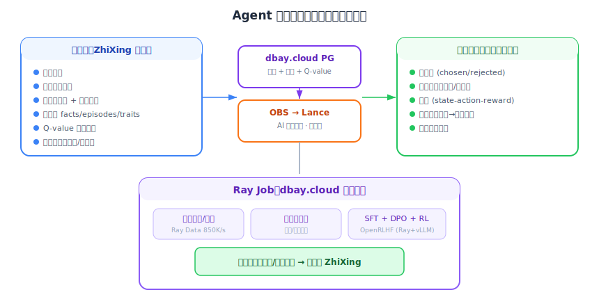

# 提取优化：数据飞轮与模型训练

本文档覆盖记忆**提取和管理**环节的优化：**数据飞轮架构**（从运行态数据到学习态数据的完整流转）和 **ZhiXing 平台模型训练**（用聚合数据训练专用记忆提取/管理模型，构建核心竞争壁垒）。

---

## 1. 数据飞轮：从运行态到学习态

### 1.1 概念

"数据飞轮"（Data Flywheel）是 2025-2026 年 AI 行业的核心概念之一。NVIDIA 已有官方术语定义和开源蓝图（GitHub: NVIDIA-AI-Blueprints/data-flywheel）。

核心循环：
```
Agent 运行 → 产生经验数据 → 数据流入训练管线
    ↑                                    ↓
    └──── 改进的模型/策略 ←── RL/SFT 训练 ←┘
```

关键论文和实践：
- **"Agent-in-the-Loop: A Data Flywheel for Continuous Improvement"**（arXiv 2510.06674）：LLM 客服场景，将重训练周期从数月缩短到数周
- **"Arena Learning"**（arXiv 2407.10627）：用模拟竞技场生成偏好数据
- **NVIDIA Data Flywheel Blueprint**：开源，NeMo Curator + Customizer + Evaluator，演示 98% 成本降低（70B → 1B 模型蒸馏）
- **Shreya Shankar 的实践指南**：生产环境飞轮需要验证器 + 人类在环评估

### 1.2 Agent 数据从运行态到学习态的流转

```
运行态数据（ZhiXing 产生）          学习态数据（训练管线消费）
├── 对话日志                         ├── 偏好对（chosen/rejected）
├── 工具调用记录                      ├── 奖励信号（任务成功/失败）
├── 检索的记忆 + 是否有用              ├── 轨迹数据（state-action-reward）
├── 提取的 facts/episodes/traits      ├── 蒸馏输出（大模型→小模型）
├── 记忆的 Q-value 变化轨迹           └── 策略梯度数据
└── 任务结果（成功/失败/部分成功）
```

### 1.3 ZhiXing + DBay.cloud 的技术栈拉通

DBay.cloud 基于 S3/OBS 的架构天然支持数据从运行态流转到学习态：



### 1.4 关键技术组件

| 组件 | 项目 | 作用 |
|------|------|------|
| **Lance 格式** | github.com/lance-format/lance | AI 原生数据格式，向量+多模态，S3 上运行，100x 快于 Parquet |
| **LanceDB** | lancedb.com | 基于 Lance 的向量数据库，嵌入式（无服务器进程），"Lance for AI, Iceberg for BI" |
| **lance-ray** | lance + Ray 集成包 | Ray 直接读写 Lance 数据集，分布式处理 |
| **Apache Iceberg** | iceberg.apache.org | 结构化分析数据，ACID 事务，时间旅行。Salesforce 运行 4M 张 Iceberg 表 |
| **OpenRLHF** | github.com/OpenRLHF/OpenRLHF | 基于 Ray + vLLM 的开源 RLHF 框架，支持 PPO/DAPO/REINFORCE++ |
| **NVIDIA Data Flywheel** | github.com/NVIDIA-AI-Blueprints/data-flywheel | 开源蓝图，NeMo Curator + Customizer + Evaluator |

---

## 2. 三层飞轮架构

### 2.1 飞轮的分层价值

```
第一层（运行时自优化，每用户闭环）：
├── MemRL 的 Q-value 更新 → 记忆检索越用越准
├── 不需要 GPU，不需要训练管线
├── ZhiXing 内部闭环即可
├── 本质：检索即个性化（与 Jeff Dean 观点一致）
└── 价值：Agent 每天变好一点

第二层（离线分析 + 平台级模型优化）：
├── 导出使用数据到 Lance → 分析检索模式
├── 发现低效模式（总被召回但总失败的记忆）
├── 批量调整 Q-value、清理噪声记忆
├── 聚合全平台匿名使用数据 → 训练 ZhiXing 自己的内部模型
│   ├── 检索排序模型：学习 (query, memory, context) → relevance
│   ├── 记忆提取模型：学习从对话中提取什么、怎么结构化
│   └── 类似 Google 用搜索日志优化排序算法——改进平台能力，所有用户受益
└── 价值：系统性优化，周级别

第三层（平台模型训练 + 企业定制）：
├── 聚合全平台匿名数据 → 训练 4B-8B 记忆专精小模型
│   ├── 记忆提取模型：从对话中判断"什么值得记"(SFT+DPO)
│   ├── 记忆管理模型：ADD/UPDATE/DELETE/NOOP 决策 (SFT+RL)
│   └── 检索排序模型：联合 Q-value+语义排序 (DPO+RL)
├── 平台 base model 所有用户共享
├── Per-tenant LoRA：企业在 base model 上微调自己的记忆策略
├── export() API：导出训练数据供企业训练自己的 Agent 模型
└── 价值：专精模型替代通用 LLM，质量更高、成本更低
```

**关键设计原则：**

- **第一层（Q-value）是最快可落地的个性化闭环**——零 GPU，更新一个浮点数
- **第二层（数据采集）为第三层积累训练数据**——从第一天起以训练数据格式记录所有 I/O
- **第三层（专精模型）是终局壁垒**——行业已证明 4B 专精模型在记忆任务上击败 70B+ 通用模型（详见下文 3.2）

**关于 Per-user 微调：**
- **个人用户不训模型**——个性化通过 Q-value 检索实现（Jeff Dean: "personalization through retrieval"）
- **企业客户可选 Per-tenant LoRA**——Multi-LoRA 推理已是生产级技术（Together AI/Fireworks/vLLM 原生支持），按 base model token 价格计费。8B LoRA 训练成本 $50-300/次，企业付费用户完全可承受

对于 ZhiXing，**第一层是起步，第三层是终局**。第一层让产品能用（Q-value 检索个性化），第三层让产品不可替代（专精模型 + 独有训练数据 = 壁垒）。

### 2.2 完整图景

```
┌─────────────────────────────────────────────────────────────┐
│                    ZhiXing 数据飞轮                         │
│                                                             │
│  第一层：运行时自优化（每用户闭环，检索即个性化）               │
│  ┌──────────┐     ┌──────────┐     ┌──────────┐           │
│  │ recall() │ ──→ │ Agent    │ ──→ │ feedback │           │
│  │ 检索记忆  │     │ 执行任务  │     │ 更新Q值   │           │
│  └────▲─────┘     └──────────┘     └────┬─────┘           │
│       └──────── Q值影响下次排序 ──────────┘                  │
│  不训模型，只更新浮点数 → Jeff Dean: 检索即个性化              │
│                                                             │
│  第二层：平台级模型优化（周级，聚合全平台数据）                 │
│  ┌──────────────────────────────────────────┐              │
│  │ DBay.cloud PG → OBS → Lance              │              │
│  │ → Ray 分析检索模式、清理噪声记忆、批量调优  │              │
│  │ → 聚合匿名数据训练 ZhiXing 内部模型       │              │
│  │   (检索排序模型、记忆提取模型)              │              │
│  │ → 改进平台能力，所有用户受益               │              │
│  └──────────────────────────────────────────┘              │
│                                                             │
│  第三层：平台模型训练 + 企业定制                               │
│  ┌──────────────────────────────────────────┐              │
│  │ 聚合匿名数据 → 训练 4B-8B 记忆专精小模型    │              │
│  │ → 提取模型(SFT+DPO) · 管理模型(SFT+RL)    │              │
│  │   排序模型(DPO+RL) → 替代通用 LLM           │              │
│  │ → 平台 base model 所有用户共享              │              │
│  │ → Per-tenant LoRA: 企业定制记忆策略          │              │
│  │ → export() API: 导出训练数据                │              │
│  └──────────────────────────────────────────┘              │
│                                                             │
│  存储层：DBay.cloud (PG) → OBS → Lance + Iceberg            │
└─────────────────────────────────────────────────────────────┘
```

### 2.3 与现有产品的关系

```
当前产品             数据飞轮中的角色
─────────           ──────────────
ZhiXing Core       运行时引擎（recall/ingest/feedback/Q-value）
DBay.cloud PG       运行时存储（记忆+元数据+Q-value+使用日志）
DBay.cloud OBS      数据湖桥接（PG → OBS 导出）
Lance on OBS        AI 训练数据格式（向量+轨迹+Q-value历史）
Iceberg on OBS      分析数据格式（使用统计+成本+性能指标）
Ray on DBay.cloud   计算引擎（离线分析 + ZhiXing 内部模型训练）
                    Ray 作为 dbay.cloud 第二层产品引入（当前规划中）
```

**所有组件都已存在或可直接整合，不需要从零构建新系统。** 核心新增工作是：
1. ZhiXing 加 Q-value + feedback API（第一层飞轮——每用户个性化闭环）
2. 训练数据采集格式设计 + PG → OBS → Lance 导出管线（第二层飞轮——数据积累）
3. 从 mem-agent checkpoint LoRA 微调 → 在线 RL → 平台模型 + Per-tenant LoRA（第三层飞轮——专精模型）

### 2.4 竞争壁垒

数据飞轮是**最强的竞争壁垒**——一旦用户的 Agent 在 ZhiXing 上积累了 Q-value 和使用历史，这些"学习到的记忆效用"在其他平台上不存在。迁移意味着从零开始学习哪些记忆有用。

| 壁垒类型 | 说明 | 强度 |
|---------|------|------|
| 记忆数据本身 | 可导出，迁移成本中等 | ⭐⭐⭐ |
| Q-value 效用评分 | 需要持续任务反馈积累，不可复制 | ⭐⭐⭐⭐ |
| ZhiXing 平台模型 | 聚合全平台数据训练的检索/提取模型，新进者无数据可训 | ⭐⭐⭐⭐⭐ |
| 训练数据资产 | 高质量轨迹+记忆+Q-value 数据集，格式化可直接消费 | ⭐⭐⭐⭐ |
| 完整飞轮 | 三层叠加，运行越久壁垒越高 | ⭐⭐⭐⭐⭐ |

---

## 3. 记忆专精模型：行业验证与洞察

### 3.1 行业已证明可行性

训练专精小模型做记忆管理不是假设——**行业已经在做，且效果远超通用大模型。**

| 系统 | 规模 | 方法 | 关键结果 | 状态 |
|------|------|------|---------|------|
| **Dria mem-agent** | 4B | GSPO 在线 RL | md-memory-bench 第 2 名。base Qwen3-4B 仅 0.39 → 训练后 **0.75（+92%）**。击败 GPT、Claude、DeepSeek 等所有 frontier 模型，仅次于 Qwen3-235B | MCP server 已发布，模型开源，4bit 仅 2GB |
| **Memory-R1** | 3B-14B | PPO/GRPO | LLaMA-8B 上 F1 +48%，BLEU-1 +69%。**仅用 152 条训练数据**。跨 3B/7B/14B 稳定 scale | 研究（慕尼黑+剑桥+港大） |
| **Mem-alpha** | 4B-32B | RL | 4B 模型 F1 从 0.389→**0.642（+65%）**，超过 GPT-4.1-mini（0.517）。从 30K 训练泛化到 **400K+ token**（13x） | ICLR 2026 接收，代码开源 |
| **MemSearcher** | 3B-7B | 多上下文 GRPO | **3B 超过 7B baseline**，跨 7 个 benchmark +11-12% | 研究，代码开源 |
| **Cursor Tab** | 未公开（小） | 在线 RL | **日处理 4 亿请求**，+28% 接受率，每天部署多次新模型 | 大规模生产 |
| **Cursor Composer** | MoE | Agent RL | 250 tok/s（同级 4x），frontier 级智能 | 大规模生产 |

### 3.2 五个关键洞察

**洞察一：4B 专精 > 70B+ 通用——在特定任务上，小模型 + RL 训练碾压大模型。**

mem-agent 4B 在记忆 CRUD 任务上击败了 GPT、Claude、DeepSeek。这不是"差不多"，是"排行榜第二名"。原因很直观：通用大模型要做好一切（写代码、聊天、推理、记忆管理...），专精小模型只做一件事——记忆管理。把所有参数都用于一个任务，4B 足以超越把参数分散在万种任务上的 200B+。

**对 ZhiXing 的意义：** 不需要和 GPT/Claude 在通用能力上竞争。只需要在记忆提取/管理/排序这三件事上训一个比通用 LLM 更好的小模型。

**洞察二：训练数据效率惊人——152 条数据就能 +48%。**

Memory-R1 仅用 152 条 QA 对就实现了 F1 +48%。这意味着：
- **不需要百万级训练数据**——ZhiXing 日常运行产生的 ingest/recall 数据在几周内就足够
- **关键是数据质量和独有信号**，不是数据量
- ZhiXing 的独有训练信号（Q-value 变化轨迹 + Trait 证据链 + 提取配对数据）是竞品没有的

**洞察三：在线 RL 是终极飞轮——Cursor 每天部署新模型。**

Cursor Tab 模型用真实用户接受/拒绝信号做在线 RL，新模型每天部署多次。这创造了一个加速飞轮：
```
模型更好 → 用户更多 → 反馈数据更多 → 模型更好 → ...
```
**ZhiXing 可以复制这个模式：** 用 Q-value 变化作为奖励信号，recall 结果的后续使用情况作为反馈，持续在线 RL 更新记忆管理模型。

**洞察四：路径不需要从零——从 mem-agent checkpoint LoRA 微调是最务实的起步。**

mem-agent 的模型权重开源（HuggingFace），4bit 版仅 2GB。从这个 checkpoint 出发做 LoRA 微调比从零训一个模型快 10 倍。路径：

```
mem-agent 4B（开源 checkpoint）
    ↓ LoRA 微调（ZhiXing 的 ingest/recall 数据格式）
ZhiXing 专精模型 v1
    ↓ 在线 RL（Q-value 做奖励信号，Cursor 模式）
ZhiXing 专精模型 v2, v3, ...（持续进化）
```

**洞察五：壁垒在训练信号，不在模型架构。**

模型架构是开源的（mem-agent、Memory-R1 都公开了方法）。但训练信号是产品运行时才能产生的——ZhiXing 拥有三类独有信号：

| 训练信号 | 来源 | 竞品有吗？ |
|---------|------|----------|
| Q-value 变化轨迹 | recall→ingest 隐式闭环 | ❌ Mem0/OpenViking/MemOS 都没有 Q-value |
| Trait 证据链 | 9 步反思引擎的 supporting/contradicting 评分 | ❌ 没有 Trait 反思的竞品无法产生 |
| 提取配对数据 | 对话 → ZhiXing 提取了什么 → 后续对话验证正确性 | ⚠️ Mem0 有类似但缺 Q-value 关联 |

**从阶段一第一天起以训练数据格式采集所有 ingest/recall I/O——零额外工程成本，但为未来训练积累独有壁垒。** 竞品要复制这些信号需要：① 设计对等机制（3-6 个月）② 积累用户数据（3-6 个月）③ 建设训练管线。时间窗口 12-18 个月。

### 3.3 对飞轮架构的修正

基于以上行业证据，三层飞轮的第三层从"数据导出服务"升级为"平台模型训练"：

| 旧版（06 号初稿） | 新版（行业验证后） | 变化原因 |
|-----------------|----------------|---------|
| "ZhiXing 不做训练" | ZhiXing 训练 4B-8B 专精模型 | mem-agent 4B > frontier 证明可行 |
| "数据供应商" | 平台模型 + Per-tenant LoRA | 纯数据层会被商品化（Flybridge 报告） |
| "MaaS 不支持 LoRA" | Multi-LoRA 已是生产级技术 | Together AI/Fireworks/vLLM 原生支持 |
| "训练成本不可行" | 8B LoRA $50-300/次 | 对企业用户完全可承受 |
| "Q-value 已经够了" | Q-value 是第一步，专精模型是终局 | Memory-R1 +48% F1 超越纯 Q-value |

---

## 参考链接

### 记忆专精模型
- [Dria mem-agent](https://huggingface.co/blog/driaforall/mem-agent) | [模型权重](https://huggingface.co/driaforall/mem-agent) | [MCP server](https://github.com/firstbatchxyz/mem-agent-mcp)
- [Memory-R1 论文](https://arxiv.org/abs/2508.19828) | [MarkTechPost 分析](https://www.marktechpost.com/2025/08/28/memory-r1-how-reinforcement-learning-supercharges-llm-memory-agents/)
- [Mem-alpha (ICLR 2026)](https://arxiv.org/abs/2509.25911) | [GitHub](https://github.com/wangyu-ustc/Mem-alpha)
- [MemSearcher](https://arxiv.org/abs/2511.02805)
- [Cursor Tab RL](https://cursor.com/blog/tab-rl) | [Cursor Composer](https://cursor.com/blog/composer)
- [Together AI Multi-LoRA](https://www.together.ai/blog/serverless-multi-lora-fine-tune-and-deploy-hundreds-of-adapters-for-model-customization-at-scale)
- [Fireworks AI Multi-LoRA](https://fireworks.ai/blog/multi-lora)
- [LoRA 训练成本分析 2026](https://www.stratagem-systems.com/blog/lora-fine-tuning-cost-analysis-2026)
- [ICLR 2026 MemAgents Workshop](https://sites.google.com/view/memagent-iclr26/)

### 数据飞轮
- [Agent-in-the-Loop: A Data Flywheel](https://arxiv.org/abs/2510.06674)
- [NVIDIA Data Flywheel Blueprint](https://github.com/NVIDIA-AI-Blueprints/data-flywheel)
- [NVIDIA Data Flywheel Glossary](https://www.nvidia.com/en-us/glossary/data-flywheel/)
- [Shreya Shankar: Data Flywheels for LLM Applications](https://www.sh-reya.com/blog/ai-engineering-flywheel/)
- [Arena Learning: Build Data Flywheel](https://arxiv.org/abs/2407.10627)
