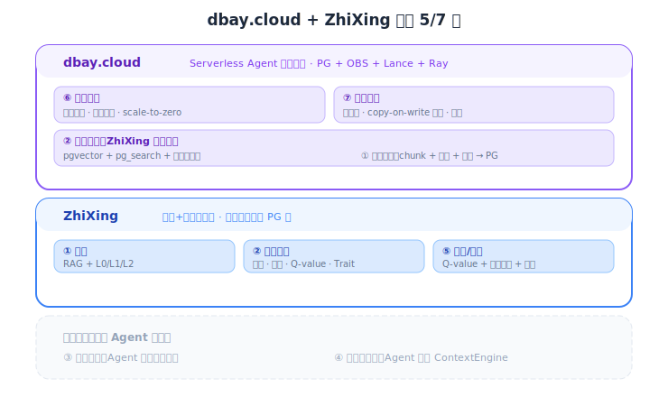

# 运行环境与工作状态：Neon 分析

本文分析 Agent 运行环境（Environment）和工作状态（State）层的数据需求，以 Neon 为核心案例。Neon 的"数据库为 Agent"定位揭示了一个关键洞察：Agent Environment 是独立于 Knowledge/Memory 的数据层。

---

## 1. Neon："数据库为 Agent" 的真正场景

### 1.1 Neon 的核心定位

Neon 的"数据库为 Agent"**不是**知识库/记忆场景，而是 **Agent Environment**：AI 编码 Agent（Replit Agent、Databutton、Dyad）为用户生成全栈应用，每个应用需要一个独立的 Postgres 实例。

**关键数据：Neon 上 80%+ 的数据库是由 AI Agent 创建的，不是人类。** 这个数字从 GA 时的 30% 跳到了 80%+。

典型流程：
```
用户对 AI 编码 Agent 说："帮我建一个任务管理应用"
    ↓
Agent 生成前端代码 + 后端代码
    ↓
Agent 调用 Neon API → <1 秒创建一个 Postgres 数据库（匿名，无需用户账号）
    ↓
Agent 创建表结构、写入种子数据
    ↓
用户得到一个完整应用（含独立数据库）
```

### 1.2 Neon 的核心能力

| 能力 | 详情 | 传统 PG 的问题 |
|------|------|--------------|
| **<1 秒创建数据库** | API 调用即创建，支持匿名创建（不需要用户账号） | RDS 需要 5-10 分钟 |
| **Scale-to-zero** | 空闲 5 分钟后挂起，~350-500ms 唤醒。空闲数据库只收存储费（$0.35/GB-month） | 24/7 按实例付费 |
| **Copy-on-write 分支** | 瞬时克隆整个数据库状态。Agent 在危险操作前创建分支，失败则回滚。端点地址不变 | 手动备份恢复 |
| **快照 API** | Agent 友好的可恢复检查点，逻辑瞬时（copy-on-write，不复制文件） | 无 |
| **API-first** | 创建、配额、分支、集群管理全部 API 化。含 PostgREST 兼容的 Data API | 需要控制台/CLI |
| **Neon Auth** | 内置 JWT 签发映射到 Postgres 角色，多租户无需额外认证胶水代码 | 需要额外搭建 |
| **pgvector** | 内置 HNSW 索引，可在同一个库中做 RAG + 关系查询 | 需要安装扩展 |

### 1.3 Neon 的目标客户

**主要客户（Agent 平台）**：
- Replit Agent（生产后端）
- Retool（管理 30 万个 Postgres 实例）
- Databutton、Dyad、Vapi、xpander.ai

**框架集成**：
- MCP Server（官方提供，自然语言控制数据库）
- LangGraph、Microsoft AutoGen、CrewAI（via Composio）
- IDE 插件：Cursor、Claude Code

**Databricks 10 亿美元收购 Neon（2025.5）**：Databricks 认为 AI Agent 是新的"用户画像"——Agent 以机器速度创建/销毁数据库，传统数据库无法满足。

### 1.4 竞品对比

| | Neon | Supabase | Turso | 传统托管 PG |
|---|---|---|---|---|
| **核心** | Serverless Postgres | BaaS（PG + auth + 存储 + 实时） | Edge SQLite (libSQL) | 托管 Postgres |
| **Agent 创建速度** | <1 秒，API，匿名 | 较慢，需要项目设置 | 快，但 SQLite 限制 | 分钟级，需要控制台 |
| **Scale-to-zero** | ✅（350-500ms 冷启动） | 有限（默认常驻） | ✅（边缘副本） | ❌ |
| **分支** | ✅ Copy-on-write，瞬时 | Git 集成（较慢） | ❌ | ❌ |
| **万级多租户** | 核心强项 | 可以但不优化 | 开发版无限 DB | 运维噩梦 |
| **向量/RAG** | ✅ pgvector 内置 | ✅ pgvector 内置 | ❌ 不原生 | pgvector 扩展 |
| **最适合** | Agent 批量创建隔离 DB | Agent 需要完整后端栈 | 全球边缘低延迟 | 少量 DB，可预测负载 |

### 1.5 对 DBay.cloud 的战略启示：独立产品，独立价值

DBay.cloud 远超 Neon 的范畴。Neon 是 Serverless PG，dbay.cloud 是 **Serverless Agent 数据平台**——不只是数据库，还有 OBS 文档/知识存储、PG→Lance 数据工程、Ray 计算集群做训练。Serverless 化、弹性伸缩、存算分离、多版本多分支。它独立覆盖 Environment 和 State 层，同时支撑任何记忆系统（OpenViking、MemOS、ZhiXing）的存储、数据工程和训练需求。

#### 双产品定位



#### 为什么是两个产品而非一个

**买家路径不同：**
- **"我的 Agent 需要记忆"** → 找 ZhiXing → 不关心底层是什么数据库
- **"我需要一个数据库给 AI 应用"** → 找 dbay.cloud → 不关心记忆提取

**独立价值：**
- dbay.cloud 不用 ZhiXing 也有价值：Agent 开发者需要 serverless PG 来做 Environment（Neon 在中国不可用）
- ZhiXing 不用 dbay.cloud 也能运行：可以跑在任意 PG 上

**交叉销售自然发生：**
- 用 ZhiXing → 推荐 dbay.cloud（降成本、加分支）
- 用 dbay.cloud → 推荐 ZhiXing（加记忆智能）

**合并的风险：** 一个产品什么都做 = 什么都不突出，"Agent 全栈数据平台" 太抽象，不如两个精准定位的产品各自获客再互导。

#### dbay.cloud 的独立价值（不需要 ZhiXing）

- **Serverless PG for China**——Agent 开发者创建后端数据库（Neon 在中国不可用）
- **每用户独立数据库 + 零成本休眠**（0.1 CNY/用户/月）
- **Git 式分支**——Agent 试错前快照状态，失败回滚
- **支撑 OpenViking/MemOS/Mem0**——任何记忆系统都能用 dbay.cloud 做存储层

#### 可借鉴 Neon 的 Agent 友好特性

1. **匿名/API 创建**：Agent 无需人类操作即可创建数据库或记忆空间
2. **分支**：Agent 试错前快照状态，失败则回滚（DBay.cloud 已有此能力）
3. **MCP Server**：提供官方 MCP Server 让 Agent 自然语言操作数据库和记忆
4. **SDK/Toolkit**：像 `@neondatabase/toolkit` 一样提供简洁的 Agent SDK

---

## 2. 工作状态 (State) 层

工作状态（State）是 Agent 数据分类五层模型中的底层，关注 Agent 执行过程中的临时但关键的运行数据。

**State 包含什么**：
- **工作流检查点**：多步任务中每一步完成后的状态快照，允许从任意步骤恢复
- **中间结果**：Agent 推理过程中产生的草稿、计算中间值、待验证的假设
- **Agent 协作状态**：多 Agent 系统中的任务分配、进度同步、共享上下文

**核心能力需求：分支试错与快照回滚**：
- Agent 在执行高风险操作（如数据库 schema 变更、批量数据修改）前，需要创建状态快照
- 操作失败时回滚到快照，成功时合并结果——这本质上是 trial-and-error 的基础设施
- 对于多路径探索（如同时尝试多种解法），分支能力让 Agent 并行试错而不互相干扰

**技术实现**：
- **Neon** 使用 copy-on-write 分支实现：瞬时克隆数据库状态，零存储开销（只记录差异），分支间完全隔离
- **DBay.cloud** 具备相同的底层能力，可以提供等价的分支/快照功能

**当前状态**：我们尚未对 State 层进行专门的深度分析。在五层数据模型中，Knowledge、Memory、Trajectory 已有详细研究（见本系列其他文档），Environment 在本文第 1 节覆盖，State 层的独立深度分析留待后续补充。

---

## 参考链接

### Neon
- [Neon for AI Agent Platforms](https://neon.com/use-cases/ai-agents)
- [Neon Agent Plan](https://neon.com/programs/agents)
- [Branching for Agents](https://neon.com/branching/branching-for-agents)
- [Databricks Acquires Neon ($1B)](https://www.databricks.com/company/newsroom/press-releases/databricks-agrees-acquire-neon-help-developers-deliver-ai-systems)
- [AI Tools for Agents - Neon Docs](https://neon.com/docs/ai/ai-agents-tools)
