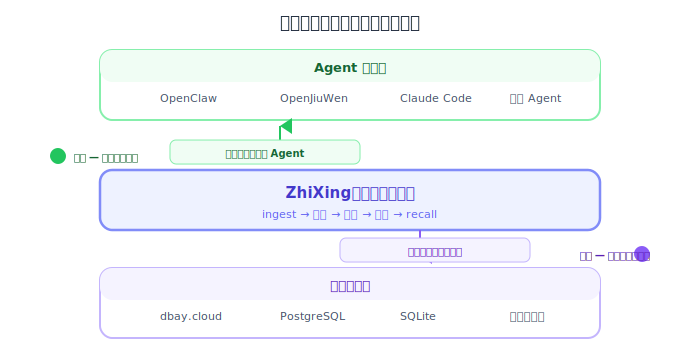

# 垂直整合分析：向上做 Agent 还是向下做存储？

## 1. 问题定义

ZhiXing 处于 Agent 和存储之间的"记忆中间层"：



**核心问题：假设我们能深度优化上下游，哪个方向的投入产出比更高？**

我们有两个独特的整合优势：
1. **dbay.cloud**（数据港湾）是我们自研的 Serverless PostgreSQL 云服务，底层可深度定制
2. **OpenJiuWen**（开源九问）是华为开源的 Agent 平台，我们可以参与开发、推动原生集成

---

## 2. 向上整合：与 Agent 系统的深度结合能创造什么新价值？

### 2.1 整合对象

#### OpenClaw（已有集成，深化方向）

OpenClaw 的记忆架构已在 [03-memory-native-systems.md](./03-memory-native-systems.md) 详细分析。关键点：
- 已有 ZhiXing 插件（`@zhixing/openclaw-zhixing`）
- 插件通过 TypeScript npm 包接入，实现 `memory_search` / `memory_get` 工具
- 已有多个竞品插件：Supermemory、Mem0、Cognee、MemOS
- 插件系统成熟，但**同一时间只能启用一个记忆插件**

#### OpenJiuWen（华为开源 Agent 平台）

**基本信息：**
- 华为主导的开源 Agent 框架，Apache-2.0 协议
- 已商用于华为云 AgentArts、小艺智能体、鸿蒙 Agent 开发
- DeepAgent 在 GAIA benchmark 得分 91.69%（接近人类水平 92%）
- 主要代码在 GitCode（`gitcode.com/openJiuwen`），GitHub 为只读镜像
- 版本 0.1.8（Beta），社区早期但企业背书强

**架构：**
```
┌─────────────────────────────────────────────┐
│ Agent Studio（零代码/低代码可视化开发）         │
├─────────────────────────────────────────────┤
│ Agent Store（Agent 应用商城）                  │
├─────────────────────────────────────────────┤
│ Agent Engine                                │
│ ├── ReActAgent（推理+行动循环，复杂推理）      │
│ └── WorkflowAgent（预定义流程自动化）          │
├─────────────────────────────────────────────┤
│ agent-core（Python SDK）                     │
│ ├── 异步并行图执行器                          │
│ ├── 事件驱动多 Agent 控制                     │
│ ├── 状态中断/恢复                            │
│ └── LLM 调用 + 工具调用                       │
├─────────────────────────────────────────────┤
│ Agent Protocol（MCP + A2A，C++ SDK）          │
├─────────────────────────────────────────────┤
│ DeepSearch（知识增强搜索）                     │
└─────────────────────────────────────────────┘
```

**原生记忆能力：**

| 能力 | 说明 | 与 ZhiXing 的关系 |
|------|------|-------------------|
| Agent 状态持久化 | 全局管理 Agent 实例状态，断点恢复 | **工作记忆**，不是长期记忆，不冲突 |
| 上下文压缩 | 压缩无关上下文，保留关键信息 | **会话级别**，ZhiXing 的摘要可增强 |
| 自进化外部记忆 | "数字大脑"，自我诊断+优化策略 | 定位类似反思引擎，但**细节未公开、实现不透明** |
| Agent 自进化 | 根据用户反馈生成优化策略 | **Agent 行为优化**，不是记忆 |

**与 OpenClaw 的关键差异：**

| 维度 | OpenJiuWen | OpenClaw |
|------|-----------|----------|
| 定位 | Agent 开发平台（SDK+Studio+Store） | 个人 AI 助手运行时 |
| 语言 | Python | TypeScript (Gateway) + Markdown |
| Agent 类型 | ReAct + Workflow（通用） | 对话式助手（聚焦） |
| 记忆 | 内置状态持久化+自进化（不透明） | Markdown+SQLite 混合检索（透明） |
| 外部记忆接口 | **无公开插件机制** | 成熟的 TypeScript 插件系统 |
| 商用规模 | 华为云 AgentArts + 小艺 + 鸿蒙 | 独立开源社区 |
| JiuwenClaw | 华为的 OpenClaw 等价物（90 stars） | 原版 |

**关键发现：** OpenJiuWen 有 Agent 框架但缺好的长期记忆系统，且**没有外部记忆插件机制**。这既是机会（ZhiXing 填补空白）也是障碍（需要主动推动接口标准）。

### 2.2 向上整合能创造的新价值

#### 价值 1：记忆生命周期与 Agent 生命周期深度绑定

**现状问题：** ZhiXing 通过 API 被动接收 `ingest()` 调用，不了解 Agent 的工作状态。

**整合后的新能力：**

```
Agent 生命周期事件        →    ZhiXing 记忆策略响应
──────────────────────────────────────────────────
Agent 启动                →    预加载该用户 Top-K 高频记忆
会话开始                  →    生成 L0 摘要列表注入 system prompt
Agent 调用工具            →    recall 工具相关的 procedural 记忆
Agent 收到用户纠正        →    自动存储为高优先级 feedback 记忆
Agent 完成任务            →    从对话中提取 episode 存储
Agent 空闲 5 分钟         →    触发后台 digest（反思 + trait 提炼）
Agent 被销毁              →    记忆持久化确认 + 对话摘要归档
```

**创造的价值：**
- 用户无感知的自动记忆管理（不依赖 Agent 自律写日记）
- 记忆质量更高（在正确的时机提取正确类型的记忆）
- 解决 OpenClaw 的"日记堆积"问题和 OpenJiuWen 的"记忆不透明"问题

#### 价值 2：对话上下文压缩（省 token 的核心能力）

**现状问题：** OpenClaw 对话历史无限增长，15-20 分钟可达数万 token。OpenJiuWen 的上下文压缩是内置的但不可控。

**整合后的新能力：**

```
原始对话流 → ZhiXing 上下文管理器 → 优化后的上下文

策略 1: 对话摘要压缩（借鉴 MemOS，省 70%+ token）
  ┌─────────────────────────────────────────┐
  │ 最近 3 轮对话：保留原文                     │  ~1500 tokens
  │ 4-10 轮前：压缩为关键信息摘要                │  ~500 tokens
  │ 10 轮以前：仅保留 ZhiXing 提取的记忆引用     │  ~200 tokens
  │ 总计：~2200 tokens（原本可能 15000+）        │
  └─────────────────────────────────────────┘

策略 2: L0/L1/L2 分层加载（借鉴 OpenViking，省 80%+ token）
  ┌─────────────────────────────────────────┐
  │ 第一步：recall → 返回 L0 列表              │  ~100 tokens
  │    "用户喜欢 Python / 住在北京 / 讨厌 React" │
  │ 第二步：Agent 判断需要展开 → 请求 L1        │  ~500 tokens
  │    "用户从 2024 年开始学 Python..."         │
  │ 第三步：如需精确细节 → 请求 L2（原文）       │  按需加载
  └─────────────────────────────────────────┘
```

**创造的价值：**
- 直接减少 Agent 的 API 成本（token = 钱）
- 允许更长的对话而不超出上下文窗口
- **这是用户 5 分钟内可感知的价值**（对话更快、更便宜）

#### 价值 3：跨 Agent/跨平台统一用户画像

**现状问题：** 每个 Agent 实例的记忆完全隔离。用户在 OpenClaw 聊了一个月的偏好，换到 OpenJiuWen 要从零开始。

**整合后的新能力：**

```
┌──────────────┐  ┌──────────────┐  ┌──────────────┐
│ OpenClaw #1  │  │ OpenClaw #2  │  │ OpenJiuWen   │
│ (个人助理)   │  │ (工作助手)   │  │ (企业Agent)  │
└──────┬───────┘  └──────┬───────┘  └──────┬───────┘
       │                 │                 │
       └────────────┬────┴────────────────┘
                    ▼
         ┌──────────────────┐
         │ ZhiXing 统一画像  │
         │                  │
         │ Facts:           │
         │ - 住在北京        │
         │ - 在华为工作      │
         │                  │
         │ Traits:          │  ← 跨所有 Agent 聚合
         │ - 偏好简洁回答    │
         │ - 技术深度高      │
         │                  │
         │ Preferences:     │
         │ - 中文交流        │
         │ - 代码用 Python   │
         └──────────────────┘
```

**创造的价值：**
- 用户在任何 Agent 上都"被记住"——这是纯本地记忆做不到的
- 数据飞轮：多个 Agent 贡献记忆 → 画像更丰富 → 每个 Agent 都受益
- **迁移锁定效应**：一旦记忆积累，用户不愿换到没有 ZhiXing 的 Agent

#### 价值 4：Trait 回写 + 记忆可视化

**现状问题：** OpenClaw 原生的 Markdown 记忆用户可读但不自动更新。ZhiXing 的 trait 反思在后台运行但用户看不到。

**整合后的新能力：**

```
ZhiXing 反思引擎
    ↓ 定期运行
生成/更新 trait: "用户偏好简洁的技术讨论"
    ↓ 回写
OpenClaw MEMORY.md:
  ## AI 观察到的你的特征（自动更新）
  - 偏好简洁的技术讨论（置信度 0.82, 基于 47 次对话）
  - Python 专家，对 React 态度消极（置信度 0.71）
  - 工作时间主要在 10:00-23:00（置信度 0.65）
```

**创造的价值：**
- **透明度**：用户能"看到" AI 在学习自己，建立信任
- **可纠正**：用户可以直接编辑 MEMORY.md 来纠正错误的 trait
- **惊喜感**："你怎么知道我喜欢这种风格？" → 黏性

#### 价值 5：为 OpenJiuWen 贡献长期记忆后端

**现状问题：** OpenJiuWen 的"自进化记忆"是内置不透明的，没有外部记忆插件机制。

**我们可以做的：**

```
贡献路径：
1. 为 agent-core 提交 PR：添加 MemoryBackend 抽象接口
   - ingest(user_id, messages) → 存储记忆
   - recall(user_id, query) → 检索记忆
   - digest(user_id) → 反思/整理

2. 提供 ZhiXing 作为参考实现
   - pip install openjiuwen-zhixing
   - 3 行代码集成

3. 对接 Agent Studio 可视化
   - 在零代码界面中配置记忆策略
   - 可视化 trait 演化过程
```

**创造的价值：**
- **成为标准**：如果 OpenJiuWen 采纳了 MemoryBackend 接口，ZhiXing 就是"官方推荐实现"
- **华为生态入口**：AgentArts + 小艺 + 鸿蒙的 Agent 都能用 Neuromem
- **影响设计方向**：作为贡献者参与接口设计，确保对 ZhiXing 友好

**但要注意的风险：**
- OpenJiuWen 还在 v0.1.x，API 可能频繁变动
- 记忆接口需要我们主动提出并推动，不是现成的
- 华为主导的开源项目有"公司优先"风险——内部需求可能突然改变方向
- 需要适应 GitCode（中国开源社区）的协作模式

### 2.3 向上整合价值总结

| 新价值 | 用户感知 | 技术难度 | 竞品是否已做 | 优先级 |
|--------|---------|---------|-------------|-------|
| 对话压缩省 token | ⭐⭐⭐⭐⭐ 直接 | 中 | MemOS 已做 | **P0** |
| L0/L1/L2 分层加载 | ⭐⭐⭐⭐ 直接 | 中 | OpenViking 已做 | **P0** |
| 跨 Agent 统一画像 | ⭐⭐⭐⭐⭐ 直接 | 低 | **无竞品做到** | **P0** |
| 记忆生命周期绑定 | ⭐⭐⭐ 间接 | 中 | Mem0 部分做了 | P1 |
| Trait 回写可视化 | ⭐⭐⭐⭐ 直接 | 低 | **无竞品做到** | P1 |
| OpenJiuWen 标准接口 | ⭐⭐ 间接（渠道价值） | 高 | 无 | P2 |

**向上整合的核心逻辑：让用户感知到"AI 更懂我"、"对话更便宜"、"换 Agent 不丢记忆"。**

---

## 3. 向下整合：与 dbay.cloud 的深度结合能创造什么新价值？

### 3.1 dbay.cloud 现有能力盘点

基于对 `/Users/jacky/code/lakeon` 代码库的深度分析：

**架构（基于 Neon 开源存储引擎，部署在华为云 CCE + OBS）：**
```
用户连接 ──PG协议:4432──→ ELB
                          └──→ Neon Proxy（SCRAM 认证 + 自动唤醒）
                              └──→ 计算 Pod（PostgreSQL 17, 无状态）
                                   └──→ Pageserver（页面缓存）
                                        └──→ OBS（华为云对象存储，持久化）
```

**已有能力：**

| 能力 | 实现状态 | 关键指标 |
|------|---------|---------|
| 自动休眠/唤醒 | ✅ 生产可用 | 热唤醒 ~500ms，冷启动 10-17s |
| 计算存储分离 | ✅ 核心架构 | 计算无状态，存储在 OBS |
| 数据库分支 | ✅ 生产可用 | Neon timeline 的 copy-on-write |
| pgvector | ✅ 默认可用 | Neon 官方镜像自带 |
| pg_search (ParadeDB) | ✅ 定制镜像 | BM25 全文检索，已有 `Dockerfile.compute` |
| 多租户隔离 | ✅ Neon 级隔离 | 每个数据库 = 独立的 Neon tenant |
| 弹性计算 | ✅ 1-8 CU | 1CU = 1vCPU/2GiB |
| Pod 保留(30分钟) | ✅ 已实现 | 热唤醒窗口 |
| 连接池 | ❌ 未实现 | 每连接直连 Pod |
| 高可用 | ❌ 单 Pageserver | SPOF |
| 暖池预热 | ❌ 规划中 | 目标 200-500ms |

**关键发现：dbay.cloud 已原生支持 pgvector + pg_search，ZhiXing 的全部存储能力可以开箱即用。**

### 3.2 向下整合能创造的新价值

#### 价值 1：每用户独立数据库 + Serverless 零成本休眠

**现状问题：** ZhiXing-cloud 当前使用 schema-per-tenant（所有用户在同一个 PostgreSQL 实例），存在：
- 资源争用：一个用户的大量 recall 影响其他用户
- 隔离不彻底：共享 pg 实例，理论上存在越权风险
- 成本固定：即使 90% 用户不活跃，PG 实例也要一直运行

**整合后的新架构：**

```
现在（schema-per-tenant）:
┌────────────────────────────────────┐
│ 一个 PostgreSQL 实例               │
│ ├── schema user_a (活跃)           │  始终占用资源
│ ├── schema user_b (空闲)           │  始终占用资源
│ ├── schema user_c (空闲)           │  始终占用资源
│ └── ... 1000 个 schema             │  一直在线 = 固定成本
└────────────────────────────────────┘
成本：~500 CNY/月（不管多少人活跃）

整合后（database-per-user on dbay.cloud）:
┌──────────┐  ┌──────────┐  ┌──────────┐
│ user_a   │  │ user_b   │  │ user_c   │
│ 活跃     │  │ 休眠     │  │ 休眠     │
│ 1CU运行  │  │ 0CU      │  │ 0CU      │
│ $$$      │  │ $0       │  │ $0       │
└──────────┘  └──────────┘  └──────────┘
   ↑ 用户聊天时唤醒         ↑ 数据在 OBS，零计算成本
成本：只为活跃用户付费
```

**成本模型对比（1000 用户，日活 10%）：**

| 方案 | 月成本估算 | 用户均摊 |
|------|----------|---------|
| 单实例 schema-per-tenant | ~500 CNY | 0.5 CNY/用户 |
| dbay.cloud database-per-user | ~100 CNY | 0.1 CNY/用户 |
| Mem0 方案（PG+Qdrant+Neo4j） | ~2000+ CNY | 2.0 CNY/用户 |

**创造的价值：**
- **成本随用户活跃度线性扩展**，而非固定成本
- **完美的安全隔离**：每个用户的记忆在独立数据库中，物理级隔离
- **GDPR 合规最简方案**：用户要求删除数据 = 删除整个数据库
- ZhiXing 可以提供**极大方的免费层**（空闲用户零成本）

**需要解决的问题：**
- 冷启动 10-17 秒：用户沉默 5 分钟后再发消息，第一次 recall 要等 10 秒
- 需要 ZhiXing 层做连接预热/缓存策略

#### 价值 2：记忆分支（Memory Branching）— 竞品不可复制

**这是 dbay.cloud 独有的能力。** 基于 Neon 的 timeline 机制，copy-on-write，零额外存储成本。

**应用场景：**

```
场景 1: A/B 测试反思策略
  main (当前记忆) ──fork──→ branch_a (新反思策略 A)
                  ──fork──→ branch_b (新反思策略 B)

  在 branch_a/b 上分别运行 digest() → 对比 trait 质量
  选择更好的 → merge 回 main
  成本：0（copy-on-write，只存差异）

场景 2: 用户"后悔"
  用户："忘掉我最近一周说的那些蠢话"
  main ──snapshot──→ point_in_time
  rollback main to snapshot
  用户的记忆回到一周前
  成本：0（timeline 操作）

场景 3: 记忆实验室（高级功能）
  用户可以"分叉"自己的 AI 记忆：
  "如果 AI 从不知道我换了工作，它会怎么回答？"
  → 在分支上测试 → 不影响主记忆
```

**创造的价值：**
- **记忆 A/B 测试**：数据驱动地优化反思策略，而非靠直觉
- **安全的记忆操作**：回滚、清理、实验都不会损坏主记忆
- **用户可控性**：用户对自己的记忆有"版本控制"能力
- **Mem0、HydraDB 的底层存储都没有分支能力**

#### 价值 3：Append-only 时序优化

**现状问题：** ZhiXing 当前对过期记忆做软删除（设 `expired_at`），不是真正的 append-only。Git 式时序图需要保留所有历史版本。

**dbay.cloud 可以提供的底层优化：**

```
PostgreSQL 原生能力（dbay.cloud 可以预配置）:

① BRIN 索引 on created_at
   → 时间范围查询从全表扫描降到扫描少数页
   → 对 append-only 表效果极好（数据天然按时间排列）

② 按月自动分区
   CREATE TABLE memories (...) PARTITION BY RANGE (created_at);
   → 老记忆归档到冷分区（只读，压缩存储）
   → 热记忆在小分区中，查询更快

③ 物化视图缓存"当前有效记忆"
   CREATE MATERIALIZED VIEW active_memories AS
   SELECT * FROM memories WHERE expired_at IS NULL;
   → recall() 查物化视图（小表），不查全表
   → 后台定期刷新

④ 定制存储参数
   → fillfactor 100（append-only 不需要更新空间）
   → autovacuum 降频（没有 dead tuples）
```

**创造的价值：**
- recall() 延迟降低（BRIN 索引 + 分区 + 物化视图）
- 存储成本降低（冷分区压缩）
- 支持 Git 式时序图而不牺牲查询性能
- 这些优化可以由 dbay.cloud 作为"记忆数据库模板"预配置

#### 价值 4：记忆感知的计算弹性

**现状问题：** dbay.cloud 的默认策略是"5 分钟空闲 → 休眠"，不区分负载类型。

**定制策略：**

```
记忆负载特征                    最优计算策略
──────────────────────────────────────────────
用户活跃聊天中                  1CU 持续在线（recall 延迟 < 50ms）
  ingest + recall 交替

用户空闲但在线                  保持 Pod（热唤醒窗口）
  可能随时发消息                 成本：最低 CU

后台 digest（反思）             临时扩到 2-4CU
  CPU 密集的批量计算              完成后降回 1CU

用户离线 > 30 分钟              完全休眠
  存储在 OBS，零计算              唤醒时预加载向量索引

定期批量反思（所有用户）          集中计算窗口
  凌晨 3:00 统一 digest           共享大实例 → 反思完 → 休眠
```

**创造的价值：**
- 反思引擎不再受限于"用户在线时偷偷计算"——可以在凌晨集中处理
- 计算成本与记忆负载精确匹配
- 需要 ZhiXing 和 dbay.cloud 之间有**语义级别的调度协议**

#### 价值 5：预配置的"记忆数据库"产品

**把 dbay.cloud 的能力打包成开箱即用的记忆存储：**

```
dbay.cloud 创建数据库时选择"记忆数据库"模板:

自动配置：
✅ pgvector 扩展已启用 + HALFVEC 量化
✅ pg_search (ParadeDB) 已启用 + BM25 索引
✅ 预建 memories 表（含向量列、时序列、图节点/边表）
✅ BRIN 索引 on created_at
✅ 自动分区策略（按月）
✅ 物化视图 active_memories
✅ 记忆感知的休眠策略
✅ 数据库分支已启用

用户只需：
pip install zhixing
nm = ZhiXing(database_url="postgresql://...@xxx.dbay.cloud:4432/memories")
await nm.ingest(user_id, role="user", content="...")
```

**创造的价值：**
- **降低 ZhiXing 的部署门槛**：不需要自己搭 PostgreSQL + 装扩展 + 建表
- **dbay.cloud 的差异化卖点**：不是通用 PG，是"AI 记忆最优的 PG"
- **两个产品互相引流**：用 ZhiXing → 推荐 dbay.cloud，用 dbay.cloud → 推荐 ZhiXing

### 3.3 向下整合价值总结

| 新价值 | 用户感知 | 技术难度 | 竞品能否复制 | 优先级 |
|--------|---------|---------|-------------|-------|
| 每用户独立 DB + 零成本休眠 | ⭐⭐ 间接（成本） | 中 | 难（需自有 Serverless PG） | P1 |
| 记忆分支（A/B + 回滚） | ⭐⭐⭐ 间接 | 低（dbay.cloud 已有） | **不可复制** | P1 |
| 预配置记忆数据库模板 | ⭐⭐⭐ 直接（体验） | 低 | 可复制 | P1 |
| Append-only 时序优化 | ⭐ 无感（性能） | 低 | 可复制但需 DBA | P2 |
| 记忆感知的计算弹性 | ⭐ 无感（成本） | 高 | 难 | P2 |

**向下整合的核心逻辑：降低成本、提供独有能力（分支）、降低部署门槛。但用户对这些的直接感知弱于向上整合。**

---

## 4. 两个方向的本质区别

### 4.1 价值链位置

```
用户感知的价值:

  "AI 真的记住我了"  ←←←← 用户直接感知
         ↑
  Agent 用对了记忆   ←←←← 向上整合在这里（记忆调度、上下文编排）
         ↑
  记忆被正确提取和组织 ←← ZhiXing 核心
         ↑
  数据被可靠存储和检索 ←← 向下整合在这里（性能、成本、隔离）
         ↑
  基础设施稳定运行    ←←←← 用户完全无感知
```

**越靠近用户的优化，回报越快但越难标准化。越靠近底层的优化，回报越慢但越可复用。**

### 4.2 对比矩阵

| 维度 | 向上整合（Agent 方向） | 向下整合（存储方向） |
|------|---------------------|---------------------|
| **用户感知** | ⭐⭐⭐⭐⭐ 直接可感知 | ⭐⭐ 间接且微弱 |
| **竞争壁垒** | ⭐⭐⭐ 中（可被替换但迁移成本高） | ⭐⭐⭐⭐ 强（记忆分支不可复制） |
| **投入回报周期** | 短（有用户就有反馈） | 长（基建性质） |
| **独立性** | 弱（依赖 Agent 平台发展） | ⭐⭐⭐⭐⭐ 完全自主可控 |
| **可复用性** | 每个 Agent 平台单独适配 | 一次优化所有平台受益 |
| **成本影响** | 省用户的 token 成本 | 省我们的运营成本 |
| **数据合规** | 不涉及 | ⭐⭐⭐⭐⭐ 数据主权优势 |

### 4.3 核心矛盾

```
向上整合的矛盾:                      向下整合的矛盾:
越深度集成越有价值                    存储层越好，Agent 越可能
但越深度集成越依赖平台                 自己造轮子来替换你
        ↓                                    ↓
   解法: 同时集成多个 Agent            解法: 提供 Agent 层做不到的
   保持 Core 平台无关性                独有能力（分支、serverless）
```

### 4.4 协同飞轮

两个方向不是互斥的，而是可以形成飞轮：

```
              向上: Agent 集成
                   ↓ 带来用户
              更多记忆数据
                   ↓ 积累规模
              更好的反思模型     ←─── 数据飞轮
                   ↓
              用户留存提升
                   ↓
              更多 Agent 平台愿意集成
                   ↓
              ═══════════════
                   ↓
              向下: 存储优化
                   ↓ 降低成本
              每用户成本趋近于零   ←── 成本飞轮
                   ↓
              可以做更大方的免费层
                   ↓
              更低的用户获取成本
                   ↓
              更多用户 → 回到向上
```

**向上整合决定了 ZhiXing 能不能活（有没有用户），向下整合决定了 ZhiXing 能不能活得好（成本和壁垒）。**
