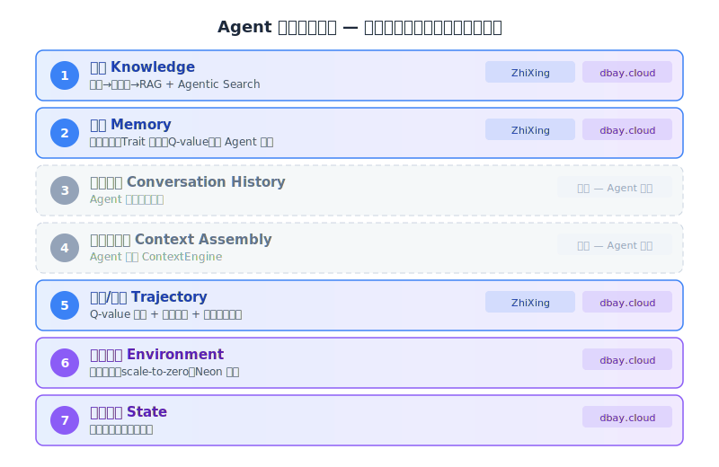
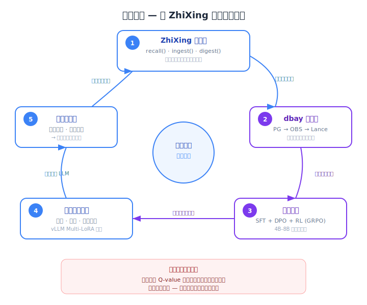
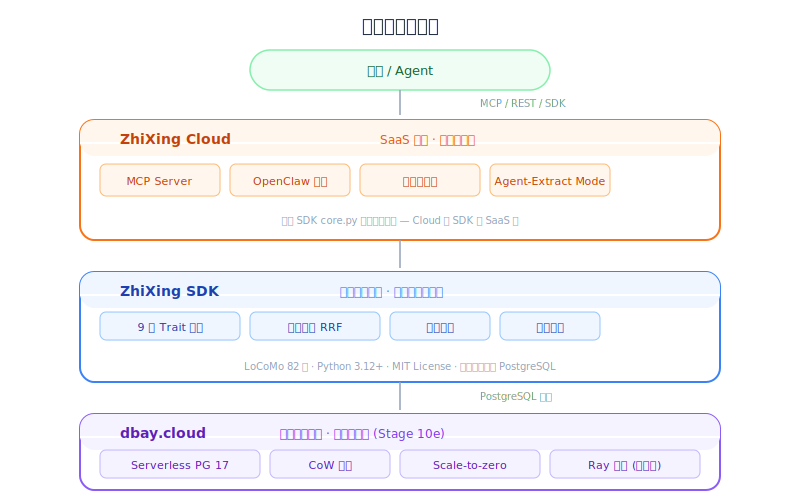
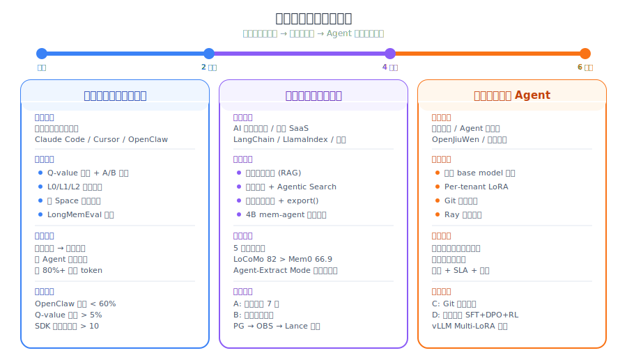

# ZhiXing 定位与策略建议

> 本文综合前十篇分析的所有发现，给出 dbay.cloud 和 ZhiXing 各自的定位判断和实施策略。
> 结构：**愿景**（我们要到哪里）→ **现状**（我们有什么）→ **策略**（怎么打）→ **路线图**（怎么做）
> 详细的竞品分析和能力差距见 [11a-competitive-analysis.md](./11a-competitive-analysis.md)

---

## 1. 愿景：Agent 的数据智能平台

### 1.1 核心定位

**两个独立产品，各自直接产生价值。**

- **dbay.cloud** — Serverless Agent 数据平台。不只是数据库——从原始数据存储到知识检索到模型训练的完整闭环。五层能力：① 存储层（Serverless PG + OBS）② 知识管线（文档/视频/图片 → 解析→分块→增强→图谱→embedding→分层存储，插件式处理器）③ 数据工程层（PG → OBS → Lance）④ 计算层（Ray 集群：知识管线批处理 + 模型训练）⑤ 产出层（MCP 知识检索工具 + 模型部署）。Serverless 化、弹性伸缩、存算分离、多版本多分支管理。可以支撑任何记忆系统（ZhiXing、OpenViking、MemOS），也可以独立服务 AI 应用开发者。**知识管线归 dbay.cloud，记忆智能归 ZhiXing。**
- **ZhiXing** — AI Agent 的记忆智能引擎（SDK + Cloud）。跑在任意 PG 上，不依赖 dbay.cloud。专注记忆智能层（②记忆提取/反思/画像 + ⑤轨迹/飞轮），不做知识管线（已下沉到 dbay.cloud）。

各自有独立的用户群、独立的商业价值、独立的发展空间。



### 1.2 双产品架构


**为什么是两个独立产品：**
- **不同的用户**："需要数据库" → dbay.cloud；"需要记忆" → Neuromem
- **各自独立成立**：dbay.cloud 服务 OpenViking/MemOS 用户时完全不需要 ZhiXing；ZhiXing 跑在 Supabase/自建 PG 上完全不需要 dbay.cloud
- **各自独立发展**：dbay.cloud 的路线图由 Serverless PG 市场驱动；ZhiXing 的路线图由 Agent 记忆市场驱动

### 1.3 数据飞轮愿景

数据飞轮是 ZhiXing 的核心壁垒——**让 ZhiXing 自己越用越强**。



**为什么这个飞轮难以复制：** 竞品没有 Q-value 反馈数据（ZhiXing 独有训练信号），没有聚合的全平台记忆使用数据，飞轮越转越快——先发者的数据优势不断积累。

飞轮的技术细节和三层落地路径见第 4 章实施路线图。

### 1.4 各自的独立价值

**dbay.cloud 独立价值（不需要 ZhiXing）：**
- 中国市场唯一的 Serverless PG——Agent 开发者创建后端数据库
- 秒级建库 + scale-to-zero → 每用户 0.1 CNY/月
- Git 式分支 → Agent 试错前快照，失败回滚
- 可以服务 OpenViking、MemOS、Mem0 或任何需要 PG 的记忆系统

**ZhiXing 独立价值（不需要 dbay.cloud）：**
- LoCoMo 82 分的记忆引擎——跑在任意 PG 上
- 9 步 Trait 反思——让 Agent 越来越懂你
- zhixing.cloud 可视化管理——让用户看见和管理自己的记忆
- MCP + OpenClaw 插件——即插即用接入任何 Agent

---

## 2. 现状：三个产品的能力盘点

我们已有三个产品，各自有独立价值，组合后构成完整平台。

### 2.1 ZhiXing SDK（核心引擎）

> 代码库：~/code/zhixing | Python 3.12+ | MIT License
> LoCoMo 基准：**82.0 分**（Mem0 66.9，Zep 75.1，Memobase 75.8）| LongMemEval：未测试

| 模块 | 能力 | 说明 |
|------|------|------|
| **记忆类型** | fact/episode/trait/procedural/document | 5 种记忆类型，结构化分类 |
| **反思引擎** | 9 步 Trait 反思 | trend→candidate→emerging→established→core 生命周期，含敏感内容过滤 |
| **知识图谱** | 20+ 关系类型，自动三元组提取 | person/org/skill/location/event 实体，双向关系查询 |
| **混合检索** | pgvector + BM25 + RRF | 向量+全文+图谱三路融合，余弦相似度+倒数排序 |
| **时间建模** | 双时间线 valid_from/valid_until | 支持 as_of 时间旅行查询，中英文时间表达自动解析 |
| **滑动窗口** | window 模式提取 | 上下文携带，500 字符阈值，前文摘要传递 |
| **画像 API** | profile_view() | facts + traits + recent_mood 聚合返回 |
| **Trait 证据链** | get_trait_evidence() | 支持/反对证据，质量评分 A/B/C/D |
| **KV 存储** | 命名空间隔离的键值对 | 轻量配置/状态存储 |
| **文件处理** | PDF/DOCX/TXT 导入 | 文档→记忆转换 |
| **回调系统** | on_extraction/on_llm_call/on_embedding_call | 可观测性，同步/异步均支持 |
| **Provider 抽象** | Embedding/LLM/Storage 可替换 | SiliconFlow/OpenAI/SentenceTransformer/自定义 |
| **去重** | MD5 哈希 + 嵌入缓存 | 按 memory_type 区分策略 |
| **重要性评分** | importance 字段 | 可配置默认值 |
| **访问追踪** | access_count + last_accessed_at | 为 Q-value 飞轮做基础 |

**LoCoMo Benchmark 详情（ACL 2024，GPT-4o-mini Judge）：**

| 维度 | 得分 |
|------|------|
| Single-Hop | 87.1% |
| Multi-Hop | 80.9% |
| Open-Domain | 81.9% |
| Temporal | 71.6% |
| **Overall** | **82.0%**（第 2 名，仅次于 memU 92.1） |

### 2.2 ZhiXing Cloud（SaaS 平台 + 用户界面）

> 代码库：~/code/zhixing-cloud | FastAPI + Next.js 16 | Railway 部署

| 模块 | 能力 | 说明 |
|------|------|------|
| **MCP Server** | 13 个工具 via /mcp/ | ingest/recall/digest/list/update/delete/feedback/import 等，Streamable HTTP |
| **OpenClaw 插件** | auto-recall/capture/digest | 零配置，6 个 Agent 可调用工具，智能消息解析 |
| **Agent-Extract Mode** | 客户端提取，零额外 LLM 成本 | ingest_extracted/digest_extracted，比 Mem0 节省 80%+ API 成本 |
| **Trait 可视化** | 生命周期阶段 + 证据面板 + 信心度 | 6 种阶段着色，reinforcement/contradiction 计数 |
| **知识图谱可视化** | D3.js 交互式图谱浏览器 | 节点类型过滤、关系展示、实体删除 |
| **对话导入** | ChatGPT/Claude/微信/Markdown | 异步提取 + 进度追踪 + 去重 + 自动格式识别 |
| **Sleep-time 反思** | 后台 Worker 定时执行 | watermark 机制，无新记忆零开销 |
| **去重服务** | 相似度 0.92 阈值自动合并 | digest 后触发 |
| **多 Space** | 每个 Agent 独立 Space + API Key | 隔离不同场景的记忆 |
| **多 Agent 配置** | Claude Code/Desktop/Cursor/Gemini/ChatGPT/OpenClaw | 一键复制 MCP 配置片段 |
| **时间线视图** | 按时间浏览记忆 | 直观的记忆历程 |
| **使用统计** | API 调用量、端点分布、响应时间 | 基础可观测性 |
| **Admin 面板** | 租户管理、使用量、日志、追踪、成本 | SRE 级别运维 |
| **请求追踪** | TraceManager 全链路追踪 | ingest→embed→LLM 每步可观测 |
| **三种部署形态** | 全本地 / 混合加密 / 全托管 | Form 1(RSA-2048+AES-256-GCM) / Form 2 / Form 3 |

**zhixing.cloud 的差异化价值——跨 Agent 记忆管理：**

竞品（Mem0、MemOS）都只提供 API，用户看不见自己的记忆。zhixing.cloud 让用户：
- **看得见**：记忆列表、Trait 卡片、知识图谱——理解 AI 对自己的认知
- **管得了**：编辑/删除记忆、反馈 Trait 有用性——纠正 AI 的理解
- **跨 Agent**：一个面板管理所有 Agent 的记忆——Claude、Cursor、OpenClaw 共享同一个"你"

这是用户愿意付费的核心理由之一：**记忆不是黑盒，而是用户可以主动管理的数字身份。**

### 2.3 dbay.cloud（Serverless Agent 数据平台）

> 代码库：~/code/lakeon | Java Spring Boot + Vue 3 | 华为云 CCE 部署
> 版本：API v0.4.6 | Console v0.3.7 | 已完成到 Stage 10e

| 模块 | 能力 | 说明 |
|------|------|------|
| **Serverless PG 17** | pgvector + pg_search | ~17s 冷启动，完整 PostgreSQL 17 |
| **Scale-to-zero** | 自动休眠/唤醒 | 可配置超时（默认 5m），无空闲成本 |
| **数据库分支** | Git 式 CoW 分支 | SVG DAG 可视化，LSN 级恢复点 |
| **多租户隔离** | 匿名注册 + API Key | 零摩擦创建，lk_ 前缀密钥，完全数据隔离 |
| **计算规格** | 1cu-8cu（1C2G 到 8C16G） | 按需选择 |
| **备份恢复** | 手动快照 + 自动清理 | 可配置保留策略 |
| **SQL 审计日志** | 完整操作记录 | Stage 10d |
| **数据库用户管理** | ADMIN/WRITER/READER 模板 | Stage 10e，角色模板 |
| **数据导入** | pg_dump/restore + 逻辑复制 | 实时同步支持 |
| **Web Console** | SQL 编辑器、分支可视化 | 完整管理界面 |
| **SRE Admin** | 租户管理、成本监控、告警 | 5 条告警规则，组件健康检查 |
| **OBS 存储** | Neon 页面 + WAL 存档 | 华为云 S3 兼容，存算分离 |
| **CLI 工具** | lakeon tenant/db/branch 命令 | Python CLI |

### 2.4 三产品协同关系



### 2.5 与各 Agent 系统的关系

| Agent 系统 | 当前状态 | 正确策略 |
|-----------|---------|---------|
| OpenClaw | ✅ 插件已有，auto-recall/capture/digest | 继续深化，做 Markdown 的"智能后台" |
| Claude Code | ✅ MCP 配置模板已有 | 跨项目画像同步 |
| Cursor | ✅ MCP 配置模板已有 | 编码上下文记忆 |
| Gemini CLI | ✅ MCP 配置模板已有 | 跨 Agent 画像统一 |
| ChatGPT | ✅ MCP 配置模板已有 | 跨 Agent 画像统一 |
| OpenJiuWen | ❌ 未接入 | 贡献 MemoryBackend 接口，成为官方推荐 |

### 2.6 基于真实盘点的能力差距

对照竞品和愿景，以下是**真正还需要建设**的能力（已从"以为缺"修正为"确认缺"）：

| 分类 | 能力 | SDK | Cloud | dbay | 行动 |
|------|------|-----|-------|------|------|
| **飞轮核心** | Q-value / MemRL | ❌ | ❌ | — | utility_score + 隐式反馈 + 联合排序 |
| **检索增强** | L0/L1/L2 分层加载 | ❌ | ❌ | — | ingest 预生成摘要 + recall 分级返回 |
| **检索增强** | 三路向量 | ❌ | ❌ | — | 加 enriched_embedding（借鉴 HydraDB v_inferred） |
| **检索增强** | Agent 友好元数据 | ❌ | 部分 | — | 返回 confidence/freshness/token_cost |
| **知识能力** | 完整知识管线 RAG | 部分(文件导入) | ❌ | ❌ 已规划 | **归 dbay.cloud**：托管知识管线（解析→分块→增强→图谱→向量化→分层存储）+ MCP 检索工具。详见 [16-dbay-knowledge-offering](./16-dbay-knowledge-offering.md) |
| **知识能力** | Agentic Search | ❌ | ❌ | ❌ 已规划 | **归 dbay.cloud**：Agent 驱动多步检索，作为知识库 MCP 工具的高级模式 |
| **时序增强** | Git 式时序图 | ⚠️ 基础有 | ❌ | — | 停止软删除→append-only + change_reason |
| **数据导出** | 训练数据导出 | ❌ | ❌ | — | export(format="sft\|dpo\|rl") |
| **数据导出** | 轨迹存储 | ❌ | ❌ | — | ingest_trajectory() |
| **跨 Agent** | 跨 Space 记忆共享 | — | ❌ | — | 统一画像跨 Agent 可见+可查 |
| **企业级** | 细粒度权限控制 | — | ❌ | — | per-Space IAM |
| **飞轮基建** | Ray 计算集群 | — | — | ❌ 已设计 | 部署 Ray，连接 PG→OBS→Lance |
| **方向修正** | 滑动窗口 | ⚠️ 需修正 | — | — | 从"批量提取"改为"chunk 增强" |
| **Benchmark** | LongMemEval | ❌ 未测 | — | — | 测试并量化时序推理能力 |

---

## 3. 产品策略

### 3.1 总体策略：两个独立产品，各有各的用户

**dbay.cloud 和 ZhiXing 是两个独立的产品，各自面向不同的用户群，各自有独立的商业价值。**

- **dbay.cloud**——Serverless Agent 数据平台。用户是"需要 AI 数据基础设施的人"：记忆系统开发者、Agent 平台方、需要从数据到模型完整闭环的团队。它可以支撑 **任何**记忆系统（ZhiXing、OpenViking、MemOS、Mem0），不绑定自家产品。
- **ZhiXing**（SDK + Cloud）——AI Agent 的记忆智能引擎。用户是"需要记忆的人"：Agent 开发者、个人用户、企业。它有独有的差异化能力，可以跑在 dbay.cloud 上也可以跑在任意 PG 上。

两个产品独立获客、独立发展。**组合使用时产生增值，但不强制捆绑。**

### 3.2 dbay.cloud：Serverless Agent 数据平台

#### 核心叙事

OpenViking 已经帮用户省了 80%+ token，MemOS 省了 72%。**但这些开源记忆系统都需要数据基础设施——存储数据、存储原始文档、做数据工程、跑训练。** 用户现在的选择是自建 PG + 自搭对象存储 + 自建训练管线——每个环节都是工程负担。

**dbay.cloud 是为 AI Agent 场景原生设计的 Serverless Agent 数据平台。** 五层能力覆盖从原始数据到 Agent 可用的知识检索和模型训练的完整闭环：

```
① 存储层    Serverless PG（结构化数据）+ OBS（原始文档/知识库/多模态文件）
② 知识管线  文档/视频/图片 → 解析→分块→增强→图谱→embedding→分层存储（插件式处理器）
③ 数据工程  PG → OBS → Lance（AI-native 列存格式，100x 快于 Parquet）
④ 计算层    Ray 集群（知识管线批处理 + 模型训练 SFT/DPO/RL）
⑤ 产出层    MCP 知识检索工具 + 训练好的模型 → 部署为推理服务
```

**新增：DBay 知识库 Offering**——托管知识管线 + Serverless PG 存储 + MCP 检索工具。用户上传文档（含视频、图片等多模态内容），后台 Ray 自动处理，拿到 MCP endpoint 配到 Agent 里即可。详见 [16-dbay-knowledge-offering.md](./16-dbay-knowledge-offering.md)。

**核心特性：** Serverless 化（scale-to-zero 零空闲成本）、弹性伸缩（1cu-8cu 按需）、存算分离（PG 和 Ray 独立扩缩）、多版本多分支管理（Git 式 CoW 分支 + 检查点回滚）。

用户在获得了 OpenViking/MemOS/ZhiXing 已有好处的基础上，再获得额外的好处：

| 能力 | 对 AI Agent 生态的价值 | 自建能做到吗？ |
|------|----------------------|--------------|
| **Scale-to-zero** | 用户不活跃时零成本（~0.1 CNY/月），记忆库不再是持续烧钱的资源 | ❌ 普通 RDS 即使空闲也收费 |
| **秒级建库** | 每个新用户自动创建独立数据库，零人工运维 | ❌ 需要手动配置 |
| **每用户隔离** | 匿名创建 + API Key，完全数据隔离，零交叉污染 | ⚠️ schema 级手动隔离 |
| **多分支多版本** | A/B 测试记忆策略——"分支试试新参数，效果好再合回来"；回滚糟糕的 digest | ❌ 没有 CoW 分支能力 |
| **pgvector + pg_search** | 向量检索 + BM25 全文 + 图谱，一个库搞定所有结构化存储 | ⚠️ 需自己装扩展 |
| **OBS 文档/知识存储** | 原始文档、知识库文件、训练数据集——不只是结构化数据 | ❌ PG 不适合存大文件 |
| **数据工程管线** | PG → OBS → Lance 自动转换，AI-native 格式（100x 快于 Parquet 随机访问） | ❌ 需自建 ETL |
| **Ray 训练计算** | 批量知识管线 + SFT/DPO/RL 模型训练，弹性 GPU（按需扩缩） | ❌ 需自建 GPU 集群 |
| **SQL 审计** | 企业合规——谁在什么时候访问了什么数据 | ❌ 需额外配置 |
| **中国合规** | 数据在华为云北京四区，不出境 | ❌ Neon 只在美欧 |
| **存算分离** | 存储（PG+OBS）和计算（Ray）独立扩缩，互不干扰 | ❌ 传统架构绑定 |

#### 与开源记忆系统的合作姿态

**不是竞争，是合力。** dbay.cloud 的策略是做好底座，让所有开源记忆系统都跑得更好：

| 记忆系统 | 原生存储 | 在 dbay.cloud 上的额外收益 |
|---------|---------|-------------------------|
| **OpenViking** | Local C++ 嵌入库或 VikingDB | Serverless 弹性 + 分支试错 + 中国合规 + OBS 存知识文档 + Ray 做批量 chunk 增强（OpenViking 本身无托管 SaaS，无训练能力） |
| **MemOS** | SQLite（本地版） | 多用户隔离 + 云端持久化 + 审计 + Ray 做离线反思计算（MemOS Cloud 的替代方案） |
| **ZhiXing** | 任意 PG | 获得 scale-to-zero + 分支 + OBS 飞轮管线（完整闭环） |
| **Mem0** | Qdrant + Redis + PG | 用一个 dbay.cloud 实例替代三个独立服务，简化架构 |

**这个姿态让 dbay.cloud 成为开源生态的"最佳拍档"，而非竞争对手。** 当用户选择了 OpenViking 省 token，自然会问"数据存哪里"——这时 dbay.cloud 就是答案。

#### dbay.cloud 发展路线

```
阶段一（现在）：验证 + 模板 + 知识库 MVP
├── 验证 ZhiXing/OpenViking 能跑在 dbay.cloud 上
├── 创建"记忆数据库"一键模板（预装 pgvector + pg_search）
├── 测量冷启动延迟对 recall 的影响
├── 输出对比报告：dbay.cloud vs 自建 PG vs 云 RDS 的成本/性能
├── 【知识库】基础管线 MVP：文档上传→OBS→解析+分块+embedding→PG
├── 【知识库】MCP endpoint 暴露检索能力（dbay.knowledge_search）
└── 【知识库】用自己的项目文档验证 Claude Code 检索质量

阶段二（2-4 个月）：深化 + 知识库高级管线
├── 每用户独立数据库自动化管理
├── 记忆感知的休眠策略（有 recall 活动就保持唤醒）
├── Agent 友好 API：匿名创建、分支试错
├── 与 OpenViking 联合推广（"省 80% token + 零运维数据库"）
├── 成本对标测试 vs Neon / Supabase / PlanetScale
├── 【知识库】Ray 集群上线，批量处理知识管线
├── 【知识库】Chunk 增强（v_inferred）+ 图谱提取 + 三路检索
├── 【知识库】L0/L1/L2 分层返回
├── 【知识库】多模态处理器：视频（Whisper 转录+关键帧）、图片（OCR+VLM）
└── 【知识库】控制台知识库管理界面

阶段三（4-6 个月）：Ray + 规模化 + 企业级知识库
├── PG → OBS → Lance → Ray 数据飞轮管线
├── 每用户 DB + 自动休眠 → 0.1 CNY/月
├── 记忆分支功能暴露给终端用户
├── 集中反思窗口（凌晨批量 digest 省成本）
├── 【知识库】增量更新（文档变化检测 + 局部重索引）
├── 【知识库】多租户知识库隔离 + 企业合规（审计、访问控制）
└── 【知识库】与 ZhiXing 协同：知识+记忆联合检索（Agent 两个 MCP 工具）
```

### 3.3 ZhiXing（SDK + Cloud）：差异化的记忆智能引擎

#### 核心叙事

开源记忆系统已经解决了"存什么"和"省 token"的问题。**但它们没有解决"怎么让 Agent 越来越懂你"。**

ZhiXing 的差异化不在存储层（OpenViking 的 L0/L1/L2 很好），而在**智能层**：

| 差异化能力 | ZhiXing | OpenViking | MemOS | Mem0 |
|-----------|---------|-----------|-------|------|
| **9 步 Trait 反思引擎** | ✅ trend→candidate→emerging→established→core | ❌ | ❌ | ❌ |
| **知识图谱 + 自动三元组** | ✅ 20+ 关系类型 | ❌ | ❌ | ✅ 基础版 |
| **双飞轮（Q-value + Trait）** | ✅（Q-value 待实现） | ❌ | ❌ | ❌ |
| **记忆可视化管理** | ✅ Trait 卡片 + 图谱 + 时间线 | ❌ | ❌ | ❌ |
| **跨 Agent 统一画像** | ✅ 多 Space + MCP | ❌ | ⚠️ Multi-Agent | ❌ |
| **Agent-Extract Mode** | ✅ 零额外 LLM 成本 | ❌ | ❌ | ❌ |
| **对话导入** | ✅ ChatGPT/Claude/微信/Markdown | ❌ | ❌ | ❌ |
| **Sleep-time 反思** | ✅ 后台自动发现行为模式 | ❌ | ❌ | ❌ |
| **LoCoMo Benchmark** | 82.0 | 未公布 | 31.68 | 66.9 |

**一句话：OpenViking 让记忆更省，ZhiXing 让记忆更懂你。**

#### ZhiXing SDK：核心引擎

SDK 是所有能力的源头，面向开发者：

- **5 行代码集成**：`pip install zhixing` + ingest/recall
- **跑在任意 PG 上**：不绑定 dbay.cloud，用 Supabase、自建 PG 都行
- **MIT License**：完全开源，无 vendor lock-in
- **Provider 可替换**：Embedding、LLM、Storage 全部可插拔

#### ZhiXing Cloud：用户接触层

Cloud 是 SDK 的 SaaS 壳 + 用户界面，面向终端用户和开发者：

- **MCP Server**：13 个工具，Claude Code/Cursor/Gemini/ChatGPT 一键接入
- **OpenClaw 插件**：auto-recall/capture/digest，零配置
- **记忆可视化**：看得见（Trait 卡片）、管得了（编辑/删除）、跨 Agent（统一面板）
- **Agent-Extract Mode**：零额外 LLM 成本

#### 主战场：Claude Code 开发者

> 详细分析见 [13-claude-code-developer-memory.md](./13-claude-code-developer-memory.md)

**为什么 Claude Code 是 ZhiXing 的主战场，而非 OpenClaw：**

1. **自己是用户**：团队每天用 Claude Code 开发——可以直接感受是否带来价值，反馈循环极短
2. **强需求已验证**：GitHub 上 10+ issues、HN 上 3 个 Show HN 项目、DEV.to 6+ 篇文章，开发者每周平均浪费 3.7 小时重复解释上下文
3. **竞品空白**：Mem0/Supermemory 都只做"存储"，没有"智能"（Trait 反思、Q-value、图谱）
4. **用户价值高**：开发者付费意愿强，且是早期传播者
5. **OpenClaw 还在打磨期**：产品成熟度不确定，Supermemory 已抢先布局

**Claude Code 开发者的两层价值：**

```
第一层：项目记忆（解决「每次 session 从零开始」）
├── 自动 capture：架构决策、技术选型理由、已排除方案
├── 自动 recall：session 开始时注入相关上下文（L0/L1/L2，节省 token）
└── Compact 感知：/compact 后恢复关键决策，而不是一片空白

第二层：开发者画像（解决「重复教 Claude 你的偏好」）
├── 跨项目 Trait 反思：「你始终用 FastAPI + asyncpg，从不用 ORM」
├── 禁忌记忆：「你明确排除过 Redis 三次，不要再建议」
└── 跨 Agent 统一画像：Cursor / Gemini CLI 看到同一个「你」
```

**与现有解法的本质区别：**

CLAUDE.md 解决「让 Claude 不犯基础错误」；ZhiXing 解决「让 Claude 越来越懂这个开发者」。Mem0/OpenMemory 做存储；ZhiXing 做智能。

**差异化叙事：**

> 「让 Claude Code 变成专属于你的编程搭档。装了 ZhiXing，它知道你用 FastAPI 不用 Django，知道你上周排除了 Redis，知道你更喜欢集成测试——每次 session 都比上次更懂你。」

**与 Agent 的结合策略（不替换原生记忆，做增强层）：**

```
Agent 原生行为（不变）
    ↓
ZhiXing MCP（增强层）
    ↓ auto-capture
自动提取结构化记忆（决策 / 偏好 / fact / triple）
    ↓ auto-recall
精准注入相关记忆（L0/L1/L2 分层，节省 token）
    ↓ digest（后台）
Trait 反思 → 越来越懂这个开发者
    ↓ zhixing.cloud
可视化管理 + 跨 Agent 同步
```

| Agent 系统 | 当前状态 | 优先级 | 策略 |
|-----------|---------|--------|------|
| **Claude Code** | ✅ MCP 配置已有 | **P0 主战场** | 开发者项目记忆 + 画像，打磨到开箱即用 |
| **Cursor** | ✅ MCP 配置已有 | P1 | 复用 Claude Code 开发者画像，零额外工作 |
| **Gemini CLI** | ✅ MCP 配置已有 | P1 | 同上，跨 Agent 统一画像 |
| OpenClaw | ✅ 插件已有 | P2 维护 | 保留，不废弃，但不是主力投入方向 |
| LangChain / LlamaIndex | ❌ | P3 | SDK 集成指南 |
| OpenJiuWen | ❌ | P3 | 贡献 MemoryBackend 接口 |

#### ZhiXing 发展路线

```
阶段一（现在 → 2 个月）：以 Claude Code 为主战场的核心能力补齐
├── 验证（第 1 周）:
│   ├── 团队自己装上 ZhiXing MCP 用于日常 Claude Code 开发
│   └── 记录哪些 capture 有用、哪些 recall 有帮助、安装摩擦点在哪
├── SDK:
│   ├── L0/L1/L2 分层加载（ingest 预生成摘要 + recall 分级返回）← P0
│   ├── 开发者场景 auto-capture hooks（架构决策、排除方案、命名规范）← P0
│   ├── MemRL Q-value 飞轮（utility_score + 隐式反馈 + 联合排序）← P1
│   ├── Compact 感知（/compact 后自动恢复关键决策）← P1
│   └── 滑动窗口修正（从"批量提取"改为"chunk 增强"）← P1
├── Cloud:
│   ├── 跨 Space 统一开发者画像（多项目共享 Trait）← P1
│   └── MCP 安装体验打磨（一行命令配置完成）← P0
└── Benchmark:
    └── LongMemEval 测试 → 量化时序推理能力（异步进行）

阶段二（2-4 个月）：dbay 知识库集成 + 开发者生态
├── SDK:
│   ├── 与 dbay.cloud 知识库集成（知识管线已下沉到 dbay.cloud，ZhiXing 专注记忆智能）
│   ├── zhixing.recall + dbay.knowledge_search 双 MCP 工具协同
│   ├── 轨迹存储 ingest_trajectory() + 训练数据导出 export()
│   └── 从阶段一开始所有 I/O 以训练数据格式记录
├── Cloud:
│   ├── 飞轮可视化（Q-value 演化趋势）
│   └── 开发者调试视图（检索质量、记忆分布）
├── 生态:
│   ├── SDK 文档完善 + 5 行代码集成示例
│   ├── LangChain/LlamaIndex/CrewAI 官方集成
│   └── Benchmark 结果 + 最佳实践发布
└── 验证:
    └── 用积累的 Q-value 数据训练 4B 记忆管理模型概念验证

阶段三（4-6 个月）：企业级 + 飞轮闭环
├── SDK:
│   ├── Git 式时序图（append-only + change_reason + superseded_by）
│   └── 平台 base model 训练（聚合匿名数据 → 4B-8B 专精小模型）
├── Cloud:
│   ├── 企业管理面板（多用户、多 Agent 记忆治理）
│   ├── Per-tenant LoRA（企业定制记忆策略，$50-300/次）
│   └── "MemRL-ready" 产品分层（基础版/专业版/企业版）
├── 企业:
│   ├── 细粒度权限控制（per-Space IAM）
│   ├── 审计 + SLA + 合规报告
│   └── OpenJiuWen 长期记忆插件
└── 生态:
    ├── 通用 Agent SDK 发布（Python/JS/Rust）
    └── 社区运营 + Benchmark 持续更新
```

### 3.4 可选的组合收益

两个产品各自独立运转。如果用户恰好同时使用，会有一些额外收益：

| 收益 | 说明 |
|------|------|
| 记忆分支 | dbay.cloud 分支能力 + ZhiXing 记忆管理 → A/B 测试反思参数 |
| 飞轮管线 | dbay.cloud PG → OBS → Lance → Ray → 模型回写，管线在平台内闭环 |
| 凌晨批量反思 | 利用 dbay.cloud 低价时段集中 digest |

**但这些不是卖点——卖点是每个产品独立的价值。** 不能让用户觉得"要用两个才有用"。

### 3.5 分阶段用户目标



| 阶段 | dbay.cloud 目标用户 | ZhiXing 目标用户 |
|------|-------------------|-----------------|
| **一（现在→2月）** | 验证阶段：ZhiXing/OpenViking 开发者 | 开发者作为个人用户（Claude Code/Cursor/OpenClaw） |
| **二（2-4月）** | 开源记忆系统用户：需要 Serverless PG 的开发者 | AI 应用开发者：集成 SDK 到自己的产品 |
| **三（4-6月）** | 企业客户：需要合规 + 审计 + 大规模的平台方 | 企业客户：需要定制记忆策略 + 飞轮效果的企业 |

---

## 4. 关键技术详解

> 以下技术分布在各阶段路线图中，此处集中说明以便团队评审。

### 4.1 知识加工管线

原始文档不能直接存为知识库——需要经过完整的加工管线：

```
原始文档（PDF/Notion/GitHub/网页）
    ↓ ① 文档解析 → 结构化文本（保留标题、表格、代码块）
    ↓ ② 智能分块 → 语义完整的 chunk（按段落/章节边界）
    ↓ ③ chunk 增强（借鉴 HydraDB v_inferred）
        每个 chunk + 前后上下文 → LLM 消解代词、补全实体
    ↓ ④ 图谱提取 → 实体+关系三元组，预关联到 chunk
    ↓ ⑤ 三路 embedding: v_content + v_inferred + v_sparse(BM25)
    ↓ ⑥ L0/L1 摘要生成 → 一句话 + 核心摘要 + 完整 chunk
    ↓ ⑦ 分层存储: 原始→文件存储 | chunk+向量+图谱+摘要→PG
```

运行模式：实时（ZhiXing Core 内部，秒级）或批量（dbay.cloud Ray 集群，分钟级），对用户透明。

### 4.2 飞轮三层落地

```
第一层：Q-value 运行时自优化（零 GPU）
├── utility_score + recall→ingest 隐式闭环
└── 壁垒：迁走 = 失去所有积累的效用评分

第二层：训练数据采集 + 导出
├── 每次 ingest/recall 自动采集训练数据
├── export(format="sft|dpo|offline_rl")
└── PG → OBS → Lance 格式转换

第三层：平台模型训练（4B-8B 专精小模型）
├── 记忆提取模型 (SFT+DPO) · 管理模型 (SFT+RL) · 排序模型 (DPO+RL)
├── OpenRLHF (Ray+vLLM)，8B LoRA ≈ 1-2 张 A100
└── 部署: vLLM Multi-LoRA 或托管推理
```

### 4.3 记忆专精模型：行业可行性验证

**训练专精小模型做记忆管理，不是我们的设想——行业已经在做，并且效果惊人。**

#### 已有案例

| 系统 | 规模 | 训练方法 | 任务 | 关键结果 | 状态 |
|------|------|---------|------|---------|------|
| **Dria mem-agent** | 4B | GSPO（在线 RL） | 记忆 CRUD（检索/更新/过滤） | md-memory-bench 第 2 名，**4B 击败所有 frontier 模型**（GPT、Claude、DeepSeek），仅次于 Qwen3-235B。base Qwen3-4B 仅 0.39 → 训练后 0.75（+92%） | **已发布 MCP server，可生产使用**。模型开源，4bit 版仅需 2GB 内存 |
| **Memory-R1** | 3B-14B | PPO/GRPO | 记忆管理 + 回答（ADD/UPDATE/DELETE/NOOP） | 在 LLaMA-8B 上 F1 从 30.41→45.02（**+48%**），BLEU-1 +69%。**仅用 152 条训练数据**即实现，数据效率极高 | 研究（慕尼黑大学+剑桥+港大），论文公开 |
| **Mem-alpha** | 4B-32B | RL | 记忆构建（决定存什么、存哪里、何时更新） | 4B 模型 F1 从 0.389→0.642（**+65%**），超过 GPT-4.1-mini（0.517）。从 30K token 训练泛化到 **400K+ token**（13x） | ICLR 2026 接收，代码开源 |
| **MemSearcher** | 3B-7B | 多上下文 GRPO | 搜索+记忆联合优化 | **3B 模型超过 7B baseline**，跨 7 个 benchmark 平均 +11-12% | 研究，代码开源 |
| **Cursor Tab** | 未公开（小） | 在线 RL（真实用户反馈） | 代码预测（类比：记忆→预测用户下一步） | **日处理 4 亿请求**，+28% 接受率，每天部署多次新模型。RL 改进：减少 21% 不必要建议 | **大规模生产运行** |
| **Cursor Composer** | MoE（未公开） | Agent RL（沙箱环境） | Agentic 编码 | 250 tok/s（同级 4x），frontier 级智能 | **大规模生产运行** |

#### 关键结论

**1. 小模型 + RL 训练 = 在特定任务上击败大模型。** mem-agent 4B 击败 GPT、Claude、DeepSeek 等 frontier 模型。这不是"差不多"，是"明显超越"——因为专精模型只需要做好一件事（记忆管理），而通用大模型要做好一切。

**2. 训练数据需求极低。** Memory-R1 仅用 152 条 QA 对就实现了 +48% F1 提升。ZhiXing 的日常 ingest/recall 运行可以轻松产生远超这个量级的训练数据。

**3. 已有生产级先例。** Cursor 每天用专精小模型处理 4 亿请求，证明了在线 RL 训练专精模型的商业可行性。Dria mem-agent 已作为 MCP server 发布，4bit 版仅需 2GB 内存，在笔记本上即可运行。

**4. 学术界正在加速。** ICLR 2026 同时接收了 Mem-alpha 论文和 MemAgents Workshop——记忆专精模型已成为独立研究方向。

**对 ZhiXing 的意义：** 第三层飞轮（平台模型训练）不是空想——行业已经证明 4B 模型+RL 训练可以在记忆任务上超越通用大模型。ZhiXing 的独特优势是拥有 Q-value + Trait 证据链 + 多轮对话上下文这些独有的训练信号，这些信号是 Dria/Memory-R1 所没有的。

来源：[mem-agent](https://huggingface.co/blog/driaforall/mem-agent) · [Memory-R1](https://arxiv.org/abs/2508.19828) · [Mem-alpha](https://arxiv.org/abs/2509.25911) · [MemSearcher](https://arxiv.org/abs/2511.02805) · [Cursor Tab RL](https://cursor.com/blog/tab-rl) · [Cursor Composer](https://cursor.com/blog/composer)

### 4.3 Git 式时序图

append-only 模式管理事实变化（HydraDB 时序推理 90.97%）。ZhiXing 已有 valid_from/valid_until 基础，改进量级小：停止软删除 + change_reason + superseded_by。不需要换存储引擎。详见 [11a](./11a-competitive-analysis.md) 第 3.3 节。

---

## 5. 趋势驱动的策略调整

1. **OpenClaw memory 插件是最高优先级入口**：Mem0、MemOS、Supermemory 已在竞争——我们已有插件，需持续深化
2. **token 浪费是已验证痛点**：用户报告每天浪费 12 万 token，QMD 15 秒冷启动——L0/L1/L2 + PG 后端（200ms）是天然优势
3. **结构化记忆是平台留给生态的空白**：OpenClaw 两次关闭结构化提案，但社区持续要求——ZhiXing 正好填补
4. **Supermemory 是最直接竞争对手**：Jeff Dean 投资、已有 OpenClaw 插件。差异化：trait 反思 + 记忆可视化管理 + 中国合规 + dbay.cloud
5. **Jeff Dean "分级漏斗" 验证 L0/L1/L2**：不是存更多，而是检索更准
6. **MemRL 是飞轮第一层**：recall→ingest 隐式闭环，不依赖客户端 feedback()
7. **dbay.cloud 数据湖支撑完整飞轮**：PG → OBS → Lance → Ray

详细分析见各专题文档：[02](./02-knowledge-agentic-search.md)、[05](./05-retrieval-memrl-qvalue.md)、[06](./06-flywheel-model-training.md)、[08](./08-jeff-dean-supermemory.md)。

---

## 6. 关键认知

**两个独立产品，各有各的用户。** dbay.cloud 的用户是"需要 AI 数据基础设施的人"——它提供 Serverless PG、托管知识管线、MCP 检索工具，服务 OpenViking、MemOS、ZhiXing 以及任何需要数据平台的 Agent。ZhiXing 的用户是"需要记忆智能的人"——它提供 Trait 反思、Q-value 飞轮、可视化管理等差异化能力。两者独立获客，组合使用时增值。不强制捆绑。

**知识管线归 dbay.cloud，记忆智能归 ZhiXing。** 知识管线（文档解析、分块、增强、embedding）是通用的、与 Agent 类型无关的，适合做平台级能力下沉到 dbay.cloud。记忆策略（何时记、记什么、何时忘）因 Agent 类型不同而不可能通用，这是 ZhiXing 的差异化领地。对 Agent 来说，知识和记忆是两个独立的 MCP 工具（Supermemory 已验证的模式）。详见 [16-dbay-knowledge-offering.md](./16-dbay-knowledge-offering.md)。

**dbay.cloud 与开源生态合力，而非竞争。** 当用户选择了 OpenViking 省 80% token，他们需要存数据、存文档、建知识库、跑数据工程、做训练。dbay.cloud 提供从原始数据到知识检索到模型训练的完整闭环（PG + OBS + 知识管线 + Ray），在已有好处之上叠加 Serverless 弹性、多版本分支、存算分离、中国合规——这让它成为开源记忆系统的"最佳拍档"。

**ZhiXing 的差异化在智能层，不在存储层，也不在知识管线。** OpenViking 的 L0/L1/L2 省 token 很强，但它不做 Trait 反思、不做 Q-value 飞轮、不做跨 Agent 画像、不做记忆可视化管理。"OpenViking 让记忆更省，ZhiXing 让记忆更懂你"——这是清晰的差异化叙事。

**我们的家底比想象中厚。** SDK 82 分 LoCoMo + 9 步反思 + 知识图谱；Cloud 13 个 MCP 工具 + OpenClaw 插件 + Agent-Extract Mode；dbay.cloud 生产级 Stage 10e。真正需要补的是 Q-value、L0/L1/L2（ZhiXing 侧）和知识管线（dbay.cloud 侧）——不是从零开始。

**数据飞轮是最强壁垒**——积累的 Q-value + Trait 反思 + 检索策略在其他平台不存在，迁移 = 从零学习。最有说服力的不是"我们支持五种 Agent"，而是"装了 ZhiXing 的 Agent，每天自动变得更懂你"。
