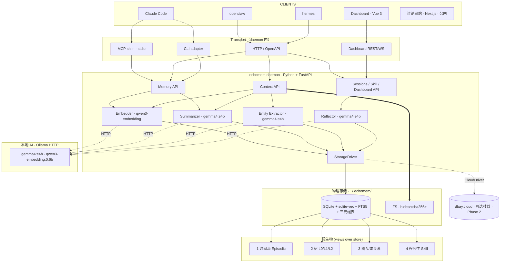

# echomem 设计

> 作者：Jacky Li
> 日期：2026-04-30
> 状态：Design — 等审阅
> 上游讨论网站（待建）：基于 `agent-memory-oss-research-website` 扩展，部署 Vercel
> 配套 brainstorm 可视化：`.superpowers/brainstorm/<session>/content/*.html`（已 gitignore）

---

## 1. 概览

**echomem** 是本地 Agent 记忆/知识/skill 共享中枢。三家本地 Agent（Claude Code、openclaw、hermes）共享同一份本地记忆与衍生物，并通过统一 Dashboard 查看与管理。它是云端 dbay 的 **Local-first 同源近亲**：schema 兼容、API 概念一致，但本地完全自给（SQLite + FS），云端是可选挂载。

一句话：**让三家 Agent 共享一颗"会反思"的本地大脑，省 token、跨 Agent 不丢上下文，并且 demo 不需要云。**

---

## 2. 背景与动机

| 现状 | 问题 |
|---|---|
| 用户在 CC、openclaw、hermes 之间切换工作 | 记忆/skill/上下文不互通；同一件事每家 Agent 重新讲一遍 |
| dbay 云端有完整 memory_ingest/recall/list/delete + LakebaseFS Phase 2 钩子 + 加密体系 | 强依赖云；客户/同事 demo 不便；客户离线场景受阻 |
| 想让本地小模型（gemma + qwen3-embedding）做衍生物提取 | 现有 dbay pipeline 与云 PG schema 紧耦合，剥本地版有工程量 |
| 想验证"echomem 用记忆预测 LLM 输出长度"对 MaaS 调度的价值 | 假设未验证；做法侵入 agent；做错代价大 |

echomem 解上面 4 类问题：单机自给的本地中枢、统一接入、跨 Agent 共享、并为长输出预测假设留一条研究通道。

---

## 3. 目标 / 非目标

**目标（MVP 阶段）：**

1. 三家 Agent 通过统一 API 共享同一份记忆（**A 跨 Agent 记忆共享**）
2. 用户能用 Dashboard 看到记忆/衍生物/会话，并理解"为什么有这条衍生物"（**B Dashboard**）
3. 本地 AI 跑通 ingest pipeline，产出 4 种衍生物：时间流 / 树 / 图 / 程序性（**C 衍生物**）
4. 一条命令完成安装、注册 MCP、起 Dashboard、拉本地模型（**D Onboarding**）
5. 上下文 API：URL / PDF / repo 文件能灌到 echomem 给 Agent 引用（**F 上下文 API**）
6. 配套讨论网站，给同事/潜在客户呈现调研、架构、roadmap（**I 讨论网站**）

**非目标（不做或留后期）：**

- Benchmark Runner（locomo / longmemeval）—— Phase 3
- 会话采集（被动 hook 三家 Agent 对话）—— Phase 2
- Insight Track（输出长度预测 + MaaS 集成）—— Phase 2+ 研究子项目
- 单独的 "Skill 共享" 模块 —— 已并入"程序性记忆"衍生物
- 因果链衍生物 —— Phase 3+ 待证明价值
- 多用户认证 / 团队协作 —— 单机单用户

---

## 4. 设计原则

| 原则 | 含义 |
|---|---|
| **Local-first** | 本地是主战场；备份 = `cp` 一个目录；云端 dbay 是可选挂载 |
| **同源不重写** | schema 与 API 概念尽量与云端 dbay 兼容（StorageDriver 抽象同时支持 SQLite / PG / Cloud） |
| **存储抽象层** | 所有上层只见 `StorageDriver` 接口；切换 SQLite ↔ PG ↔ Cloud 不动业务代码 |
| **小模型友好** | 衍生物 pipeline 对 gemma 4B 量级模型留降级路径，置信度低不入污染数据 |
| **零云依赖默认** | demo 必须在没有外网时跑通；云挂载是用户主动行为 |
| **Hook 不入侵** | Insight Track 等可选能力通过 Agent 框架 hook 接入，不修改 Agent 业务代码 |

---

## 5. 范围（MVP）

### 5.1 P0 — MVP 必含

| 模块 | 要点 |
|---|---|
| **A. Memory API** | `ingest / recall / list / delete / get`（直接抄 `dbay-mcp/src/dbay_mcp/server.py:467-629`） |
| **B. Dashboard** | Vue 3 + Vite，daemon serve；呈现记忆/衍生物/会话；解释 "为什么有这条衍生物"（来源链） |
| **C. 衍生物 Pipeline** | 4 种组织方式：1 时间流 + 2 树 + 3 图 + 4 程序性。**4 程序性 MVP 仅支持 `import`**（导入外部 skill 文件如 `superpowers / impeccable`），`extract`（从会话萃取）留 P1 |
| **D. Onboarding** | 一条 `curl ... \| sh` 安装 echomem 单二进制，自动注册 MCP 到三家 Agent，启 Dashboard，提示拉模型 |
| **F. Context API** | `add_url / ls / read / write / mv`，从 dbay LakebaseFS 抽出本地版；原始文件存 FS by sha256 |
| **I. 讨论网站** | Next.js + Tailwind，基于 agent-memory-oss-research-website 扩展，部署 Vercel |

### 5.2 P1 — MVP 后第二阶段

- 会话采集（被动 hook 三家 Agent 对话） + 后台衍生物提取
- Insight Track 进 P1 接 MaaS（前提：研究子项目准确率达标）

### 5.3 P2+ — 后续

- Benchmark Runner（locomo / longmemeval）
- 因果链衍生物
- 多设备同步（CloudDriver 真正打通双向 sync）

---

## 6. 整体架构

### 6.1 分层概览



### 6.2 数据目录布局（`~/.echomem/`）

```
~/.echomem/
  config.toml            # 用户偏好、Ollama URL、agent 注册状态
  db.sqlite              # SQLite + vec + FTS5 + 三元组
  db.sqlite-wal
  db.sqlite-shm
  blobs/                 # 内容寻址存储
    ab/cd/abcd1234...    # 大文件：PDF / HTML / md / repo 拷贝
  sessions/              # P2：被动会话日志（JSONL）
    <session_id>/events.jsonl
  cache/                 # 重复计算的 embedding / 摘要缓存
  logs/                  # daemon 日志
```

---

## 7. 组件

### 7.1 daemon（echomem-daemon）

- Python 3.11 + FastAPI + uvicorn 单进程
- 启动顺序：load config → 打开 SQLite → 健康检查 Ollama → 起 worker pool → 暴露 transport
- 默认监听 `127.0.0.1:NNNN`（NNNN 写入 `~/.echomem/config.toml`，三家 Agent 共读）
- 后台 worker pool 用 `asyncio` 任务队列；衍生物生成是异步任务

### 7.2 Transport 适配

| Transport | 服务对象 | 说明 |
|---|---|---|
| **MCP shim (stdio)** | Claude Code | 一个 thin Python 子进程作为 stdio MCP server，把工具调用转发给 daemon HTTP |
| **HTTP / OpenAPI** | openclaw / hermes / Dashboard / 第三方 Agent | FastAPI 直出，OpenAPI 自动生成 |
| **CLI adapter** | 用户命令行（`echomem mem ls` 等） | Typer-based CLI 直连 daemon HTTP |

> **openclaw / hermes 接入细节**：MVP 阶段先用 HTTP 直连。各家 Agent 的具体配置写法（如何把 echomem 当工具暴露给 LLM）属于实施时调研事项，列在第 16 节"未决"。

### 7.3 API 模块

| API | 端点示例 | 来源 |
|---|---|---|
| Memory | `POST /memory/ingest`、`GET /memory/recall?q=...&k=10`、`GET /memory/list`、`DELETE /memory/{id}`、`GET /memory/{id}` | 抄 `dbay_mcp/server.py:467-629` |
| Context | `POST /context/add_url`、`GET /context/ls?prefix=...`、`GET /context/read?path=...`、`POST /context/write`、`POST /context/mv` | 抄 dbay LakebaseFS 本地抽出 |
| Sessions | `POST /sessions/append`（P1）、`GET /sessions/{id}`、`GET /sessions` | 新写 |
| Skill | `GET /skill/surface?context=...`（基于程序性衍生物）、`POST /skill/import` | 新写 |
| Dashboard | `GET /derivatives/query`、`GET /memory/timeline`、`GET /memory/graph`、`WS /events` | 新写 |
| **Insight (P2+)** | `POST /insight/predict`、`POST /insight/report`、`GET /insight/evaluation` | 新写（占位 spec，不实施） |

### 7.4 Workers（衍生物 pipeline）

| Worker | 输入 | 输出 | 模型 |
|---|---|---|---|
| **Embedder** | 文本 chunk | 向量 | qwen3-embedding:0.6b |
| **Summarizer** | 文档 / 长会话 | L0 / L1 / L2 三层摘要 | gemma4:e4b |
| **Entity Extractor** | 文本 | (subject, predicate, object) 三元组 + 置信度 | gemma4:e4b |
| **Reflector** | 一组事件或会话片段 | 反思笔记 + 程序性 skill 候选 | gemma4:e4b |

每个 worker 都暴露：
- 同步接口（API 直接触发）
- 异步队列消费（async 任务）
- 降级路径（见 §11）

### 7.5 StorageDriver 抽象

```python
class StorageDriver(Protocol):
    def upsert_memory(self, mem: Memory) -> str: ...
    def recall(self, query_emb: list[float], k: int, filters: dict) -> list[Memory]: ...
    def upsert_blob_ref(self, sha256: str, mime: str, meta: dict) -> None: ...
    def upsert_triple(self, s: str, p: str, o: str, conf: float, src: str) -> None: ...
    def query_timeline(self, range: TimeRange, filters: dict) -> list[Event]: ...
    def query_tree(self, root: str, depth: int) -> Tree: ...
    def query_graph(self, seed: str, hops: int) -> Subgraph: ...
    def query_skills(self, ctx: Context) -> list[Skill]: ...
    # ... 增删改查 + 事务
```

实现：

- `SQLiteDriver` — MVP 唯一实现
- `PgDriver` — Phase 2，与云端 dbay 共享 schema
- `CloudDriver` — Phase 2+，包装 dbay.cloud REST/MCP

### 7.6 Dashboard（Vue 3 SPA）

- daemon 启动时 serve 静态 bundle 在 `http://localhost:NNNN/dashboard`
- 复用 `lakeon-console` 与 `lakeon-admin` 的组件库与设计 token（暖色港湾风格，见 `.impeccable.md`）
- 主要页面：
  1. **总览** — 记忆 / 衍生物 / 会话 数量、最近变化
  2. **记忆列表** — 按时间 / 来源 / 标签筛
  3. **衍生物 4 维视图** — 时间流（timeline）/ 树（折叠）/ 图（force layout）/ 程序性（卡片）
  4. **来源链** — 点任一衍生物，看到它由哪些原始记忆/文档生成（**这是"为什么有这条"的核心 UI**）
  5. **状态** — daemon 健康、Ollama 模型可用性、衍生物队列积压

### 7.7 讨论网站（Next.js）

- **复制**（不是 fork）`~/code/agent-memory-oss-research-website` 的 codebase 作为新仓库 `echomem-website` 的初始基础；保留它的"项目对比 / Markdown + Mermaid 渲染"能力，但定位改为 echomem 项目站（不污染原 OSS 调研平台的中立性）
- 章节：
  1. Why echomem（背景与动机）
  2. 调研（25+ 开源项目对照）
  3. 架构（本 spec 的 mermaid 图为主，加交互）
  4. Roadmap（甘特或 timeline）
  5. 决策日志（每次重要决定的原委 + 反对意见 + 采纳）
- 公网部署 Vercel；同事可远程访问

---

## 8. 关键数据流

### 8.1 显式 ingest（Agent 主动 "记住 X"）

```
Agent → MCP/HTTP → Memory API.ingest(text, meta)
  → Embedder（qwen3-embedding 生成向量）
  → SQLiteDriver.upsert_memory() — 写 memory 表 + sqlite-vec 索引 + FTS5 索引
  → enqueue([Summarizer.l0, EntityExtractor])  # 异步
返回 memory_id 给 Agent
后台：
  Summarizer 生成 L0 简短摘要 → 写 derivative_summary 表
  EntityExtractor 抽三元组 → 写 derivative_triple 表
  Reflector 周期性 batch（每小时）→ 在 episodic + 程序性视图刷新
```

### 8.2 上下文 add_url

```
Agent → POST /context/add_url(url)
  → fetch HTML / PDF（trafilatura / pdfplumber）
  → sha256 = hash(content)
  → if blobs/<sha256> 已存在: 跳过 fetch
  → else: 写 blobs/<sha256>
  → SQLiteDriver.upsert_blob_ref(sha256, mime, meta)
  → enqueue([Summarizer.l0_l1_l2, EntityExtractor])
返回 doc_id
后台：
  Summarizer 生成 L0/L1/L2 三层摘要（树衍生物）
  EntityExtractor 抽实体（图衍生物）
```

### 8.3 recall

```
Agent → MCP/HTTP → Memory API.recall(query, k=10, filters)
  → Embedder 生成 query 向量
  → SQLiteDriver.recall(query_emb, k, filters)
    - 向量检索（sqlite-vec ANN）→ candidate_ids
    - 同时 FTS5 全文 → candidate_ids
    - 合并去重，按 hybrid 分数排序
    - 拉对应 memory + 关联的 L0 摘要
  → 返回 [{id, text, score, l0_summary, source_link}]
```

返回结构包含 `source_link` ——指向原始记忆 / 原始文档 blob，用于 Dashboard "为什么"展示。

---

## 9. 数据模型 / Schema（SQLite，Phase 2 直接迁 PG）

### 9.1 核心表

```sql
-- 原始记忆 / 上下文 chunk 的统一表（不区分来源）
CREATE TABLE memory (
  id              TEXT PRIMARY KEY,        -- ULID
  agent_id        TEXT NOT NULL,           -- 'cc' | 'openclaw' | 'hermes' | 'system'
  source_kind     TEXT NOT NULL,           -- 'explicit' | 'session' | 'document'
  source_ref      TEXT,                    -- session_id | doc_sha256 | NULL
  text            TEXT NOT NULL,           -- 原文（chunk）
  meta            TEXT,                    -- JSON
  created_at      INTEGER NOT NULL,        -- unix ms
  updated_at      INTEGER NOT NULL,
  -- 软删除
  deleted_at      INTEGER
);

CREATE INDEX idx_memory_created_at ON memory(created_at DESC);
CREATE INDEX idx_memory_agent_id ON memory(agent_id);

-- sqlite-vec 向量索引
CREATE VIRTUAL TABLE memory_vec USING vec0(
  memory_id TEXT PRIMARY KEY,
  embedding float[1024]
);

-- FTS5 全文
CREATE VIRTUAL TABLE memory_fts USING fts5(text, content='memory', content_rowid='rowid', tokenize='porter');

-- 文档 blob 引用
CREATE TABLE blob_ref (
  sha256          TEXT PRIMARY KEY,
  mime            TEXT NOT NULL,
  byte_size       INTEGER,
  origin_url      TEXT,                    -- 来源 URL（如有）
  meta            TEXT,
  created_at      INTEGER NOT NULL
);
```

### 9.2 衍生物 1：时间流（Episodic）

```sql
CREATE TABLE derivative_event (
  id              TEXT PRIMARY KEY,
  window_start    INTEGER NOT NULL,        -- 时间窗起
  window_end      INTEGER NOT NULL,
  agent_id        TEXT NOT NULL,
  title           TEXT NOT NULL,           -- 一句话事件标题（gemma 生成）
  summary         TEXT,                    -- 段落摘要
  member_memory_ids TEXT,                  -- JSON array of memory.id
  created_at      INTEGER NOT NULL,
  -- 来源链 / 解释依据
  rationale       TEXT                     -- "为什么把这些归到一个事件"
);

CREATE INDEX idx_event_window ON derivative_event(window_start);
```

聚合规则（MVP）：相同 agent + 时间间隔 < 30 min + 主题相似度 > 0.7 → 同一事件。

### 9.3 衍生物 2：树（L0/L1/L2 渐进披露）

```sql
CREATE TABLE derivative_summary (
  id              TEXT PRIMARY KEY,
  source_kind     TEXT NOT NULL,           -- 'memory' | 'blob' | 'session'
  source_ref      TEXT NOT NULL,           -- memory.id | blob.sha256 | session_id
  level           INTEGER NOT NULL,        -- 0 | 1 | 2
  parent_id       TEXT,                    -- 上级摘要的 id；L0 为 NULL
  text            TEXT NOT NULL,
  token_estimate  INTEGER,
  created_at      INTEGER NOT NULL,
  rationale       TEXT
);

CREATE INDEX idx_summary_source ON derivative_summary(source_kind, source_ref);
CREATE INDEX idx_summary_parent ON derivative_summary(parent_id);
```

L0：≤ 100 tokens，全文要义。L1：≤ 500 tokens，分段摘要。L2：原 chunk 级（≤ 2000 tokens）。

### 9.4 衍生物 3：图（实体关系）

```sql
CREATE TABLE derivative_entity (
  id              TEXT PRIMARY KEY,        -- 规范化名
  name            TEXT NOT NULL,           -- 显示名
  kind            TEXT,                    -- 'person' | 'project' | 'tool' | 'concept' | ...
  meta            TEXT,
  first_seen_at   INTEGER NOT NULL,
  last_seen_at    INTEGER NOT NULL
);

CREATE TABLE derivative_triple (
  id              TEXT PRIMARY KEY,
  subject_id      TEXT NOT NULL REFERENCES derivative_entity(id),
  predicate       TEXT NOT NULL,
  object_id       TEXT NOT NULL REFERENCES derivative_entity(id),
  source_memory_id TEXT NOT NULL REFERENCES memory(id),
  confidence      REAL NOT NULL,           -- 0..1
  created_at      INTEGER NOT NULL
);

CREATE INDEX idx_triple_s ON derivative_triple(subject_id);
CREATE INDEX idx_triple_o ON derivative_triple(object_id);
```

查询时 NetworkX 把当前用户/实体相关的子图加载内存做算法（中心度、最短路径等）。

### 9.5 衍生物 4：程序性（Skill）

```sql
CREATE TABLE derivative_skill (
  id              TEXT PRIMARY KEY,
  name            TEXT NOT NULL,
  trigger_pattern TEXT NOT NULL,           -- 触发条件（自然语言或正则）
  trigger_emb     BLOB,                    -- 触发条件向量（用 qwen3-embedding 生成）
  steps           TEXT NOT NULL,           -- JSON array of 步骤描述
  agent_scope     TEXT,                    -- 'cc' | 'all' | ...
  source          TEXT NOT NULL,           -- 'extracted' | 'imported'（从外部 skill 文件导入）
  observed_count  INTEGER NOT NULL,        -- 观察到的次数
  success_count   INTEGER NOT NULL,        -- 反馈成功次数
  last_used_at    INTEGER,
  created_at      INTEGER NOT NULL,
  rationale       TEXT
);

-- 触发向量索引
CREATE VIRTUAL TABLE skill_vec USING vec0(
  skill_id TEXT PRIMARY KEY,
  embedding float[1024]
);
```

`skill.surface(context)` 用 context 向量在 `skill_vec` 召回 top-k 相关 skill；observed_count / success_count 是反馈信号，可用于排序和衰减。

`source = 'imported'` 用于把 superpowers / impeccable / codex 等外部 skill 文件**当数据导入** echomem——这是"skill 共享"的实现路径：MVP 先支持 import，extract（从会话萃取）放 P1。

---

## 10. 三 Agent 接入策略

### 10.1 Claude Code

- 通过 `~/.claude/settings.json` 注册 echomem 为 MCP server（stdio）
- echomem 提供一个轻 Python shim：`echomem-mcp-shim` 进程，stdio JSON-RPC 转发到 daemon HTTP
- 工具命名：`mcp__echomem__memory_ingest` 等（与现 `mcp__dbay__memory_ingest` 区分）
- onboarding 自动写入 `settings.json`（备份原文件）

### 10.2 openclaw

- HTTP 直连 daemon
- 通过 `openclaw.json` 的 flows / agents 配置把 echomem 当作 tool provider
- **细节待调研**：openclaw 的 tool registration 协议（写在第 16 节）

### 10.3 hermes

- HTTP 直连 daemon
- hermes 已有 terminal/browser/vision/image/MOA 等多 tool；echomem 作为新 tool 通过其 MCP 或 HTTP 工具注册
- **细节待调研**：hermes 的 tool registration 协议

### 10.4 通用约定

- 所有 Agent 调用 echomem 都带 `agent_id`（用于 ingest 时归属，recall 时按需过滤）
- 所有 Agent 共享同一 store；recall 默认跨 Agent 召回，可按 `agent_id` 过滤

---

## 11. 错误处理与降级

### 11.1 衍生物 pipeline 降级

| 衍生物 | 主流程 | 降级路径 |
|---|---|---|
| **1 时间流** | 按时间窗 + 主题相似度聚合 | 失败时仅按时间窗聚合（不依赖模型） |
| **2 树** | gemma 生成 L0/L1/L2 | 失败时只保 L2（原 chunk）；L0 用 truncate-and-prefix-fallback |
| **3 图** | gemma 抽三元组，置信度 ≥ 0.7 入库 | 置信度 < 0.7 写 `derivative_triple_pending` 表，不入图；Dashboard 单独展示，让用户确认 |
| **4 程序性 (extracted)** | Reflector batch 萃取 | MVP 阶段先支持 import，extract 用规则模板兜底（不依赖模型） |

### 11.2 Ollama 不可用

- 所有 worker 重试 3 次，间隔 1s/4s/16s
- 仍失败 → 任务进 `dead_letter` 表；ingest 立刻返回 `memory_id`，但 `derivative_status='pending'`
- Dashboard 状态页提示 "Ollama 不可用，N 个任务积压"

### 11.3 SQLite 锁

- WAL 模式 + busy_timeout = 5000ms
- 写入路径全部异步序列化（asyncio.Queue）；读取路径并发 OK
- 单 daemon 单进程意味着不存在跨进程锁问题

### 11.4 数据完整性

- ingest 成功必须保证 `memory` 表 + 向量索引一并写入（同一事务）
- 衍生物失败不影响原始记忆
- `~/.echomem/db.sqlite` 每次启动检查 schema 版本；不匹配执行 migration

---

## 12. 测试策略

| 层级 | 内容 | 工具 |
|---|---|---|
| **单元** | 每个 worker / driver / API handler | pytest |
| **集成** | daemon + Ollama + SQLite 端到端 ingest/recall/derive | pytest + ollama 本地必备 |
| **三 Agent 接入** | 起 daemon + 模拟 CC/openclaw/hermes 协议 → ingest → recall | pytest + MCP test harness |
| **Dashboard** | 主要交互（衍生物切换、来源链导航） | Playwright |
| **Onboarding** | 干净环境跑 install 脚本 → daemon 起 → MCP 注册成功 → ingest 成功 | shell + GH Action matrix |
| **性能** | 1 万条 memory → recall 延迟 p95 < 100ms；衍生物 pipeline throughput | pytest-benchmark |
| **降级** | 模拟 Ollama 离线 / SQLite 锁 / gemma 抽实体置信度低 | pytest |

特别约定（继承 `CLAUDE.md`）：
- E2E 必须断言业务正确性，不只是 HTTP 200
- FAILED 必须修，禁止标 SKIPPED
- 不稳定外部依赖要查根因，不能 skip

**与 lakeon `tests/e2e/` 关系**：echomem 测试**不放** `tests/e2e/`（那是 lakeon-api 的 API E2E）。echomem 测试在 `echomem/tests/{unit,integration,e2e}/`，独立 pytest 运行，CI 单独 job。共用的 pytest fixture（如临时租户清理逻辑）评估后再决定是否抽公共。

---

## 13. Insight Track（研究子项目）

**独立子 spec 待写**：`docs/superpowers/specs/2026-04-30-echomem-insight-track-design.md`

要点提前写在这里：

- **目标**：验证假设——echomem 用记忆/skill 能在 50ms 内预测 LLM 输出长度，准确率 ≥ 70%
- **Phase**：与 MVP 并行（独立 prototype）；进 echomem P1 的门槛是准确率达标
- **不在 MVP 范围**：MVP 只在 daemon 内**预留 API 形状**（`POST /insight/predict` 返回 501），不实施
- **接入方式**：Phase 2 用 Agent 框架的 hook 机制（CC 的 PreToolUse / PostToolUse；openclaw / hermes 的 flow hook），不修改 Agent 业务代码
- **shadow-mode 流程**：见 brainstorm 时序图 `insight-track.html`（9 步）
- **ground truth**：Agent 收到 LLM 响应后通过 hook 调 `insight.report_actual_length(req_id, tokens)`
- **回炉条件**：准确率 < 60% 或预测延迟 > 100ms

---

## 14. 代码组织与发布

### 14.1 仓库位置（建议）

**Phase 1 (MVP)**：放在 lakeon monorepo 子目录 `echomem/`

```
lakeon/
  lakeon-api/            # 现有
  lakeon-console/        # 现有
  lakeon-admin/          # 现有
  dbay-cli/              # 现有
  dbay-mcp/              # 现有
  dbay-fuse/             # 现有
  dbay-sre-mcp/          # 现有
  echomem/               # 新增
    pyproject.toml
    src/echomem/
      daemon/            # FastAPI app
      api/               # memory, context, sessions, skill, insight
      workers/           # embedder, summarizer, entity_extractor, reflector
      drivers/           # storage_driver/{sqlite,pg,cloud}.py
      cli.py             # echomem CLI
      mcp_shim/          # stdio MCP shim 子包
    tests/
    dashboard/           # Vue 3 SPA（独立 npm 包）
      package.json
      src/
    install.sh           # onboarding 一键脚本
```

**Phase 2+**（视情况）：
- `echomem` split 成独立 GitHub repo（公网开放）
- 讨论网站独立 repo `echomem-website`（fork 自 agent-memory-oss-research-website）

### 14.2 与 dbay 代码复用策略

采用 brainstorm 决策 C：**先抄到 echomem 起 MVP，稳定后回灌成共享包**。

- MVP 阶段：抄 `dbay-mcp/server.py:467-629` 的 memory_* 实现到 `echomem/api/memory.py`
- MVP 阶段：抄 `dbay-cli mem` 7 个子命令到 `echomem/cli.py`
- MVP 阶段：抄 `memory/service/main.py:lbfs_derive` 到 `echomem/workers/derive.py`
- Phase 2 评估：把云端 dbay-mcp / memory-service 与 echomem 共同部分抽出 `dbay-core` Python 包（lakeon-api 也用）

### 14.3 发布

- echomem 单二进制：PyInstaller 打 `darwin-arm64` / `linux-x64`，GitHub Action CI
- 发布渠道（MVP 内部）：GitHub Release 直链 curl
- onboarding：`curl https://.../install.sh | sh` → 下载二进制 → 安装到 `~/.local/bin/echomem` → 提示 `echomem init`

---

## 15. Roadmap（粗略阶段，不写绝对日期，待用户审阅时填）

### Phase 1 — MVP

**目标**：A+B 目标人群验证；三家 Agent 共享记忆 + Dashboard demo 5 分钟跑通

主要交付：

1. echomem daemon（Memory + Context + Sessions + Skill API）
2. 4 种衍生物 pipeline（带降级）
3. Dashboard（4 维视图 + 来源链）
4. Onboarding 一键脚本（CC 自动注册）
5. 讨论网站 v1（背景 / 调研 / 架构 / Roadmap）
6. Insight API 占位（501）

**验收**：
- **跨 Agent 共享**：在 CC 让 echomem 记一条事，在 openclaw recall 出来；查 Dashboard 能看到这条记忆 + 它的 L0 摘要 + 涉及的实体
- **三家 Agent 接入完整性**：CC 自动注册（settings.json 写入）；openclaw 与 hermes 通过 HTTP 直连，且 **README 给出可复制粘贴的接入示例**（具体协议在 implementation plan 阶段先用 1-2 天调研落定）
- **Onboarding**：干净 macOS 跑 `curl ... | sh` → daemon 起 → MCP 注册成功 → ingest pipeline 工作 < 5 分钟（含 Ollama 模型下载除外）
- **Dashboard "为什么"**：任意一条衍生物点开能看到来源链（出自哪些 memory / 哪个文档 blob / 哪次会话）
- **讨论网站**：可公网访问；给 3 位同事看完后能说出 echomem 是什么、与 dbay.cloud 区别、什么场景能用

### Phase 2 — 会话采集 + Insight Track 接 MaaS

- 三家 Agent 的被动会话 hook + 后台衍生物提取
- Insight Track 准确率验证完成 → 真正接 MaaS hint
- Skill extracted（从会话萃取）
- Reflector 周期性反思

### Phase 3 — Benchmark + Cloud 同步

- Benchmark Runner（locomo / longmemeval）
- CloudDriver 真正打通双向 sync（与 dbay.cloud）
- 因果链衍生物 prototype
- echomem repo split

### Phase 4 — 公开发布

- echomem 公开 GitHub repo + 文档站
- 商业化 sku（如做）

---

## 16. 风险与未决事项

| 风险 / 未决 | 影响 | 缓解 / 处理 |
|---|---|---|
| openclaw / hermes 工具注册协议未调研 | 三 Agent 接入卡壳 | 实施前先做 1-2 天调研，写到 implementation plan 里 |
| gemma 4B 抽实体精度 | 衍生物 3 图质量低 | 降级路径已设；MVP 阶段以低召回换高精度 |
| Reflector 程序性萃取算法不成熟 | 衍生物 4 实用性低 | MVP 阶段只支持 import；extract 留 P1 |
| PyInstaller 打包 80MB 用户接受度 | onboarding 印象差 | 测试发现包过大可改 pyoxidizer / Nuitka |
| Insight Track 假设不成立（准确率 < 60%） | 子项目作废 | shadow mode 验证机制；不影响 MVP |
| 多 Agent 并发对同一份 SQLite 写入 | 实际是单 daemon 写，无问题 | 文档明确"daemon 是唯一写入者" |
| 用户机器无 Ollama / 模型未拉 | onboarding 需要长时间下载 | install 脚本检测并交互引导 `ollama pull` |
| dbay 云端 schema 演进与 echomem 偏离 | Phase 2 PG/Cloud driver 难做 | StorageDriver 抽象层吸收差异；要做 schema diff 工具 |
| Dashboard "为什么" 解释力不够 | Demo 故事不够 wow | 来源链 UI 重点打磨；衍生物每条都带 `rationale` 字段 |
| 隐私敏感场景 | 用户怕 echomem 把记忆/会话上传 | 默认完全本地；CloudDriver 是用户主动启动；onboarding 明确说明 |

---

## 17. 与开源项目对照（择要）

| 项目 | echomem 借鉴 / 区别 |
|---|---|
| **Mem0 / Memori** | 借鉴 SQLite + 单文件存储；echomem 多了 4 维衍生物 + 跨 Agent 共享 daemon |
| **A-MEM / cognee / graphiti** | 借鉴实体图谱 + 三元组；echomem 用降级模式让 gemma 4B 也能玩 |
| **Letta** | 借鉴 archival recall + 工具化记忆 API；echomem 专注本地 + 跨 Agent |
| **HippoRAG** | 借鉴 working memory 语义；MVP 不用，Phase 2+ 评估 |
| **OpenViking** | 借鉴 L0/L1/L2 渐进披露；echomem 在小模型上做适配 |
| **HydraDB** | 借鉴实体回填技术；用于树衍生物 + 图衍生物的连接 |
| **Anthropic Memory MCP** | 借鉴 sqlite-vec 选择；echomem 多了衍生物 + dashboard |
| **MemOS** | 借鉴"OS 视角管理记忆"；echomem 单机不上云时定位类似 |
| **LongMemEval / locomo** | Phase 3 用作 benchmark；不在 MVP |

完整 25+ 项目对照将在讨论网站中呈现。

---

## 18. 待用户审阅时确认

请重点审：

1. **第 5 节 P0 范围**：是否漏了 / 多了
2. **第 9 节 Schema**：字段是否够、表关系是否正确（特别是 source_link 概念）
3. **第 11 节 降级路径**：每种衍生物的 fallback 是否合理
4. **第 14.1 仓库位置**：是否同意先放 lakeon monorepo
5. **第 15 节 Roadmap**：是否要填绝对日期、Phase 1 到 Phase 4 的边界是否清晰
6. **第 16 节 未决事项**：是否漏了你顾虑的点

审完反馈，再进 implementation plan 阶段（先 Phase 1 / MVP 的可执行计划）。
